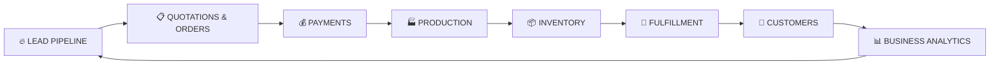
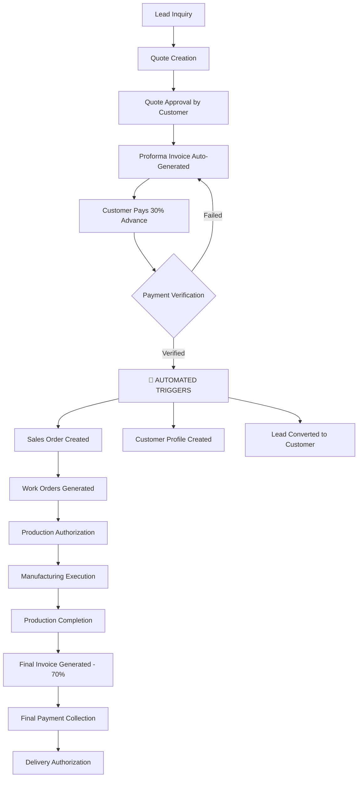
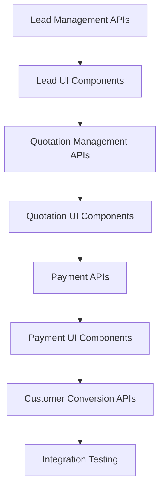
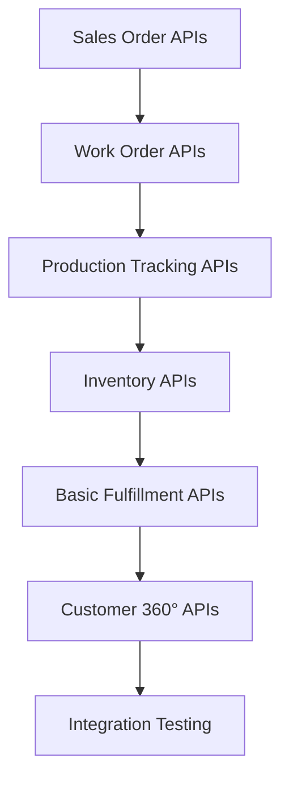
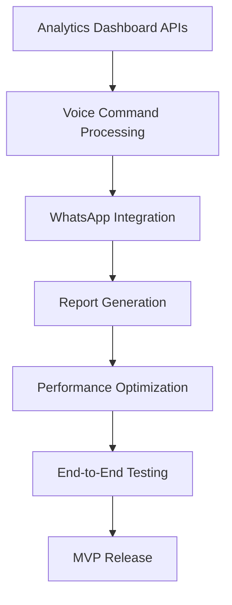

# Business Processes - ElevateIdea 360° Platform

> **📋 USE CASE TRACKING**: For detailed implementation status of all 273 use cases, see **[USE_CASES_TRACKER.md](/docs/USE_CASES_TRACKER.md)**  
> **🔄 This Document**: Provides complete business context and workflow details  
> **⚡ Quick Updates**: Use the tracker for status updates, this document for business understanding

---

## 📚 **TABLE OF CONTENTS**

## **PART 1: 🎯 FOUNDATION & OVERVIEW**
### **Core Business Understanding**
- [**OVERVIEW**](#overview)
- [**8-STAGE BUSINESS PIPELINE OVERVIEW**](#8-stage-business-pipeline-overview)
- [**DASHBOARD-TO-PROCESS MAPPING**](#dashboard-to-process-mapping)
  - [8-Stage Business Process = 8 Dashboard Cards](#8-stage-business-process--8-dashboard-cards)
- [**CORE BUSINESS PHILOSOPHY**](#core-business-philosophy)
  - [Automated Lead-to-Customer Conversion](#automated-lead-to-customer-conversion)

## **PART 2: 🔧 KEY BUSINESS CONCEPTS**
### **How the Business Works**
- [**CRITICAL DOCUMENT HIERARCHY**](#critical-document-hierarchy-sales-order-vs-work-order)
  - [Sales Order vs Work Order](#sales-order-vs-work-order)
  - [Commercial Documents vs Production Documents](#commercial-documents-vs-production-documents)
  - [Business Area Mapping](#business-area-mapping)
- [**CRM MODULE ARCHITECTURE**](#crm-module-architecture)
  - [Unified CRM System with Intelligent Views](#unified-crm-system-with-intelligent-views)
- [**CRITICAL BUSINESS RULES & COMPLIANCE**](#critical-business-rules--data-integrity)
  - [Non-Negotiable Business Rules](#-non-negotiable-business-rules)
  - [Data Security & Compliance](#-data-security--compliance)

## **PART 3: 🔄 DETAILED BUSINESS PROCESSES**
### **Complete Workflow Implementation**
- [**COMPLETE 8-STAGE BUSINESS PIPELINE**](#complete-business-pipeline)
  - [Stage 1: Lead Generation & Capture](#stage-1-lead-generation--capture)
  - [Stage 2: Commercial Document Management](#stage-2-commercial-document-management)
  - [Stage 3: Quote Lifecycle & Financial Workflow](#stage-3-quote-lifecycle-management)
  - [Stage 4: Manufacturing Execution & Work Orders](#stage-4-manufacturing-execution--work-order-management)
  - [Stage 5: Supply Chain & Materials Management](#stage-5-supply-chain--materials-management)
  - [Stage 6: Delivery & Order Completion](#stage-6-delivery--order-completion)
  - [Stage 7: Customer Relationship Management](#stage-7-customer-relationship--lifecycle-management)
  - [Stage 8: Business Intelligence & Analytics](#stage-8-business-intelligence--performance-analytics)
- [**AUTOMATED LEAD-TO-CUSTOMER CONVERSION SYSTEM**](#automated-lead-to-customer-conversion-system)
  - [Automated Conversion Trigger Points](#automated-conversion-trigger-points)
  - [Data Integrity & Business Logic](#data-integrity--business-logic)
  - [Module Responsibility](#module-responsibility-in-automated-flow)
  - [Business Benefits](#business-benefits-of-automated-conversion)
- [**CROSS-PROCESS DASHBOARD INTELLIGENCE**](#cross-process-dashboard-intelligence)
  - [Smart Navigation Between Process Stages](#smart-navigation-between-process-stages)
  - [Process Stage Indicators](#process-stage-indicators)
  - [Context-Aware Cross-Navigation](#context-aware-cross-navigation)
  - [Business Intelligence Integration](#business-intelligence-integration)

## **PART 4: 🎨 USER EXPERIENCE & INTERFACE**
### **How Users Interact with the System**
- [**UI/UX FLOW & USER JOURNEY**](#️-uiux-flow--user-journey)
  - [Complete Lead-to-Customer Navigation Path](#complete-lead-to-customer-ui-navigation-path)
  - [Visual Design Language](#-visual-design-language--status-differentiation)
  - [Mobile-First Responsive Design](#-mobile-first-responsive-design)
  - [Financial Management Consolidation](#-financial-management-consolidation-current-enhancement)
  - [Critical UI/UX Business Rules](#-critical-uiux-business-rules)
- [**COMMERCIAL-TO-PRODUCTION WORKFLOW SUMMARY**](#complete-commercial-to-production-workflow-summary)
  - [Critical Business Logic](#critical-business-logic-document-creation-sequence)
  - [Key Business Document Relationship](#key-business-document-relationship)
  - [Critical Business Gates](#critical-business-gates)
  - [System Integration Points](#system-integration-points)
- [**UNIVERSAL PLATFORM CAPABILITIES**](#universal-platform-capabilities)
  - [Voice Integration](#voice-integration)
- [**BUSINESS SUCCESS METRICS**](#critical-success-factors)
  - [Cash Flow Management](#cash-flow-management)
  - [Quality Consistency](#quality-consistency)
  - [Timeline Management](#timeline-management)
  - [Customer Relationship](#customer-relationship)
  - [Platform Integration Benefits](#platform-integration-benefits)

## **PART 5: 🚀 IMPLEMENTATION GUIDE**
### **For Development Team**
- [**COMPLETE USE CASE MATRIX BY STAGE**](#complete-use-case-matrix-by-stage)
  - [Stage 1: Lead Pipeline - Complete Use Cases](#stage-1--lead-pipeline---complete-use-cases)
  - [Stage 2: Quotations & Orders - Complete Use Cases](#stage-2--quotations--orders---complete-use-cases)
  - [Stage 3: Payments - Complete Use Cases](#stage-3--payments---complete-use-cases)
  - [Stage 4: Production - Complete Use Cases](#stage-4--production---complete-use-cases)
  - [Stage 5: Inventory - Complete Use Cases](#stage-5--inventory---complete-use-cases)
  - [Stage 6: Fulfillment - Complete Use Cases](#stage-6--fulfillment---complete-use-cases)
  - [Stage 7: Customers - Complete Use Cases](#stage-7--customers---complete-use-cases)
  - [Stage 8: Business Analytics - Complete Use Cases](#stage-8--business-analytics---complete-use-cases)
- [**ACTION-TO-MODULE IMPLEMENTATION MAP**](#action-to-module-implementation-map)
  - [Module Assignment Matrix](#module-assignment-matrix)
  - [Critical Integration Points](#critical-integration-points)
- [**MVP IMPLEMENTATION PRIORITY MATRIX**](#mvp-implementation-priority-matrix)
  - [Priority 0 (P0) - Critical for MVP Launch](#priority-0-p0---critical-for-mvp-launch)
  - [Priority 1 (P1) - Important for MVP](#priority-1-p1---important-for-mvp)
  - [Priority 2 (P2) - Post-MVP Enhancements](#priority-2-p2---post-mvp-enhancements)
- [**VOICE COMMAND ACTION MAPPING**](#voice-command-action-mapping)
  - [Universal Navigation Commands](#universal-navigation-commands)
  - [Lead Management Voice Commands](#lead-management-voice-commands)
  - [Quotation & Order Voice Commands](#quotation--order-voice-commands)
  - [Payment Management Voice Commands](#payment-management-voice-commands)
  - [Production Voice Commands](#production-voice-commands)
  - [Context-Aware Voice Commands](#context-aware-voice-commands)
  - [Business Intelligence Voice Queries](#business-intelligence-voice-queries)
- [**IMPLEMENTATION SEQUENCE & DEPENDENCIES**](#implementation-sequence--dependencies)
  - [Week 1-2: Foundation & Core Flow](#week-1-2-foundation--core-flow)
  - [Week 3-4: Production & Operations](#week-3-4-production--operations)
  - [Week 5-6: Analytics & Enhancement](#week-5-6-analytics--enhancement)
  - [Critical Path Dependencies](#critical-path-dependencies)

---

> **Quick Navigation Tips:**
> - Click any section link above to jump directly to that content
> - Use `Ctrl+F` (or `Cmd+F` on Mac) to search for specific terms
> - This document focuses on **business workflows** - see `/docs/PRODUCT_REQUIREMENTS.md` for technical specifications

---

## Overview
This document outlines the complete lead-to-customer conversion flow for Gujarat textile manufacturers, capturing the real-world business processes that map directly to the 8-stage dashboard organization. The ElevateIdea platform mirrors these natural business workflows through sequential process-driven dashboard design.

## **8-STAGE BUSINESS PIPELINE OVERVIEW**

The ElevateIdea 360° platform is built around the **natural flow of textile manufacturing business operations**, from initial customer inquiry to final delivery and relationship management. Understanding this 8-stage pipeline is crucial for both business stakeholders and the development team.

### **The Complete Business Journey:**



### **Quick Stage Overview:**

1. **🔥 LEAD PIPELINE** - *Customer Acquisition*
   - **Purpose**: Capture and nurture potential customers
   - **Key Action**: "કોણ call કર્યો?" (Who called?)
   - **Output**: Qualified leads ready for quotes

2. **📋 QUOTATIONS & ORDERS** - *Commercial Workflow*
   - **Purpose**: Convert leads to paying customers through quotes and orders
   - **Key Action**: "કયા quotes મોકલવા?" (Which quotes to send?)
   - **Output**: Approved quotes with business profiles

3. **💰 PAYMENTS** - *Financial Hub & Customer Creation Gate*
   - **Purpose**: Collect advance payments and automatically create customers
   - **Key Action**: "કોની advance લેવાની?" (Whose advance to collect?)
   - **Critical**: 30% advance payment = Lead becomes Customer

4. **🏭 PRODUCTION** - *Manufacturing Execution*
   - **Purpose**: Transform customer orders into finished products
   - **Key Action**: "આજે શું બનાવવું?" (What to make today?)
   - **Output**: Quality-checked finished goods

5. **📦 INVENTORY** - *Supply Chain Management*
   - **Purpose**: Manage materials and finished goods efficiently
   - **Key Action**: "કેટલો stock છે?" (How much stock?)
   - **Integration**: Production ↔ Materials ↔ Fulfillment

6. **🚚 FULFILLMENT** - *Delivery & Completion*
   - **Purpose**: Get products to customers professionally and on time
   - **Key Action**: "કયા orders ready છે?" (Which orders are ready?)
   - **Output**: Delivered orders with customer satisfaction

7. **🤝 CUSTOMERS** - *Relationship Management*
   - **Purpose**: Maintain relationships and drive repeat business
   - **Key Action**: "મારા best customers કોણ?" (Who are my best customers?)
   - **Outcome**: Loyal customers generating repeat business

8. **📊 BUSINESS ANALYTICS** - *Intelligence & Optimization*
   - **Purpose**: Monitor performance and identify improvement opportunities
   - **Key Action**: "Dhanda કેમ ચાલે છે?" (How's business going?)
   - **Value**: Data-driven decisions for business growth

### **Critical Business Gates:**
- **Gate 1**: Lead → Quote (qualification process)
- **Gate 2**: Quote → Customer (30% advance payment) 🚨 **AUTOMATED**
- **Gate 3**: Customer → Production (sales order authorization)
- **Gate 4**: Production → Delivery (quality approval)
- **Gate 5**: Delivery → Loyalty (customer satisfaction)

### **Why This Sequence Matters:**
✅ **Natural Business Flow**: Matches how textile manufacturers actually work  
✅ **Logical Dependencies**: Each stage builds on the previous one  
✅ **Clear Handoffs**: Defined trigger points between stages  
✅ **Measurable Progress**: Track business performance at each stage  
✅ **User-Friendly**: Intuitive navigation for non-technical users

## **DASHBOARD-TO-PROCESS MAPPING**

### **8-Stage Business Process = 8 Dashboard Cards**
The platform dashboard is organized as a **digital mirror of textile manufacturing business reality**, with each business process stage corresponding to a dashboard card:

```
BUSINESS PROCESS STAGE          DASHBOARD CARD                MVP MODULES
1. Lead Generation & Capture → 🔥 LEAD PIPELINE           → Lead Management + CRM + Voice
2. Commercial Workflow      → 📋 QUOTATIONS & ORDERS     → Quotations + Sales Orders (post-payment)  
3. Financial Workflow       → 💰 PAYMENTS                → Proforma + Advance + Final + Collection
4. Manufacturing Execution  → 🏭 PRODUCTION               → Work Orders + Manufacturing + Quality
5. Supply Chain Management  → 📦 INVENTORY                → Stock + Procurement + Materials Planning  
6. Delivery & Completion    → 🚚 FULFILLMENT             → Dispatch + Delivery + Order Completion
7. Relationship Management  → 🤝 CUSTOMERS                → Customer 360° + Feedback + Loyalty
8. Business Intelligence    → 📊 BUSINESS ANALYTICS       → Reports + KPIs + Performance Analytics
```

**Key Design Principle**: Dashboard sequence matches the natural flow of textile manufacturing business operations, eliminating cognitive friction and providing intuitive navigation.

**Cross-Document References**:
- **Feature Requirements**: See `/docs/PRODUCT_REQUIREMENTS.md` for detailed feature specifications and system requirements based on these business processes
- **Dashboard Implementation**: See `/docs/DASHBOARD_SPECIFICATIONS.md` for complete dashboard design details, component specifications, and recent improvements
- **UI/UX Implementation**: See `/docs/DESIGN_SYSTEM.md` for visual design patterns that implement this business process flow

**Document Purpose**: This document provides the business context and domain knowledge that drives product and design decisions. Use this to understand WHY the system is organized in 8 sequential process stages and HOW textile manufacturers actually work.

---

## **CORE BUSINESS PHILOSOPHY**

### **Automated Lead-to-Customer Conversion**

The ElevateIdea 360° platform is built on a fundamental business philosophy: **streamlined, intelligent automation of the textile manufacturing sales cycle**. Our approach eliminates manual data entry redundancy while maintaining complete business control and transparency.

#### **Central Business Logic: The Payment Trigger**

**🎯 Core Principle**: *"30% advance payment = Lead automatically becomes Customer"*

This simple rule drives the entire platform's intelligent automation:

- **Before Payment**: Contact remains a "Lead" in the system
- **After 30% Advance**: Lead automatically converts to "Customer" with full business profile
- **Zero Manual Work**: Business profile data flows seamlessly from lead to customer record
- **Instant Access**: All order history, payment records, and production details available immediately

#### **Business Intelligence in Action**

**Smart Data Flow**:
```
Lead Data → Quote Creation → Payment Collection → Customer Creation → Order Management
   ↓              ↓               ↓                 ↓                ↓
Contact Info  → Business Profile → Financial Record → Customer 360° → Production Flow
```

**What This Means for Business Operations**:
- **No Duplicate Data Entry**: Enter customer details once during quotation, use everywhere
- **Instant Customer Access**: Payment receipt immediately creates full customer profile
- **Complete Business Context**: Every interaction has full business history available
- **Seamless Handoffs**: Sales to production transition happens automatically

#### **Textile Manufacturing Alignment**

**Real Business Flow Mapping**:
1. **Inquiry Stage**: Lead with basic contact information
2. **Quote Stage**: Enhanced with detailed business profile for professional documentation
3. **Payment Stage**: Advance payment triggers automatic customer creation
4. **Production Stage**: Full customer context available for manufacturing teams
5. **Relationship Stage**: Complete business history drives future interactions

**Key Business Benefits**:
- ✅ **Eliminate Manual Work**: No redundant data entry between sales and production teams
- ✅ **Maintain Data Accuracy**: Single source of truth for customer information
- ✅ **Accelerate Operations**: Instant access to complete business context
- ✅ **Professional Documentation**: Automatically generated business profiles for formal processes
- ✅ **Team Coordination**: Seamless information sharing between departments

#### **Platform Intelligence Features**

**Automated Business Logic**:
- **Smart Customer Creation**: Payment processing automatically generates customer records
- **Intelligent Data Inheritance**: Lead information becomes customer foundation
- **Context-Aware Navigation**: System knows relationship status and shows relevant options
- **Business-Driven Workflows**: Process flows match real textile manufacturing operations

**MSME-Focused Design**:
- **Zero Learning Curve**: Follows natural business thinking patterns
- **Mobile-First Operations**: Designed for factory floor and client meeting environments
- **Voice-Enabled Interactions**: Hands-free operation during manufacturing tasks
- **Multilingual Support**: Gujarati, Hindi, English for complete team accessibility

---

## **CRM MODULE ARCHITECTURE**

### **Unified CRM System with Intelligent Views**
The platform implements a single, unified CRM module that automatically displays the appropriate view based on the contact's status:

#### **CRM Module Structure**
```
CRM MODULE (Single Unified System)
├── Prospect View (displayed in LEAD PIPELINE business area)
│   ├── Contact management for prospects/leads only
│   ├── Lead interaction tracking and follow-up scheduling
│   ├── Lead scoring and prioritization
│   └── Conversion preparation and nurturing
└── Customer 360° View (displayed in CUSTOMERS business area)
    ├── Complete business profiles for paying customers only
    ├── Order history and financial analytics
    ├── Relationship intelligence and lifecycle management
    └── Strategic account planning and growth opportunities
```

#### **Automatic View Switching**
- **Before Advance Payment**: Contact appears in CRM Prospect View (LEAD area)
- **After Advance Payment**: Contact automatically transfers to CRM Customer 360° View (CUSTOMER area)
- **Same Person, Same CRM Module**: Different views based on business relationship status

#### **Data Continuity**
- **Complete History Preserved**: All interactions from prospect stage transfer to customer stage
- **Seamless Transition**: No data loss during prospect-to-customer conversion
- **Unified Database**: Same contact record, different interface based on payment status
- **Business Logic**: Payment status determines which view displays the contact

---

## **CRITICAL DOCUMENT HIERARCHY: SALES ORDER vs WORK ORDER**

### **Commercial Documents vs Production Documents**

Understanding the distinction between **Sales Orders** and **Work Orders** is fundamental to textile business operations:

#### **Sales Order (Master Commercial Document)**
- **Created When**: Advance payment (30%) received from customer
- **Purpose**: Master customer order authorizing complete business transaction
- **Contains**: 
  - Customer requirements and specifications
  - Commercial terms (pricing, payment schedule, delivery)
  - Total order value and profit margins
  - Delivery commitments and logistics
- **Scope**: Entire customer order (could be multiple products/batches)
- **Example**: "SO-2024-001: Rajesh Textiles - 1000m Cotton Fabric Order (₹2,40,000)"
- **Business Function**: Customer-facing commercial management

#### **Work Order (Production Sub-Component)**
- **Created From**: Sales Order breakdown for manufacturing execution
- **Purpose**: Specific production instructions for manufacturing teams
- **Contains**:
  - Detailed production specifications and processes
  - Material requirements and machine allocations
  - Production timeline and quality checkpoints
  - Resource assignments (workers, machines, materials)
- **Scope**: Individual manufacturing tasks within the sales order
- **Examples**:
  - "WO-2024-001A: Weaving 500m Cotton 40s (Loom-3, 5 days)"
  - "WO-2024-001B: Dyeing 500m Natural Blue (Tank-2, 2 days)"  
  - "WO-2024-001C: Finishing & Quality Check (QC-Lab, 1 day)"
- **Business Function**: Internal production management

#### **Document Relationship Hierarchy**
```
Sales Order (1) → Work Orders (Many)
     ↓                    ↓
Commercial View      Production View
Customer-facing      Internal execution
Business terms      Manufacturing tasks
Order management     Production planning
```

### **Business Area Mapping**
- **📋 QUOTATIONS & ORDERS** → Manages **Sales Orders** (commercial documents)
- **🏭 PRODUCTION** → Manages **Work Orders** (manufacturing execution)

This separation ensures:
- **Commercial clarity** for customer relationships
- **Production efficiency** for manufacturing teams  
- **Proper authorization flow** from payment → sales order → work orders
- **Clear responsibility boundaries** between sales and production teams

---

## Complete Business Pipeline

### **Stage 1: Lead Generation & Capture**
**Dashboard Card**: 🔥 **LEAD PIPELINE** (Business Entry Point)
**Platform Modules**: Lead Management + CRM (Prospect View)

#### **Business Mental Model & Daily Workflow**
**Business Owner's Mindset**: "કોણ call કર્યો? કયા leads hot છે? આજે કોને quotes મોકલવા?"
*Translation*: "Who called? Which leads are hot? Who should I send quotes to today?"

**Daily Workflow Pattern**:
- **Morning (7-9 AM)**: Review overnight inquiries, WhatsApp messages, missed calls
- **Priority Assessment**: Categorize by urgency and potential order value
- **Immediate Actions**: Return calls to hot leads, gather missing specifications
- **Planning**: Schedule follow-ups, prepare quote requirements for ready leads

#### **Lead Sources & Channels**
- **Direct Inquiries**: Phone calls from textile buyers and garment manufacturers
- **WhatsApp Business**: Messages with fabric requirements and specifications
- **Referrals**: Recommendations from existing satisfied customers
- **Trade Shows**: Contacts from textile exhibitions in Ahmedabad, Surat, Mumbai
- **Website Forms**: Online inquiries through company website
- **Walk-ins**: Direct visits to factory/showroom

**Lead Information Captured:**
- **Company Details**: Name, location, business type (garment manufacturer, trader, retailer)
- **Contact Person**: Name, designation, phone number, WhatsApp number
- **Material Requirements**: Fabric type, width, quantity needed
- **Technical Specifications**: GSM, treatments (pre-shrunk, mercerized), dye requirements
- **Color Preferences**: Solid colors, prints, patterns, color matching requirements
- **Usage Purpose**: End product (sarees, kurtas, bedsheets, industrial use)
- **Budget Range**: Expected price per meter or total budget
- **Timeline**: Required delivery date, urgency level
- **Competition**: Other suppliers being considered

**Lead Prioritization:**
- **🔥 Hot Lead**: Immediate requirement (within 15 days), budget confirmed, ready to place order
- **⭐ Warm Lead**: Near-term requirement (15-30 days), comparing 2-3 suppliers, budget discussed
- **❄️ Cold Lead**: Future requirement (30+ days), price shopping, relationship building

---

### **Stage 2: Commercial Document Management**
**Dashboard Card**: 📋 **QUOTATIONS & ORDERS** (Commercial Workflow)
**Platform Modules**: Quotation Management + Sales Order Management + Commercial Analytics

#### **Business Area Scope**
This business area manages the complete commercial document lifecycle:
1. **Quotations**: Price proposals and commercial negotiations (pre-payment)
2. **Sales Orders**: Master customer orders (created after advance payment received)
3. **Commercial Analytics**: Quote-to-order conversion and commercial performance

#### **Business Mental Model & Daily Workflow**
**Business Owner's Mindset**: "કયા quotes મોકલવા? કયા approved છે? કયા orders બનાવવા?"
*Translation*: "Which quotes to send? Which are approved? Which orders to create?"

**Daily Workflow Pattern**:
- **Mid-Morning (9-11 AM)**: Prepare quotes for qualified leads from morning review
- **Calculation Process**: Consider material costs, production capacity, delivery timeline
- **Pricing Strategy**: Factor in customer relationship, order size, market conditions
- **Follow-up Tracking**: Monitor quote responses, negotiate terms, handle revisions

#### **Quote Creation Process**
1. **Lead Review**: Analyze captured lead requirements and specifications
2. **Cost Calculation**: 
   - Raw material costs (yarn, dyes, chemicals)
   - Manufacturing costs (labor, machine time, power)
   - Quality control and testing costs
   - Packaging and transportation
   - Margin calculation
3. **Quote Preparation**:
   - Quote number generation (QT-YYYY-XXX format)
   - Detailed specifications matching lead requirements
   - Per meter pricing with quantity breaks
   - Total order value calculation
   - Payment terms (advance %, final payment schedule)
   - Delivery timeline and logistics
   - Validity period (typically 7-15 days)
   - Terms and conditions

**Multiple Quote Scenarios:**
- **Quantity Variations**: Full order vs. trial order vs. bulk pricing
- **Specification Changes**: Different GSM, treatments, or quality grades
- **Price Negotiations**: Revised quotes after customer feedback
- **Alternative Proposals**: Substitute materials or processes to meet budget
- **Rush Orders**: Premium pricing for expedited delivery

**Quote Communication:**
- **WhatsApp**: PDF quote with fabric samples photos
- **Email**: Formal quote document with company letterhead
- **Phone Calls**: Verbal discussion of specifications and pricing
- **Physical Samples**: Courier fabric swatches for approval

---

### **Stage 3: Quote Lifecycle Management**  
**Dashboard Card**: 📋 **QUOTATIONS & ORDERS** (Conversion Stage - Continued)
**Platform Modules**: Quotation Management + Sales Order Creation + Quote Analytics

**Quote Status Tracking:**
- **⏳ Pending**: Quote sent, waiting for customer response
- **🔄 Under Discussion**: Customer has questions, negotiations ongoing
- **✅ Approved**: Customer accepted quote, ready for advance payment
- **❌ Rejected**: Customer declined (documented reason: price, specs, timeline)
- **🔄 Revised**: New quote created based on customer feedback
- **🔥 Expired**: Validity period passed, requires follow-up or re-quote

**Customer Interaction Management:**
- **Follow-up Schedule**: Automated reminders for quote follow-ups
- **Negotiation History**: Record of all price discussions and spec changes
- **Competitor Analysis**: Customer mentions of competing quotes
- **Relationship Notes**: Personal details, preferences, business patterns

**Quote Revision Process:**
1. **Customer Feedback**: Price too high, specifications need adjustment
2. **Cost Re-analysis**: Review material costs, manufacturing efficiency
3. **Revised Quote**: New quote number with updated terms
4. **Comparison Tracking**: Link revised quotes to original for analysis

---

### **Stage 3: Complete Financial Workflow Management**
**Dashboard Card**: 💰 **PAYMENTS** (Financial Transaction Hub)
**Platform Modules**: Proforma Invoices + Advance Payment + Final Payment + Collection Management
**Cross-Process Flow**: 📋 QUOTATIONS & ORDERS → 💰 PAYMENTS → 🏭 PRODUCTION

#### **Business Area Scope**  
This business area manages the complete financial transaction lifecycle:
1. **Proforma Invoices**: Formal invoice generation from approved quotes
2. **Advance Payments**: 30% advance collection (critical business gate)
3. **Final Invoices**: Final invoice generation after production completion
4. **Payment Collection**: Outstanding payment tracking and collection management

#### **Business Mental Model & Daily Workflow**
**Business Owner's Mindset**: "કોની advance લેવાની? કયા payment આવ્યા? કયા customers બન્યા?"
*Translation*: "Whose advance to collect? Which payments came? Which became customers?"

**Daily Workflow Pattern**:
- **Afternoon (1-3 PM)**: Follow up on sent quotes, handle customer responses
- **Payment Collection**: Generate proforma invoices for approved quotes immediately
- **Cash Flow Management**: Track pending advances, prioritize collection calls
- **Customer Conversion**: Monitor payment receipts for automatic customer creation

#### **Automated Quote-to-Proforma Process**
1. **Customer Quote Approval**: Verbal or written confirmation of quote acceptance
2. **🤖 Automatic Proforma Generation**: System auto-creates proforma invoice from approved quote
3. **Proforma Invoice Details**:
   - Unique proforma number (PI-YYYY-XXX format)
   - Customer details (still in Lead status)
   - Complete item specifications from quote
   - Advance payment percentage and amount
   - Bank details for payment
   - Terms and conditions
   - Validity period for payment

**Advance Payment Structure:**
- **Standard**: 30-50% advance payment
- **New customers**: 50% advance payment  
- **Trusted leads**: 30% advance payment
- **Rush orders**: 100% advance payment

**Critical Business Rule**: 
- ⚠️ **Leads remain as Leads** until advance payment is received
- ⚠️ **No customer creation** until actual payment commitment
- ⚠️ **No sales orders** without verified advance payment

---

### **Stage 5: Advance Payment & Automated Customer Creation**
**Dashboard Card**: 💰 **ADVANCE PAYMENTS** (Financial Commitment Gate - Continued)
**Platform Modules**: Payment Collection + Proforma Invoices + Lead-Customer Conversion  
**Automation**: 🔄 **Automatic Lead-to-Customer Conversion**

**Payment Collection Methods:**
- **Bank Transfer**: RTGS/NEFT with bank account details
- **UPI Payments**: Digital payments for smaller amounts
- **Cheque Collection**: Traditional method with clearing time
- **Cash Payment**: For local customers (with proper receipt)

**🔄 AUTOMATED CUSTOMER CREATION PROCESS:**
**When advance payment is received and verified, the system automatically triggers:**

1. **🤖 Sales Order Auto-Creation**: 
   - Generate unique sales order (SO-YYYY-XXX) from approved quote
   - Link to proforma invoice and advance payment
   - Copy all specifications and terms from quote

2. **🤖 Lead-to-Customer Conversion**:
   - **Auto-generate Customer ID** (unique identifier)
   - **Create Customer Profile** with complete business information
   - **Migrate Lead History**: Transfer all leads, quotes, communications to customer record
   - **Update All References**: Link all existing records to new customer ID
   - **Preserve Data Integrity**: Maintain complete audit trail

3. **🤖 System Integration**:
   - Update advance payment record with customer ID
   - Link sales order to customer record
   - Trigger work order creation eligibility
   - Activate customer in CRM system

**Advanced Payment Verification & Automation:**
- **Bank Statement Monitoring**: Daily reconciliation triggers automation
- **Payment Confirmation**: Auto-notification to customer with order confirmation
- **Outstanding Tracking**: System tracks partial payments
- **Credit Terms**: Future orders automatically reference established customer

**Payment Status Tracking:**
- **💳 Requested**: Proforma invoice sent to lead
- **⏳ Pending**: Awaiting payment from lead
- **✅ Received**: Payment confirmed → **🚀 AUTO CUSTOMER CREATION**
- **⚠️ Partial**: Partial payment received, awaiting balance
- **❌ Delayed**: Payment overdue, no customer creation

---

### **Stage 4: Manufacturing Execution & Work Order Management**
**Dashboard Card**: 🏭 **PRODUCTION** (Manufacturing Execution Hub)
**Platform Modules**: Work Order Management + Manufacturing Execution + Production Tracking + Quality Control
**Cross-Process Flow**: 💰 PAYMENTS → 🏭 PRODUCTION → 📦 INVENTORY

#### **Business Area Scope**
This business area manages manufacturing execution from sales orders to completed products:
1. **Work Orders**: Production tasks created from sales orders (one sales order → multiple work orders)
2. **Manufacturing**: Production floor execution, machine scheduling, resource allocation
3. **Production Tracking**: Progress monitoring, timeline management, bottleneck identification
4. **Quality Control**: In-process quality checks, final inspection, compliance management

#### **Business Mental Model & Daily Workflow**
**Business Owner's Mindset**: "કયા orders production માં છે? આજે શું બનાવવું? Quality કેમ છે?"
*Translation*: "Which orders are in production? What to make today? How's the quality?"

**Daily Workflow Pattern**:
- **Early Morning (6-8 AM)**: Plan daily production based on order priorities
- **Resource Allocation**: Assign machines, operators, and materials to specific orders
- **Production Monitoring**: Track progress, handle quality issues, adjust schedules
- **Quality Control**: Monitor fabric GSM, width, color consistency throughout production

#### **Sales Order to Work Order Flow (Automated)**

**Prerequisites for Work Order Creation:**
- **✅ Sales Order Created**: Auto-created from approved quote after advance payment received
- **✅ Customer Converted**: Lead automatically converted to customer upon payment
- **✅ Advance Payment Verified**: 30% advance payment confirmed in bank account
- **✅ Specifications Locked**: All technical details transferred from approved quote
- **✅ Production Authorization**: Manufacturing authorized by payment receipt

**Work Order Creation Process:**
1. **Sales Order Analysis**: System analyzes sales order requirements and specifications
2. **Production Breakdown**: Complex orders split into manageable work order components
3. **Resource Planning**: Materials, machines, and workforce allocated to each work order
4. **Timeline Scheduling**: Production sequence planned based on delivery commitments
5. **Work Order Generation**: Individual work orders created with specific production instructions

**Work Order Details:**
- **WO Number**: Unique work order identifier (WO-YYYY-XXX)
- **Production Specifications**:
  - Exact fabric construction (warp, weft, weave)
  - Yarn specifications (count, quality, source)
  - Dyeing instructions (color codes, fastness requirements)
  - Finishing processes (calendering, mercerizing, sanforizing)
  - Quality parameters (GSM tolerance, width tolerance, defect limits)
- **Quantity Breakdown**:
  - Ordered quantity vs. production quantity (waste allowance)
  - Quality grades (A-grade, B-grade acceptance levels)
  - Sample quantities for approval
- **Timeline Management**:
  - Material procurement timeline
  - Production start date
  - Quality testing schedule
  - Tentative completion date
  - Buffer time for rework if needed

**Production Planning:**
- **Material Procurement**: Order yarn, dyes, chemicals based on WO requirements
- **Machine Scheduling**: Allocate loom time, dyeing time, finishing time
- **Labor Planning**: Assign skilled workers for specific processes
- **Quality Checkpoints**: Plan inspection stages throughout production

---

### **Stage 5: Supply Chain & Materials Management**  
**Dashboard Card**: 📦 **INVENTORY** (Supply Chain Hub)
**Platform Modules**: Stock Management + Procurement + Materials Planning + GRN (Goods Receipt Note)
**Cross-Process Flow**: 🏭 PRODUCTION ↔ 📦 INVENTORY → 🚚 FULFILLMENT

#### **Inventory Business Mental Model**
**Business Owner's Mindset**: "કેટલો stock છે? શું material ઓર્ડર કરવું? કયા orders માટે stock છે?"
*Translation*: "How much stock is there? What materials to order? Which orders have stock?"

**Stock Management Daily Pattern**:
- **Stock Checking**: Review available finished goods vs. incoming orders
- **Material Planning**: Calculate yarn and chemical requirements for work orders
- **Procurement Decisions**: Balance cash flow with material availability
- **Allocation Strategy**: Reserve stock for confirmed orders, plan production for shortfall

#### **Production Workflow**
1. **Material Inspection**: Incoming yarn quality check and approval
2. **Warping & Sizing**: Prepare warp yarn with required sizing chemicals
3. **Loom Setup**: Thread the loom with warp and configure for required construction
4. **Weaving Process**: 
   - Monitor fabric production for quality consistency
   - Regular checking of GSM, width, pattern alignment
   - Daily production quantity tracking
5. **Grey Fabric Inspection**: Check woven fabric before dyeing/finishing
6. **Dyeing/Printing**: Apply colors and patterns as per specifications
7. **Finishing Processes**: Final treatments, calendering, cutting
8. **Final Quality Control**: Comprehensive inspection before packing

**Quality Control Checkpoints:**
- **Incoming Materials**: Yarn quality, dye lot consistency
- **In-Process**: Loom settings, fabric construction, pattern alignment  
- **Post-Weaving**: Grey fabric inspection, defect marking
- **Post-Dyeing**: Color matching, fastness testing
- **Final Inspection**: Overall quality, packaging standards
- **Customer Sample**: Final approval sample before bulk dispatch

**Production Tracking:**
- **Daily Production Reports**: Quantity produced, quality issues, machine downtime
- **Material Consumption**: Actual vs. planned yarn usage
- **Waste Management**: B-grade fabric, cutting waste, rework quantities
- **Timeline Adherence**: Production vs. planned schedule, delay reasons

---

### **Stage 6: Delivery & Order Completion**
**Dashboard Card**: 🚚 **FULFILLMENT** (Delivery & Completion Hub)  
**Platform Modules**: Dispatch Management + Delivery Tracking + Order Completion + Logistics Coordination
**Cross-Process Flow**: 📦 INVENTORY → 🚚 FULFILLMENT → 🤝 CUSTOMERS

#### **Fulfillment Business Mental Model**
**Business Owner's Mindset**: "કયા orders ready છે? કયા dispatch કરવા? Delivery કેમ ચાલે છે?"
*Translation*: "Which orders are ready? Which to dispatch? How's the delivery going?"

**Dispatch Daily Pattern**:
- **Order Completion Review**: Check finished goods against order specifications
- **Packaging & Documentation**: Prepare professional packaging with proper documentation
- **Transport Coordination**: Book appropriate transport based on destination and urgency
- **Customer Communication**: Inform customer of dispatch with tracking details

#### **Pre-Dispatch Process**
1. **Final Quality Inspection**: Comprehensive quality check against WO specifications
2. **Customer Sample Approval**: Send sample for final customer approval if required
3. **Quantity Reconciliation**: Confirm delivered quantity vs. ordered quantity
4. **Packaging Preparation**: 
   - Professional packaging with company branding
   - Care instructions and fabric details
   - Invoice and delivery documentation
5. **Transport Arrangement**: Book truck, train, or courier based on destination

**Dispatch Documentation:**
- **Delivery Challan**: Detailed list of items being dispatched
- **Tax Invoice**: GST invoice with proper HSN codes and tax calculations
- **Transport Receipt**: Vehicle details, driver information, expected delivery date
- **Insurance Certificate**: Cargo insurance for valuable shipments
- **Quality Certificate**: Lab test reports if required by customer

**Delivery Tracking:**
- **Transport Updates**: Real-time location tracking where possible
- **Customer Notification**: Advance intimation of dispatch and expected delivery
- **Delivery Confirmation**: Receipt acknowledgment from customer
- **Post-Delivery Follow-up**: Customer satisfaction check

---

### **Stage 7: Customer Relationship & Lifecycle Management**
**Dashboard Card**: 🤝 **CUSTOMERS** (Relationship Management Hub)
**Platform Modules**: CRM (Customer 360° View) + Relationship Management + Loyalty Programs
**Cross-Process Flow**: 🚚 FULFILLMENT → 🤝 CUSTOMERS → 🔥 LEAD PIPELINE (repeat business)

### **Stage 8: Business Intelligence & Performance Analytics**
**Dashboard Card**: 📊 **BUSINESS ANALYTICS** (Intelligence & Optimization Hub)
**Platform Modules**: Performance Analytics + Financial Reports + Process Analytics + Predictive Intelligence  
**Cross-Process Flow**: All Stages → 📊 BUSINESS ANALYTICS → Process Optimization Insights

#### **Customer Relationship Business Mental Model**
**Business Owner's Mindset**: "મારા best customers કોણ? કોને repeat માટે call કરવું? Customer satisfaction કેમ છે?"
*Translation*: "Who are my best customers? Who to call for repeat business? How's customer satisfaction?"

**Relationship Management Daily Pattern**:
- **Post-Delivery Follow-up**: Check customer satisfaction, handle any issues
- **Payment Collection**: Follow up on final payments, maintain good relationships
- **Future Opportunity**: Identify repeat business potential, seasonal patterns
- **Feedback Collection**: Gather feedback for service improvement and loyalty building

#### **Analytics Business Mental Model**
**Business Owner's Mindset**: "Dhanda કેમ ચાલે છે? Performance કેમ છે? અડચણ ક્યાં છે?"
*Translation*: "How's the business going? How's the performance? Where are the bottlenecks?"

**Business Intelligence Daily Use**:
- **Performance Review**: Check daily sales, production efficiency, payment collection
- **Problem Identification**: Spot bottlenecks in lead conversion, production, or delivery
- **Opportunity Analysis**: Identify best customers, profitable products, growth trends
- **Decision Support**: Use data for pricing, capacity planning, customer prioritization

#### **Final Payment Collection**
- **Payment Due Calculation**: Total order value minus advance payment received
- **Payment Terms**: 
  - Cash customers: Payment on delivery
  - Credit customers: 15-30 days credit period
  - Trusted customers: Extended credit terms
- **Payment Follow-up**: Systematic collection process for outstanding amounts
- **Incentives**: Early payment discounts, prompt payment recognition

**Customer Relationship Management:**
- **Satisfaction Survey**: Formal or informal feedback collection
- **Quality Review**: Discussion of any quality issues and resolution
- **Future Requirements**: Understanding of upcoming orders and seasonal patterns
- **Relationship Building**: Personal touch, festival greetings, business visits

**Business Intelligence:**
- **Customer Profitability Analysis**: Margin analysis by customer
- **Repeat Order Patterns**: Seasonal trends, quantity patterns
- **Customer Lifetime Value**: Total business potential over time
- **Credit Worthiness**: Payment behavior tracking for future terms

---

## **AUTOMATED LEAD-TO-CUSTOMER CONVERSION SYSTEM**

### **Core Business Philosophy**
**"A customer is someone who has committed financially to our business."**

In the textile manufacturing industry, distinguishing between prospects and actual customers is crucial for:
- **Accurate Business Analytics**: Revenue forecasting based on actual paying customers
- **Credit Management**: Proper assessment of credit-worthy customers  
- **Resource Allocation**: Focus production capacity on confirmed orders
- **Relationship Management**: Different service levels for leads vs. customers

### **Automated Conversion Trigger Points**

#### **🔴 Lead Status (Pre-Payment)**
**Characteristics:**
- Inquiry received and lead created
- Quote provided and negotiations ongoing
- Proforma invoice sent for advance payment
- **No financial commitment made**

**System Behavior:**
- Maintains lead record with all interaction history
- Tracks quotes and proforma invoices against lead ID
- No customer profile created
- No access to customer-specific features

#### **🟢 Customer Status (Post-Payment)**
**Automatic Conversion Triggered By:**
- **Verified advance payment receipt** in company bank account
- **Payment reconciliation** completed and confirmed

**System Auto-Actions (Within Seconds):**
1. **Generate unique Customer ID** (format: CUST-YYYY-XXXX)
2. **Create comprehensive Customer Profile**:
   - Complete business information from lead data
   - Contact history and communication preferences  
   - Payment behavior and credit assessment
   - Technical preferences and quality requirements
3. **Auto-create Sales Order** from approved quote
4. **Transfer all historical data**:
   - All lead interactions → Customer communication history
   - All quotes → Customer quotation history
   - Proforma invoice → Customer advance payment record
5. **Update system references**:
   - Link sales order to customer ID
   - Update advance payment with customer reference
   - Activate customer in CRM system
6. **Trigger downstream processes**:
   - Enable work order creation
   - Activate customer loyalty tracking
   - Initialize customer analytics

### **Data Integrity & Business Logic**

#### **Lead Data Structure (Pre-Customer)**
```
Lead Record:
├── Lead ID (primary key)
├── Company/Individual Information
├── Contact Details & Preferences  
├── Business Requirements & History
├── Quote History (linked by Lead ID)
├── Proforma Invoice (linked by Lead ID)
├── Communication History
└── Conversion Status: "PENDING PAYMENT"
```

#### **Customer Data Structure (Post-Conversion)**
```
Customer Record:
├── Customer ID (new primary key) 
├── Original Lead ID (for audit trail)
├── Complete Business Profile (migrated data)
├── Sales Order History (auto-created first order)
├── Payment History (advance + future payments)
├── Production History (work orders)
├── Quality & Service History
├── Loyalty & Rewards Status
└── Conversion Date & Details
```

#### **System Integration Rules**
1. **Quote Management**: Quotes remain linked to original lead until payment
2. **Proforma Invoice**: Created against lead, transferred to customer upon payment
3. **Sales Order**: Only created after payment, always linked to customer
4. **Work Order**: Only possible with valid customer and sales order
5. **Financial Records**: Split between lead (proforma) and customer (orders)

### **Module Responsibility in Automated Flow**

#### **Module 1: Lead Management**
- **Before Payment**: Complete lead lifecycle management
- **After Payment**: Historical data provider for customer creation
- **Responsibility**: Lead nurturing and conversion preparation

#### **Module 2: Quotation & Sales Orders**
- **Before Payment**: Quote creation and proforma generation
- **After Payment**: Auto sales order creation from quotes
- **Responsibility**: Quote-to-order conversion automation

#### **Module 3: CRM - Customer Management**  
- **Before Payment**: No customer records exist
- **After Payment**: Customer creation and relationship management
- **Responsibility**: Automated conversion and ongoing customer relationships

#### **Module 4: Advance Payment Management**
- **Before Payment**: Payment collection and tracking
- **After Payment**: Conversion trigger and automation coordinator
- **Responsibility**: Payment verification and system automation triggers

### **Business Benefits of Automated Conversion**

#### **Operational Efficiency**
- **Zero Manual Errors**: No manual customer creation reduces data inconsistencies
- **Instant Processing**: Payment receipt immediately enables production planning
- **Complete Audit Trail**: Every customer has complete pre-conversion history

#### **Business Intelligence**
- **Accurate Customer Metrics**: Only paying customers in analytics
- **Lead Conversion Tracking**: Clear visibility of lead-to-customer funnel
- **Payment Behavior Analysis**: Immediate start of customer credit history

#### **Risk Management**
- **Credit Control**: Only established customers get credit terms
- **Production Planning**: No production without confirmed customers
- **Cash Flow**: Direct link between payment and production authorization

---

## **Critical Success Factors**

### **Cash Flow Management**
- **Advance Payment Discipline**: Never start production without confirmed advance
- **Payment Terms Clarity**: Clear communication of all payment milestones
- **Credit Risk Assessment**: Regular review of customer payment behavior

### **Quality Consistency**
- **Specification Adherence**: Exact compliance with customer requirements
- **Sample Approval Process**: Confirm quality expectations before bulk production
- **Continuous Improvement**: Learn from quality issues and customer feedback

### **Timeline Management**
- **Realistic Commitments**: Promise delivery dates that account for potential delays
- **Proactive Communication**: Inform customers immediately of any delays
- **Buffer Management**: Build appropriate buffers for material procurement and production

### **Customer Relationship**
- **Personal Touch**: Understand customer's business and seasonal patterns
- **Proactive Service**: Anticipate customer needs and offer solutions
- **Long-term Partnership**: Focus on mutual growth rather than transactional relationships

---

## **Platform Integration Benefits**

### **Operational Efficiency**
- **Single Source of Truth**: All information accessible from one platform
- **Automated Workflows**: Reduce manual tracking and follow-up errors  
- **Mobile Access**: Real-time updates from factory floor or customer visits

### **Business Intelligence**
- **Pipeline Visibility**: Clear view of leads, quotes, and orders in progress
- **Performance Metrics**: Conversion rates, average order values, customer profitability
- **Trend Analysis**: Seasonal patterns, popular fabric types, pricing trends

### **Risk Management**
- **Payment Tracking**: Clear visibility of outstanding payments and credit exposure
- **Quality Consistency**: Documented processes ensure repeatable quality
- **Customer Communication**: Complete history of all interactions and commitments

---

---

## **CRITICAL BUSINESS RULES & DATA INTEGRITY**

### **🚨 Non-Negotiable Business Rules**

#### **Customer Creation Rules**
1. **❌ NO Manual Customer Creation**: Customers can only be created through payment-triggered automation
2. **❌ NO Sales Orders Without Payment**: Sales orders require verified advance payment
3. **❌ NO Production Without Customer**: Work orders require valid customer and sales order
4. **✅ Lead Conversion Only**: Leads must convert through payment process

#### **Data Integrity Rules**
1. **Unique Identifiers**: Each customer gets unique system-generated ID
2. **Complete History**: All lead history transfers to customer record
3. **Audit Trail**: Every conversion maintains complete tracking
4. **Reference Integrity**: All system references update automatically

#### **Payment & Order Rules**
1. **Advance Payment Verification**: Must reconcile with bank statement
2. **Quote Validity**: Proforma invoices honor original quote terms
3. **Order Authorization**: Payment receipt authorizes all downstream processes
4. **Credit Assessment**: Customer credit history starts from first payment

#### **System Automation Rules**
1. **Zero Manual Intervention**: Conversion process is fully automated
2. **Real-time Processing**: Conversion happens within seconds of payment confirmation
3. **Error Handling**: Failed conversions trigger alerts and manual review
4. **Backup & Recovery**: All conversion steps maintain transaction logs

### **🔐 Data Security & Compliance**

#### **Lead Data Protection**
- Lead information protected until conversion
- Payment details encrypted and secured
- Communication history maintained confidentially

#### **Customer Data Management**
- Customer profiles comply with data protection regulations
- Payment history secured with banking-grade encryption
- Business information available only to authorized personnel

#### **System Access Controls**
- Module-specific access based on user roles
- Lead vs. Customer data segregation enforced
- Audit logs for all data access and modifications

---

## **🖥️ UI/UX FLOW & USER JOURNEY**

### **Complete Lead-to-Customer UI Navigation Path**

The ElevateIdea 360° platform provides a seamless user interface that mirrors the business process flow, with intelligent automation and visual status differentiation throughout the lead-to-customer conversion journey.

#### **🏠 Stage 1: Dashboard → Lead Management**
**User Navigation Path:** Dashboard → "📋 Lead Management" button  
**UI State:** All entries are **prospects/leads** (not customers yet)

**What Users See & Experience:**
- **Lead Cards Layout**: Professional card-based design showing:
  - Company name and location prominently displayed
  - Contact person with designation and department
  - Material requirements and specifications
  - Budget range and timeline expectations
  - Last contact summary and notes
- **Visual Priority System**: 
  - 🔥 **Hot Lead** (red accent) - Immediate requirements, budget confirmed
  - ⭐ **Warm Lead** (orange accent) - Near-term needs, comparing suppliers  
  - ❄️ **Cold Lead** (blue accent) - Future requirements, relationship building
- **Action Buttons**: 📞 Call | 📱 WhatsApp | 📧 Email | 📝 Create Quote
- **Status Indicators**: Active Lead | Quote Sent | Under Discussion | Quote Expired
- **Search & Filters**: Industry, location, budget range, timeline, priority

**Business Logic Visibility:**
- **No Customer Status**: All entries clearly marked as "Lead" 
- **Conversion Tracking**: Visual progress indicators showing lead stage
- **Contact History**: Complete communication timeline for each lead

---

#### **📋 Stage 2: Lead → Quote Creation & Management**  
**User Navigation Path:** Lead Management → Select Lead → "📝 Create Quote"  
**UI State:** Quote creation linked to **Lead ID** (still prospect status)

**What Users See & Experience:**
- **Quote Creation Form**:
  - Pre-filled with lead requirements and specifications
  - Material cost calculator with real-time pricing
  - Margin configuration and total value computation
  - Payment terms setup (advance percentage, final payment)
  - Delivery timeline and logistics planning
- **Quote Preview**: Professional PDF-ready format with company branding
- **Communication Options**: 
  - 📱 WhatsApp integration with PDF attachment
  - 📧 Email template with quote and cover letter
  - 🖨️ Print option for physical delivery
- **Version Control**: Track quote revisions and negotiations
- **Status Management**: 
  - ⏳ **Pending** - Quote sent, awaiting response
  - 🔄 **Under Discussion** - Customer feedback, negotiations ongoing
  - ✅ **Approved** - Customer accepted, ready for proforma invoice
  - ❌ **Rejected** - Declined with documented reason
  - 🔥 **Expired** - Validity period passed, requires follow-up

**Critical UI Business Rule Display:**
- **"Still a Lead"** status clearly shown - no customer creation yet
- **Quote-Lead Linking** visually represented in interface
- **Conversion Prerequisites** displayed (approval needed for next stage)

---

#### **💰 Stage 3: Quote Approval → Proforma Invoice Generation**
**User Navigation Path:** Quote Management → "✅ Mark as Approved" → Auto-Navigation to Payments  
**UI State:** **Automatic proforma creation** but still **Lead status maintained**

**What Users See & Experience:**
- **Auto-Generated Proforma**:
  - Unique proforma number (PI-YYYY-XXX format) 
  - Lead details (clearly marked as "Prospect")
  - Complete item specifications from approved quote
  - Advance payment calculation and bank details
  - Terms, conditions, and payment validity period
- **Immediate Navigation**: System auto-redirects to Payments module
- **Payment Collection Interface**: 
  - Proforma linked to original lead
  - Payment tracking dashboard
  - Bank reconciliation tools
  - Customer communication templates

**Key UI Visual Cues:**
- **🔸 Prospect Status** maintained with gray/amber indicators
- **Payment Pending** alerts and reminders
- **No Customer Features** available (credit terms, order history, etc.)

---

#### **🚀 Stage 4: CRITICAL TRANSFORMATION - Payments Module**
**User Navigation Path:** Dashboard → "💰 Payments" (Enhanced consolidated component)  
**UI State:** **Payment-Centric Conversion Hub** - where automation magic happens

**Enhanced Payments UI Experience (Post-Consolidation):**
```
💰 Payments - Unified Payment Management
├── 🎯 Payment Type Filters: 
│   ├── [All Payments] - Complete payment overview
│   ├── [💳 Advance] - Lead-related advance payments (conversion triggers)
│   └── [💰 Final] - Customer-related final payments
├── 📊 Status Filters: 
│   ├── [Show All] - Complete payment portfolio
│   ├── [🔴 Overdue] - Urgent attention required
│   ├── [⏳ Pending] - Awaiting payment from prospects/customers
│   └── [✅ Received] - Confirmed payments (triggers automation)
├── 📈 Summary Dashboard:
│   ├── Total Outstanding Amount (₹)
│   ├── Overdue Payments Count
│   └── Received This Month (₹)
└── 💳 Payment Records Display:
    ├── ADVANCE PAYMENTS (Lead-linked):
    │   ├── 🔸 Prospect Company Name + Location
    │   ├── 📄 Proforma Invoice Reference  
    │   ├── 💰 Amount & Payment Status
    │   ├── 📱 Contact Actions (Call, WhatsApp, Reminder)
    │   └── 🚀 [Record Payment] ← CONVERSION TRIGGER
    └── FINAL PAYMENTS (Customer-linked):
        ├── ✅ Customer Company Name + Location
        ├── 📋 Sales Order & Final Invoice Reference
        ├── 💰 Balance Amount & Payment Status
        ├── 📱 Customer Communication Actions
        └── 💰 [Record Final Payment]
```

**🔥 THE AUTOMATION MOMENT:**
When user clicks "💰 Record Payment" for an advance payment:

**Instant Visual Feedback (< 2 seconds):**
1. **💳 Payment Status** updates to "✅ Received"
2. **🚀 Success Animation** shows "Converting Lead to Customer..."
3. **✅ Customer Badge** replaces prospect indicator
4. **📋 Sales Order Created** notification appears
5. **🔄 Cross-Module Updates** refresh all related interfaces

**System Actions Visible to User:**
- **Payment Record** moves from "Advance Pending" to "Advance Received"
- **New Sales Order** appears in Sales Orders module
- **Customer Profile** becomes active in Customer Management
- **Production Options** become available in Work Orders

---

#### **📋 Stage 5: Post-Conversion - Sales Orders (Customer View)**
**User Navigation Path:** Dashboard → "📋 Sales Orders"  
**UI State:** Now displays **Customer Orders** (converted from leads)

**What Users See & Experience:**
- **Customer-Centric Interface**:
  - ✅ **"Customer"** badges with green indicators
  - Company information with full business profile access
  - Complete order history and relationship timeline
- **Payment Integration**:
  - **Cross-Navigation Links**: Click payment status → jumps to Payments view
  - **Payment History**: Direct links to advance and final payment records
  - **Outstanding Tracking**: Real-time balance information
- **Production Workflow**:
  - **Ready for Production** - Advanced payment confirmed
  - **In Production** - Work order active with progress tracking
  - **Completed** - Finished goods ready for delivery
- **Business Intelligence**:
  - Customer profitability indicators
  - Order value trends and patterns
  - Payment behavior scoring

**Visual Status Evolution:**
```
Lead Management → Sales Orders
🔸 Prospect Card    →    ✅ Customer Card
"Lead ID: XXX"      →    "Customer ID: YYY" 
Gray/Amber Theme    →    Green/Blue Theme
Basic Contact       →    Full Business Profile
```

---

#### **👥 Stage 6: Customer Relationship Management**
**User Navigation Path:** Dashboard → "👥 Customers"  
**UI State:** **Complete Customer Profiles** (only converted leads appear here)

**What Users See & Experience:**
- **360° Customer Dashboard**:
  - **Customer Status Verification**: Only entries with ✅ "Customer" badges
  - **Conversion History**: Complete lead → quote → payment → customer journey
  - **Business Intelligence**: Total orders, revenue, profit margins
  - **Credit Management**: Payment scores, credit limits, terms
  - **Relationship Timeline**: All interactions from initial lead contact
- **Customer Segmentation**:
  - **Payment Behavior**: Excellent | Good | Watch List | Risk
  - **Order Volume**: Large | Medium | Small | Trial
  - **Geographic**: Local | Regional | National | International
- **Predictive Analytics**:
  - **Repeat Order Probability**: Based on historical patterns
  - **Seasonal Trends**: Fabric preferences and timing patterns
  - **Customer Lifetime Value**: Projected business potential

**Business Rule Enforcement in UI:**
- **No Manual Customer Creation**: All customers arrived through payment conversion
- **Complete Audit Trail**: Every customer shows original lead source
- **Payment-First Philosophy**: Customer status directly linked to payment history

---

### **🎨 Visual Design Language & Status Differentiation**

#### **Color-Coded Status System**
- **🔸 Prospects/Leads**: Gray badges, amber accents, "Prospect" labels
- **✅ Customers**: Green badges, blue accents, "Customer" labels
- **⏳ Pending Payments**: Orange indicators, attention-grabbing animations
- **🔴 Overdue Payments**: Red alerts, urgent action prompts
- **✅ Received Payments**: Green confirmations, success indicators

#### **Cross-Module Navigation Intelligence**
```
Lead Management ↔ Quote Management ↔ Payments ↔ Sales Orders ↔ Customer Management
      ↓                    ↓              ↓           ↓              ↓
   [Prospect]         [Prospect]     [🚀CONVERT]  [Customer]    [Customer]
```

**Smart Navigation Features:**
- **Context-Aware Links**: Click on any reference ID to jump to related module
- **Breadcrumb Navigation**: Always shows user's current position in flow
- **Status-Based Actions**: Available buttons change based on lead/customer status
- **Real-Time Updates**: All modules refresh automatically after status changes

---

### **📱 Mobile-First Responsive Design**

#### **Factory Floor Accessibility**
- **Voice Command Integration**: "Show pending payments", "Mark payment received"
- **One-Handed Operation**: Large touch targets, swipe gestures
- **Offline Capability**: View records and sync when connection returns
- **WhatsApp Integration**: Direct communication from payment records

#### **Real-World Usage Scenarios**
- **Morning Reviews**: Dashboard summary of overnight payments and urgent actions
- **Customer Visits**: Mobile access to complete customer history and payment status
- **Bank Reconciliation**: Quick payment recording with photo upload of receipts
- **Production Meetings**: Sales order status with payment confirmation verification

---

### **🔄 Financial Management Consolidation (Current Enhancement)**

#### **Before Consolidation:**
```
Financial Management Section:
├── 💳 Advance Payment Management (separate component)
├── 📄 Proforma Invoice Management (separate component)  
├── 📊 Final Invoice Management (separate component)
├── 💰 Payment Collection (separate component)
└── 📈 Financial Reports (coming soon)
```
**Issues:** 4+ separate buttons, scattered functionality, navigation complexity

#### **After Consolidation (Current State):**
```
Financial Management Section:
├── 💰 Payments (unified: advance + final with filtering)
├── 📄 Invoices (unified: proforma + final with filtering) ← Next Step
├── 📊 Reports (coming soon)
└── 💵 Cash Flow (coming soon)
```
**Benefits:** 2 main buttons, unified experience, consistent filtering, cross-navigation

#### **Enhanced User Experience:**
- **Tabbed Filtering**: Internal categorization instead of separate navigation
- **Unified Search**: Find any payment or invoice from single interface  
- **Consistent Actions**: Same interaction patterns across payment types
- **Cross-References**: Easy navigation between related invoices and payments

---

### **🚨 Critical UI/UX Business Rules**

#### **Lead vs Customer Visual Enforcement**
1. **Never Show "Customer" for Unpaid Leads**: UI strictly enforces payment-first rule
2. **Real-Time Status Updates**: Payment confirmation instantly updates all modules
3. **Consistent Color Coding**: Same status indicators across all components
4. **Audit Trail Visibility**: Users can always trace lead → customer conversion path

#### **Payment-Centric Design Philosophy**
1. **Payments as Conversion Hub**: Central role in lead-to-customer transformation
2. **Visual Payment States**: Clear differentiation of advance vs final payments
3. **Action-Oriented Interface**: "Record Payment" buttons prominently placed
4. **Automation Feedback**: Users see system actions happening in real-time

#### **Business Process Integrity**
1. **No Manual Customer Creation**: UI prevents bypassing payment workflow
2. **Quote-Order Linkage**: Visual connections show approved quote → sales order
3. **Payment Verification**: Bank reconciliation tools integrated into UI
4. **Credit Management**: Customer payment history drives UI behavior

---

---

## **CROSS-PROCESS DASHBOARD INTELLIGENCE**

### **Smart Navigation Between Process Stages**
The dashboard provides intelligent connections showing how business processes naturally flow together:

```
🔥 LEAD PIPELINE → 📋 QUOTATIONS & ORDERS → 💰 PAYMENTS → 🏭 PRODUCTION
    ↑                                                           ↓
🤝 CUSTOMERS ← 🚚 FULFILLMENT ← 📦 INVENTORY ← 🏭 PRODUCTION
    ↓                                              ↑
📊 BUSINESS ANALYTICS ← ← ← ← ← ← ← ← ← ← ← ← ← (All Stages)
```

### **Process Stage Indicators**
Each dashboard card shows its position in the business flow:
- **🔥 LEAD PIPELINE**: "Stage 1/8 • Entry Point" 
- **📋 QUOTATIONS & ORDERS**: "Stage 2/8 • Commercial Workflow"
- **💰 PAYMENTS**: "Stage 3/8 • Financial Hub"
- **🏭 PRODUCTION**: "Stage 4/8 • Manufacturing Execution"
- **📦 INVENTORY**: "Stage 5/8 • Supply Chain Management" 
- **🚚 FULFILLMENT**: "Stage 6/8 • Delivery & Completion"
- **🤝 CUSTOMERS**: "Stage 7/8 • Relationship Management"
- **📊 BUSINESS ANALYTICS**: "Stage 8/8 • Business Intelligence"

### **Context-Aware Cross-Navigation**
Dashboard cards show smart links to related process stages:
- **From LEAD PIPELINE**: "3 hot leads ready for quotes → QUOTATIONS & ORDERS"
- **From QUOTATIONS & ORDERS**: "₹2.4L quotes approved, awaiting payment → PAYMENTS"
- **From PAYMENTS**: "Advance payment received, ready for production → PRODUCTION"  
- **From PRODUCTION**: "Materials needed for work orders → INVENTORY"
- **From INVENTORY**: "Stock allocated, ready for fulfillment → FULFILLMENT"
- **From FULFILLMENT**: "Orders delivered, customer feedback → CUSTOMERS"
- **From CUSTOMERS**: "Repeat business opportunity → LEAD PIPELINE"
- **From BUSINESS ANALYTICS**: "Process optimization insights → All Stages"

### **Business Intelligence Integration**
The 📊 **BUSINESS ANALYTICS** card provides cross-process insights:
- **Lead-to-Customer Funnel**: Conversion rates across all 8 stages
- **Process Bottlenecks**: Identify stages where business flow slows
- **Performance Optimization**: Suggest improvements for each process stage
- **Predictive Intelligence**: Anticipate next actions based on process patterns

---

---

## **COMPLETE COMMERCIAL-TO-PRODUCTION WORKFLOW SUMMARY**

### **Critical Business Logic: Document Creation Sequence**



### **Key Business Document Relationship**

**QUOTATIONS & ORDERS Business Area**:
- **Quotations**: Pre-payment commercial proposals
- **Sales Orders**: Post-payment master commercial documents

**PRODUCTION Business Area**:
- **Work Orders**: Manufacturing tasks created from sales orders  
- **Manufacturing**: Production execution of work orders

**Document Hierarchy**:
```
Lead → Quote → Proforma Invoice → Advance Payment
                     ↓
            Sales Order (Master Document)
                     ↓
         Work Order 1 + Work Order 2 + Work Order 3
                     ↓
            Production Tasks → Completion
                     ↓
         Final Invoice → Final Payment → Delivery
```

### **Critical Business Gates**
1. **Quote Approval** → Proforma invoice generation
2. **Advance Payment (30%)** → Sales order + Customer creation + Work order authorization
3. **Production Completion** → Final invoice generation  
4. **Final Payment (70%)** → Delivery authorization

### **System Integration Points**
- **QUOTATIONS & ORDERS** manages commercial documents (quotes → sales orders)
- **PAYMENTS** manages financial workflow (proforma → advance → final)
- **PRODUCTION** manages manufacturing execution (work orders → completion)
- **CUSTOMERS** manages relationships (post-payment customer profiles)

This workflow ensures proper financial commitment before production and maintains clear separation between commercial and manufacturing operations.

---

## **UNIVERSAL PLATFORM CAPABILITIES**

### **Voice Integration**
Voice commands are available as a **standard platform feature** across all business areas and modules. Users can interact with any part of the system using multilingual voice commands (Gujarati, Hindi, English) optimized for factory environments.

#### **Universal Voice Capabilities**
- **Navigation**: Move between business areas and modules hands-free
- **Search and Retrieval**: Find customers, orders, leads, and data using natural language
- **Quick Actions**: Perform common tasks without screen interaction
- **Status Updates**: Get real-time information about business processes
- **Factory Environment Optimization**: Noise cancellation and clear recognition for industrial settings

#### **Multilingual Support**
- **Gujarati** (Primary): Natural language for local textile manufacturers
- **Hindi** (Secondary): Pan-India business expansion support
- **English** (Technical): Technical terms and export-related functionality

#### **Context-Aware Commands**
Voice commands automatically adapt to the current business area:
- Commands understand which screen/module user is currently viewing
- Responses provide relevant information for current business context
- Smart suggestions based on user's current workflow and data

#### **Factory Environment Benefits**
- **Hands-Free Operation**: Continue fabric handling while managing business data
- **Noise Resistance**: Optimized for manufacturing environment sound levels
- **Speed and Efficiency**: Faster than typing for quick queries and updates
- **Accessibility**: Natural interaction for users with varying technical expertise

**Note**: Voice capability is universal across all 8 business areas and is not highlighted separately for individual areas as it's a standard platform feature.

---

## **COMPLETE USE CASE MATRIX BY STAGE**

> **📊 IMPLEMENTATION TRACKING**: All use cases below are tracked in **[USE_CASES_TRACKER.md](/docs/USE_CASES_TRACKER.md)** with current status, sprint assignments, and progress updates. Use the tracker for quick status scanning and this section for detailed business context.

### **Stage 1: 🔥 LEAD PIPELINE - Complete Use Cases**
**Module**: Lead Management + CRM (Prospect View)
**MVP Status**: **P0 CRITICAL** - Must complete UC-L01 to UC-L16 for launch

#### **Lead Capture & Entry Use Cases**
| Use Case | User Action | UI Component | System Response | Voice Command |
|----------|-------------|--------------|-----------------|---------------|
| UC-L01 | Create new lead from phone inquiry | Click "➕ Add Lead" → Fill lead form | Lead created with unique ID | "नया लीड जोड़ें" |
| UC-L02 | Create lead from WhatsApp message | Import WhatsApp contact → Convert to lead | Auto-fill contact details | "WhatsApp से लीड बनाएं" |
| UC-L03 | Create lead from website form | Auto-import web inquiry | Lead created with source tracking | N/A (automated) |
| UC-L04 | Add fabric requirements to lead | Click lead → "📝 Edit Requirements" | Specification details saved | "requirements add करें" |
| UC-L05 | Set lead priority (Hot/Warm/Cold) | Select priority dropdown | Visual priority badge updated | "इस लीड को hot बनाएं" |
| UC-L06 | Add follow-up notes to lead | Click "📝 Add Note" → Enter text | Note timestamped and saved | "नोट जोड़ें" |
| UC-L07 | Schedule follow-up for lead | Click "📅 Schedule" → Set date/time | Reminder created in calendar | "कल follow-up सेट करें" |
| UC-L08 | Upload lead documents/samples | Click "📎 Attach" → Select files | Documents linked to lead record | "डॉक्यूमेंट जोड़ें" |

#### **Lead Management & Tracking Use Cases**
| Use Case | User Action | UI Component | System Response | Voice Command |
|----------|-------------|--------------|-----------------|---------------|
| UC-L09 | View all leads dashboard | Navigate to Lead Management | Lead cards displayed by priority | "सभी leads दिखाएं" |
| UC-L10 | Filter leads by priority | Click priority filter buttons | Filtered lead list displayed | "hot leads दिखाएं" |
| UC-L11 | Filter leads by date range | Select date range picker | Date-filtered leads shown | "आज के leads दिखाएं" |
| UC-L12 | Filter leads by source | Click source filter dropdown | Source-filtered leads displayed | "WhatsApp leads दिखाएं" |
| UC-L13 | Search leads by company name | Type in search box | Matching leads highlighted | "company name से search करें" |
| UC-L14 | Search leads by fabric type | Use fabric type filter | Fabric-specific leads shown | "cotton leads दिखाएं" |
| UC-L15 | Sort leads by follow-up date | Click "Follow-up Date" column | Leads sorted chronologically | "pending follow-ups दिखाएं" |
| UC-L16 | Mark lead as contacted | Click "📞 Called" button | Last contact date updated | "contact mark किया" |

#### **Lead Communication Use Cases**
| Use Case | User Action | UI Component | System Response | Voice Command |
|----------|-------------|--------------|-----------------|---------------|
| UC-L17 | Call lead from platform | Click "📞 Call" button | Dialer opened with number | "call करें" |
| UC-L18 | Send WhatsApp to lead | Click "📱 WhatsApp" button | WhatsApp opened with contact | "WhatsApp message भेजें" |
| UC-L19 | Send email to lead | Click "📧 Email" button | Email template opened | "email भेजें" |
| UC-L20 | Log communication history | After call → "📝 Log Call" | Interaction recorded | "call log करें" |
| UC-L21 | View complete interaction history | Click lead card → "History" tab | Timeline of all interactions | "history दिखाएं" |
| UC-L22 | Send fabric catalog to lead | Click "📋 Send Catalog" | Catalog PDF shared via WhatsApp | "catalog भेजें" |

#### **Lead Conversion Preparation Use Cases**
| Use Case | User Action | UI Component | System Response | Voice Command |
|----------|-------------|--------------|-----------------|---------------|
| UC-L23 | Mark lead ready for quote | Click "✅ Ready for Quote" | Lead status updated | "quote के लिए ready करें" |
| UC-L24 | Generate quote from lead | Click "📝 Create Quote" | Navigate to quotation with pre-filled data | "quotation बनाएं" |
| UC-L25 | View lead analytics | Click "📊 Analytics" tab | Lead performance metrics shown | "lead analytics दिखाएं" |
| UC-L26 | Export lead data | Click "📤 Export" button | CSV/Excel file generated | "data export करें" |

### **Stage 2: 📋 QUOTATIONS & ORDERS - Complete Use Cases**
**Modules**: Quotation Management + Sales Order Management + Commercial Analytics
**MVP Status**: **P0 CRITICAL** - Must complete UC-Q01 to UC-Q18 for launch

#### **Quote Creation Use Cases**
| Use Case | User Action | UI Component | System Response | Voice Command |
|----------|-------------|--------------|-----------------|---------------|
| UC-Q01 | Create quote from lead | Lead → "📝 Create Quote" | Quote form with pre-filled lead data | "quotation बनाएं" |
| UC-Q02 | Create quote from scratch | Click "➕ New Quote" | Blank quote creation form | "नया quotation बनाएं" |
| UC-Q03 | Add fabric specifications to quote | Quote form → Specifications section | Technical details captured | "specifications add करें" |
| UC-Q04 | Calculate quote pricing | Enter costs → Click "💰 Calculate" | Auto-calculation with margins | "price calculate करें" |
| UC-Q05 | Set payment terms in quote | Payment terms section → Select options | Terms added to quote | "payment terms सेट करें" |
| UC-Q06 | Set delivery timeline | Delivery section → Date picker | Timeline added with buffer | "delivery date सेट करें" |
| UC-Q07 | Add terms & conditions | T&C section → Select/Custom | Legal terms attached | "terms add करें" |
| UC-Q08 | Preview quote before sending | Click "👁️ Preview" | PDF preview generated | "preview दिखाएं" |
| UC-Q09 | Save quote as draft | Click "💾 Save Draft" | Quote saved with draft status | "draft save करें" |

#### **Quote Management Use Cases**
| Use Case | User Action | UI Component | System Response | Voice Command |
|----------|-------------|--------------|-----------------|---------------|
| UC-Q10 | View all quotes dashboard | Navigate to Quotations | Quote cards with status indicators | "सभी quotations दिखाएं" |
| UC-Q11 | Filter quotes by status | Status filter buttons | Filtered quote list | "pending quotes दिखाएं" |
| UC-Q12 | Filter quotes by customer | Customer filter dropdown | Customer-specific quotes | "customer wise quotes दिखाएं" |
| UC-Q13 | Search quotes by quote number | Search box → Enter QT-number | Specific quote highlighted | "quote number search करें" |
| UC-Q14 | Sort quotes by value | Click "Value" column header | Quotes sorted by amount | "high value quotes दिखाएं" |
| UC-Q15 | Sort quotes by date | Click "Date" column header | Chronological sorting | "latest quotes दिखाएं" |
| UC-Q16 | Edit existing quote | Quote card → "✏️ Edit" | Quote form in edit mode | "quotation edit करें" |
| UC-Q17 | Duplicate existing quote | Quote card → "📋 Duplicate" | New quote with copied data | "quotation duplicate करें" |
| UC-Q18 | Delete quote | Quote card → "🗑️ Delete" | Confirmation → Quote removed | "quotation delete करें" |

#### **Quote Communication Use Cases**
| Use Case | User Action | UI Component | System Response | Voice Command |
|----------|-------------|--------------|-----------------|---------------|
| UC-Q19 | Send quote via WhatsApp | Quote → "📱 Send WhatsApp" | PDF shared to customer WhatsApp | "quotation WhatsApp भेजें" |
| UC-Q20 | Send quote via email | Quote → "📧 Send Email" | Email with PDF attachment | "quotation email भेजें" |
| UC-Q21 | Generate quote PDF | Quote → "📄 Generate PDF" | Professional PDF created | "PDF बनाएं" |
| UC-Q22 | Print quote | Quote → "🖨️ Print" | Print dialog opened | "print करें" |
| UC-Q23 | Follow up on sent quote | Quote → "📞 Follow Up" | Call/message template | "follow up करें" |
| UC-Q24 | Log customer feedback | Quote → "📝 Log Feedback" | Feedback recorded with timestamp | "feedback log करें" |

#### **Quote Status Management Use Cases**
| Use Case | User Action | UI Component | System Response | Voice Command |
|----------|-------------|--------------|-----------------|---------------|
| UC-Q25 | Mark quote as approved | Quote → "✅ Approved" | Status updated, opens business profile | "approved mark करें" |

#### **Business Profile Collection Use Cases (Critical Before Proforma)**

**Two Collection Pathways Available:**
- **Pathway 1**: Manual entry by business owner (UC-Q26 to UC-Q29)
- **Pathway 2**: Customer self-service via secure link (UC-Q30 to UC-Q33)

##### **Pathway Selection & Manual Entry**
| Use Case | User Action | UI Component | System Response | Voice Command |
|----------|-------------|--------------|-----------------|---------------|
| UC-Q26 | Choose profile collection method | Quote approved → "📋 Complete Profile" | Shows options: Manual or Send Link | "business profile complete करें" |
| UC-Q27 | Manual: Add GST/PAN details | Profile form → Tax details section | Tax information captured | "GST details add करें" |
| UC-Q28 | Manual: Add billing address | Profile form → Address section | Complete address captured | "billing address add करें" |
| UC-Q29 | Manual: Add business contact details | Profile form → Contact section | Decision maker details added | "contact details add करें" |

##### **Customer Self-Service Profile Link Pathway**
| Use Case | User Action | UI Component | System Response | Voice Command |
|----------|-------------|--------------|-----------------|---------------|
| UC-Q30 | Send profile completion link | Quote approved → "📧 Send Profile Link" | Secure link generated and sent to customer | "profile link भेजें" |
| UC-Q31 | Track link status | Profile link → "📊 Track Status" | Shows opened/completed status | "link status check करें" |
| UC-Q32 | Customer submits profile | Customer fills external form | Profile data captured automatically | N/A (customer action) |
| UC-Q33 | Auto-generate proforma on submission | Profile submitted → System trigger | Proforma auto-created and sent to customer | N/A (automated) |

#### **Quote Status Management Use Cases (Continued)**
| Use Case | User Action | UI Component | System Response | Voice Command |
|----------|-------------|--------------|-----------------|---------------|
| UC-Q34 | Mark quote as rejected | Quote → "❌ Rejected" | Status updated, reason logged | "rejected mark करें" |
| UC-Q35 | Mark quote under discussion | Quote → "🔄 Discussion" | Status updated | "discussion में mark करें" |
| UC-Q36 | Create revised quote | Quote → "🔄 Revise" | New version created | "revised quotation बनाएं" |
| UC-Q37 | Set quote expiry reminder | Quote → "⏰ Set Reminder" | Reminder scheduled | "reminder सेट करें" |

#### **Sales Order Creation Use Cases (Post-Payment)**
| Use Case | User Action | UI Component | System Response | Voice Command |
|----------|-------------|--------------|-----------------|---------------|
| UC-Q38 | Auto-create sales order from payment | Payment received → System trigger | Sales order auto-generated | N/A (automated) |
| UC-Q39 | View generated sales order | Payments → "📋 View Sales Order" | Sales order details displayed | "sales order दिखाएं" |
| UC-Q40 | Edit sales order details | Sales Order → "✏️ Edit" | Editable form opened | "sales order edit करें" |
| UC-Q41 | Add special instructions | Sales Order → "📝 Instructions" | Special notes added | "instructions add करें" |
| UC-Q42 | Set production priority | Sales Order → "🔥 Priority" | Priority level set | "priority set करें" |
| UC-Q43 | Link sales order to customer | Payment conversion → Auto-link | Customer relationship established | N/A (automated) |

### **Stage 3: 💰 PAYMENTS - Complete Use Cases**
**Modules**: Proforma Invoices + Advance Payment + Final Payment + Collection Management

#### **Proforma Invoice Use Cases**
| Use Case | User Action | UI Component | System Response | Voice Command |
|----------|-------------|--------------|-----------------|---------------|
| UC-P01 | Auto-generate proforma from quote | Business profile complete (manual UC-Q29 OR customer self-service UC-Q33) → System trigger | Proforma invoice created with business details | N/A (automated) |
| UC-P02 | Create manual proforma invoice | Click "➕ New Proforma" | Proforma creation form | "proforma invoice बनाएं" |
| UC-P03 | Edit proforma invoice details | Proforma → "✏️ Edit" | Editable proforma form | "proforma edit करें" |
| UC-P04 | Preview proforma invoice | Proforma → "👁️ Preview" | PDF preview displayed | "proforma preview दिखाएं" |
| UC-P05 | Send proforma via WhatsApp | Proforma → "📱 Send" | PDF shared to customer | "proforma WhatsApp भेजें" |
| UC-P06 | Send proforma via email | Proforma → "📧 Email" | Email with PDF attachment | "proforma email भेजें" |
| UC-P07 | Set payment due date | Proforma → Date picker | Due date added | "due date set करें" |
| UC-P08 | Add bank details to proforma | Proforma → Bank details section | Payment instructions added | "bank details add करें" |

#### **Advance Payment Collection Use Cases**
| Use Case | User Action | UI Component | System Response | Voice Command |
|----------|-------------|--------------|-----------------|---------------|
| UC-P09 | Record advance payment received | Click "💰 Record Payment" | Payment entry form | "advance payment record करें" |
| UC-P10 | Upload payment proof | Payment form → "📎 Upload" | Receipt/screenshot attached | "payment proof upload करें" |
| UC-P11 | Verify payment with bank statement | Payment → "✅ Verify" | Bank reconciliation | "payment verify करें" |
| UC-P12 | Mark payment as confirmed | Payment → "✅ Confirmed" | **🚀 TRIGGERS CUSTOMER CONVERSION** | "payment confirmed करें" |
| UC-P13 | Send payment confirmation | Payment confirmed → Auto-send | WhatsApp/SMS confirmation | "payment confirmation भेजें" |
| UC-P14 | Handle partial payment | Payment form → Enter partial amount | Partial payment recorded | "partial payment record करें" |
| UC-P15 | Set payment reminder | Payment → "⏰ Reminder" | Reminder scheduled | "payment reminder set करें" |
| UC-P16 | Follow up on pending payment | Payment → "📞 Follow Up" | Call/message template | "payment follow up करें" |

#### **Final Payment Management Use Cases**
| Use Case | User Action | UI Component | System Response | Voice Command |
|----------|-------------|--------------|-----------------|---------------|
| UC-P17 | Generate final invoice | Production complete → Trigger | Final invoice created | "final invoice बनाएं" |
| UC-P18 | Calculate final payment amount | Auto-calculation | Total - Advance = Final | N/A (automated) |
| UC-P19 | Send final invoice | Invoice → "📧 Send" | Final invoice delivered | "final invoice भेजें" |
| UC-P20 | Record final payment | Click "💰 Record Final Payment" | Final payment entry | "final payment record करें" |
| UC-P21 | Mark order fully paid | Final payment → Auto-update | Order payment status complete | "fully paid mark करें" |
| UC-P22 | Generate payment receipt | Payment → "🧾 Receipt" | Official receipt created | "receipt बनाएं" |

#### **Payment Analytics & Tracking Use Cases**
| Use Case | User Action | UI Component | System Response | Voice Command |
|----------|-------------|--------------|-----------------|---------------|
| UC-P23 | View payment dashboard | Navigate to Payments | Payment summary with KPIs | "payment dashboard दिखाएं" |
| UC-P24 | Filter payments by status | Status filter | Filtered payment list | "pending payments दिखाएं" |
| UC-P25 | Filter payments by type | Type filter (Advance/Final) | Type-specific payments | "advance payments दिखाएं" |
| UC-P26 | Search payments by customer | Customer search box | Customer payment history | "customer payment search करें" |
| UC-P27 | View overdue payments | Click "🔴 Overdue" filter | Overdue payment alerts | "overdue payments दिखाएं" |
| UC-P28 | Export payment report | Click "📤 Export" | Payment report generated | "payment report export करें" |
| UC-P29 | View payment analytics | Click "📊 Analytics" | Payment insights and trends | "payment analytics दिखाएं" |

### **Stage 4: 🏭 PRODUCTION - Complete Use Cases**
**Modules**: Work Order Management + Manufacturing Execution + Production Tracking + Quality Control

#### **Work Order Creation Use Cases**
| Use Case | User Action | UI Component | System Response | Voice Command |
|----------|-------------|--------------|-----------------|---------------|
| UC-PR01 | Auto-create work order from sales order | Sales order confirmed → System | Work order auto-generated | N/A (automated) |
| UC-PR02 | Create manual work order | Click "➕ New Work Order" | Work order creation form | "work order बनाएं" |
| UC-PR03 | Break sales order into work orders | Sales Order → "🔨 Create WOs" | Multiple work orders created | "sales order breakdown करें" |
| UC-PR04 | Add production specifications | WO form → Specifications | Technical details added | "specifications add करें" |
| UC-PR05 | Assign machines to work order | WO → Machine allocation | Machine schedule updated | "machine assign करें" |
| UC-PR06 | Assign workers to work order | WO → Worker allocation | Workforce planned | "worker assign करें" |
| UC-PR07 | Set work order priority | WO → Priority level | Production queue updated | "priority set करें" |
| UC-PR08 | Calculate material requirements | WO → Material planning | Bill of materials generated | "material requirement calculate करें" |

#### **Production Planning Use Cases**
| Use Case | User Action | UI Component | System Response | Voice Command |
|----------|-------------|--------------|-----------------|---------------|
| UC-PR09 | View production schedule | Production dashboard | Gantt chart/calendar view | "production schedule दिखाएं" |
| UC-PR10 | Plan daily production | Click "📅 Daily Plan" | Daily production interface | "आज का production plan करें" |
| UC-PR11 | Allocate raw materials | WO → "📦 Allocate Materials" | Material reservation | "material allocate करें" |
| UC-PR12 | Schedule machine time | Machine calendar → Book slots | Machine utilization planned | "machine time book करें" |
| UC-PR13 | Plan production sequence | Drag-drop work orders | Optimal sequence set | "production sequence set करें" |
| UC-PR14 | Set production deadlines | WO → Deadline date | Timeline constraints set | "deadline set करें" |

#### **Manufacturing Execution Use Cases**
| Use Case | User Action | UI Component | System Response | Voice Command |
|----------|-------------|--------------|-----------------|---------------|
| UC-PR15 | Start production on work order | WO → "▶️ Start Production" | Production status = In Progress | "production start करें" |
| UC-PR16 | Record daily production | Click "📝 Production Entry" | Daily production logged | "आज का production entry करें" |
| UC-PR17 | Update production progress | WO → Progress slider | Progress percentage updated | "progress update करें" |
| UC-PR18 | Log production issues | Production → "⚠️ Issue" | Issue recorded with timestamp | "production issue log करें" |
| UC-PR19 | Record machine downtime | Machine → "⏸️ Downtime" | Downtime logged | "machine downtime record करें" |
| UC-PR20 | Complete production stage | Stage → "✅ Complete" | Stage completion marked | "stage complete mark करें" |
| UC-PR21 | Mark work order complete | WO → "✅ Complete" | Work order finished | "work order complete करें" |

#### **Quality Control Use Cases**
| Use Case | User Action | UI Component | System Response | Voice Command |
|----------|-------------|--------------|-----------------|---------------|
| UC-PR22 | Perform quality inspection | Production → "🔍 QC Check" | Quality form opened | "quality check करें" |
| UC-PR23 | Record quality parameters | QC form → Enter measurements | Quality data saved | "quality parameters record करें" |
| UC-PR24 | Grade production output | QC → Grade selection | A/B/Reject grades assigned | "quality grade assign करें" |
| UC-PR25 | Log quality defects | QC → "⚠️ Defects" | Defect details recorded | "defect log करें" |
| UC-PR26 | Approve quality for dispatch | QC → "✅ Approve" | Dispatch authorization | "quality approve करें" |
| UC-PR27 | Reject production batch | QC → "❌ Reject" | Rework/disposal decision | "production reject करें" |
| UC-PR28 | Generate quality certificate | QC complete → Auto-generate | Quality certificate created | "quality certificate बनाएं" |

#### **Production Analytics Use Cases**
| Use Case | User Action | UI Component | System Response | Voice Command |
|----------|-------------|--------------|-----------------|---------------|
| UC-PR29 | View production dashboard | Production module → Dashboard | Production KPIs displayed | "production dashboard दिखाएं" |
| UC-PR30 | Track work order progress | WO list → Progress view | Visual progress tracking | "work order progress दिखाएं" |
| UC-PR31 | View machine utilization | Click "🏭 Machine Utilization" | Machine efficiency metrics | "machine utilization दिखाएं" |
| UC-PR32 | Monitor production efficiency | Click "📊 Efficiency" | Productivity analytics | "production efficiency दिखाएं" |
| UC-PR33 | View quality trends | Click "📈 Quality Trends" | Quality analytics over time | "quality trends दिखाएं" |
| UC-PR34 | Export production reports | Click "📤 Export" | Production reports generated | "production report export करें" |

### **Stage 5: 📦 INVENTORY - Complete Use Cases**
**Modules**: Stock Management + Procurement + Materials Planning + GRN

#### **Stock Management Use Cases**
| Use Case | User Action | UI Component | System Response | Voice Command |
|----------|-------------|--------------|-----------------|---------------|
| UC-I01 | View stock dashboard | Inventory module → Dashboard | Stock levels with alerts | "stock dashboard दिखाएं" |
| UC-I02 | Check raw material stock | Click "🧵 Raw Materials" | Raw material inventory | "raw material stock check करें" |
| UC-I03 | Check finished goods stock | Click "🏷️ Finished Goods" | Finished goods inventory | "finished goods stock दिखाएं" |
| UC-I04 | Check work-in-progress stock | Click "🔄 WIP" | WIP inventory levels | "WIP stock check करें" |
| UC-I05 | Search stock by item | Search box → Enter item | Specific item stock details | "item stock search करें" |
| UC-I06 | Filter stock by category | Category filter | Category-wise stock view | "category wise stock दिखाएं" |
| UC-I07 | View low stock alerts | Click "🔴 Low Stock" | Items below minimum level | "low stock alerts दिखाएं" |
| UC-I08 | Update stock quantities | Stock item → "✏️ Update" | Manual stock adjustment | "stock update करें" |

#### **Stock Movement Use Cases**
| Use Case | User Action | UI Component | System Response | Voice Command |
|----------|-------------|--------------|-----------------|---------------|
| UC-I09 | Issue materials to production | WO → "📤 Issue Materials" | Material allocation updated | "material issue करें" |
| UC-I10 | Receive finished goods | Production → "📥 Receive" | Finished goods stock increased | "finished goods receive करें" |
| UC-I11 | Transfer stock between locations | Stock → "🔄 Transfer" | Inter-location transfer | "stock transfer करें" |
| UC-I12 | Reserve stock for orders | Order → "🔒 Reserve Stock" | Stock reservation | "stock reserve करें" |
| UC-I13 | Release reserved stock | Reservation → "🔓 Release" | Stock availability restored | "stock release करें" |
| UC-I14 | Record stock adjustments | Stock → "⚖️ Adjustment" | Stock correction entry | "stock adjustment करें" |

#### **Procurement Management Use Cases**
| Use Case | User Action | UI Component | System Response | Voice Command |
|----------|-------------|--------------|-----------------|---------------|
| UC-I15 | Create purchase order | Click "➕ New PO" | Purchase order form | "purchase order बनाएं" |
| UC-I16 | Auto-generate PO from requirements | Material planning → "🤖 Auto PO" | PO auto-created | "auto PO generate करें" |
| UC-I17 | Send PO to supplier | PO → "📧 Send" | PO emailed to supplier | "PO supplier को भेजें" |
| UC-I18 | Track PO status | PO list → Status view | PO progress tracking | "PO status check करें" |
| UC-I19 | Receive supplier confirmation | PO → "✅ Confirmed" | PO status updated | "PO confirmation record करें" |
| UC-I20 | Follow up on pending PO | PO → "📞 Follow Up" | Supplier communication | "PO follow up करें" |

#### **Goods Receipt (GRN) Use Cases**
| Use Case | User Action | UI Component | System Response | Voice Command |
|----------|-------------|--------------|-----------------|---------------|
| UC-I21 | Create GRN for received goods | Click "📥 New GRN" | GRN creation form | "GRN बनाएं" |
| UC-I22 | Inspect received materials | GRN → "🔍 Inspect" | Quality inspection form | "material inspect करें" |
| UC-I23 | Accept received goods | GRN → "✅ Accept" | Stock updated, PO closed | "goods accept करें" |
| UC-I24 | Reject received goods | GRN → "❌ Reject" | Rejection recorded | "goods reject करें" |
| UC-I25 | Partial acceptance of goods | GRN → Partial quantities | Partial GRN processed | "partial accept करें" |
| UC-I26 | Record GRN against PO | GRN → Link PO | PO-GRN linkage established | "GRN PO से link करें" |
| UC-I27 | Generate GRN report | GRN → "📄 Report" | GRN documentation | "GRN report बनाएं" |

#### **Inventory Analytics Use Cases**
| Use Case | User Action | UI Component | System Response | Voice Command |
|----------|-------------|--------------|-----------------|---------------|
| UC-I28 | View inventory valuation | Click "💰 Valuation" | Stock value calculations | "inventory valuation दिखाएं" |
| UC-I29 | View stock movement report | Click "📊 Movement" | Stock flow analytics | "stock movement report दिखाएं" |
| UC-I30 | View ABC analysis | Click "📈 ABC Analysis" | Item categorization | "ABC analysis दिखाएं" |
| UC-I31 | View aging report | Click "📅 Aging" | Stock aging analysis | "aging report दिखाएं" |
| UC-I32 | View supplier performance | Click "🏭 Suppliers" | Supplier analytics | "supplier performance दिखाएं" |
| UC-I33 | Export inventory reports | Click "📤 Export" | Inventory reports generated | "inventory report export करें" |

### **Stage 6: 🚚 FULFILLMENT - Complete Use Cases**
**Modules**: Dispatch Management + Delivery Tracking + Order Completion + Logistics

#### **Dispatch Planning Use Cases**
| Use Case | User Action | UI Component | System Response | Voice Command |
|----------|-------------|--------------|-----------------|---------------|
| UC-F01 | View ready to ship orders | Fulfillment → "📦 Ready to Ship" | Orders ready for dispatch | "ready to ship orders दिखाएं" |
| UC-F02 | Create dispatch plan | Click "📋 New Dispatch" | Dispatch planning form | "dispatch plan बनाएं" |
| UC-F03 | Select orders for dispatch | Order list → Select checkboxes | Orders grouped for dispatch | "orders select करें dispatch के लिए" |
| UC-F04 | Calculate shipping cost | Dispatch → "💰 Calculate Cost" | Shipping cost estimated | "shipping cost calculate करें" |
| UC-F05 | Book transport/courier | Dispatch → "🚛 Book Transport" | Transport booking interface | "transport book करें" |
| UC-F06 | Generate dispatch documentation | Dispatch → "📄 Generate Docs" | Shipping documents created | "dispatch documents बनाएं" |
| UC-F07 | Print shipping labels | Dispatch → "🏷️ Print Labels" | Labels generated for printing | "shipping labels print करें" |

#### **Packaging & Documentation Use Cases**
| Use Case | User Action | UI Component | System Response | Voice Command |
|----------|-------------|--------------|-----------------|---------------|
| UC-F08 | Create packing list | Order → "📝 Packing List" | Detailed packing list generated | "packing list बनाएं" |
| UC-F09 | Generate delivery challan | Dispatch → "📋 Delivery Challan" | Official delivery document | "delivery challan बनाएं" |
| UC-F10 | Generate tax invoice | Dispatch → "🧾 Tax Invoice" | GST invoice with proper HSN | "tax invoice बनाएं" |
| UC-F11 | Add packaging instructions | Order → "📦 Pack Instructions" | Special packaging notes | "packing instructions add करें" |
| UC-F12 | Generate insurance documents | Dispatch → "🛡️ Insurance" | Cargo insurance certificate | "insurance documents बनाएं" |
| UC-F13 | Create quality certificate | Order → "✅ Quality Cert" | Quality assurance document | "quality certificate बनाएं" |

#### **Dispatch Execution Use Cases**
| Use Case | User Action | UI Component | System Response | Voice Command |
|----------|-------------|--------------|-----------------|---------------|
| UC-F14 | Mark items as packed | Packing → "✅ Packed" | Packing status updated | "packed mark करें" |
| UC-F15 | Record dispatch details | Dispatch → Vehicle/Driver info | Dispatch details logged | "dispatch details record करें" |
| UC-F16 | Mark order as dispatched | Order → "🚚 Dispatched" | Order status = Dispatched | "dispatched mark करें" |
| UC-F17 | Send dispatch notification | Auto-trigger → Customer SMS/WhatsApp | Customer informed of dispatch | "dispatch notification भेजें" |
| UC-F18 | Update tracking information | Dispatch → Tracking number | Tracking details added | "tracking update करें" |
| UC-F19 | Record proof of dispatch | Dispatch → Upload receipt | Dispatch proof documented | "dispatch proof upload करें" |

#### **Delivery Tracking Use Cases**
| Use Case | User Action | UI Component | System Response | Voice Command |
|----------|-------------|--------------|-----------------|---------------|
| UC-F20 | Track order in transit | Order → "📍 Track" | Real-time tracking display | "order track करें" |
| UC-F21 | Update delivery status | Tracking → Status update | Delivery progress updated | "delivery status update करें" |
| UC-F22 | Record delivery attempt | Delivery → "🔄 Attempt" | Delivery attempt logged | "delivery attempt record करें" |
| UC-F23 | Mark order as delivered | Delivery → "✅ Delivered" | Order completion triggered | "delivered mark करें" |
| UC-F24 | Record proof of delivery | Delivery → Upload POD | Delivery confirmation documented | "delivery proof upload करें" |
| UC-F25 | Handle delivery exceptions | Delivery → "⚠️ Exception" | Exception handling workflow | "delivery exception handle करें" |

#### **Order Completion Use Cases**
| Use Case | User Action | UI Component | System Response | Voice Command |
|----------|-------------|--------------|-----------------|---------------|
| UC-F26 | Confirm customer receipt | Delivery → "📞 Confirm" | Customer confirmation call | "customer receipt confirm करें" |
| UC-F27 | Mark order complete | Order → "✅ Complete" | Order lifecycle completed | "order complete mark करें" |
| UC-F28 | Trigger final invoicing | Order complete → Auto-trigger | Final invoice generation | N/A (automated) |
| UC-F29 | Request customer feedback | Order complete → Feedback request | Satisfaction survey sent | "feedback request भेजें" |
| UC-F30 | Close order | Order → "🔒 Close" | Order archived | "order close करें" |

#### **Fulfillment Analytics Use Cases**
| Use Case | User Action | UI Component | System Response | Voice Command |
|----------|-------------|--------------|-----------------|---------------|
| UC-F31 | View fulfillment dashboard | Fulfillment → Dashboard | Fulfillment KPIs displayed | "fulfillment dashboard दिखाएं" |
| UC-F32 | Track on-time delivery | Click "⏰ On-Time Delivery" | Delivery performance metrics | "on time delivery दिखाएं" |
| UC-F33 | View shipping cost analysis | Click "💰 Shipping Costs" | Cost analytics by route/method | "shipping cost analysis दिखाएं" |
| UC-F34 | Monitor delivery exceptions | Click "⚠️ Exceptions" | Exception reports and trends | "delivery exceptions दिखाएं" |
| UC-F35 | Export fulfillment reports | Click "📤 Export" | Fulfillment reports generated | "fulfillment report export करें" |

### **Stage 7: 🤝 CUSTOMERS - Complete Use Cases**
**Modules**: CRM (Customer 360° View) + Relationship Management + Loyalty Programs

#### **Customer Profile Management Use Cases**
| Use Case | User Action | UI Component | System Response | Voice Command |
|----------|-------------|--------------|-----------------|---------------|
| UC-C01 | View customer dashboard | Customers module → Dashboard | Customer list with key metrics | "customer dashboard दिखाएं" |
| UC-C02 | View customer 360° profile | Customer list → Click customer | Complete customer profile | "customer profile दिखाएं" |
| UC-C03 | Edit customer information | Profile → "✏️ Edit" | Customer information form | "customer info edit करें" |
| UC-C04 | Add customer contacts | Profile → "👥 Add Contact" | New contact person form | "contact add करें" |
| UC-C05 | Update customer address | Profile → "📍 Edit Address" | Address update form | "address update करें" |
| UC-C06 | Add customer notes | Profile → "📝 Add Note" | Note with timestamp | "customer note add करें" |
| UC-C07 | Set customer category | Profile → Category dropdown | Customer segmentation | "customer category set करें" |
| UC-C08 | Set credit limit | Profile → "💰 Credit Limit" | Credit limit configuration | "credit limit set करें" |

#### **Customer Relationship Tracking Use Cases**
| Use Case | User Action | UI Component | System Response | Voice Command |
|----------|-------------|--------------|-----------------|---------------|
| UC-C09 | View customer order history | Profile → "📋 Orders" tab | Complete order timeline | "order history दिखाएं" |
| UC-C10 | View customer payment history | Profile → "💰 Payments" tab | Payment behavior analysis | "payment history दिखाएं" |
| UC-C11 | View customer communication | Profile → "📞 Communications" | All interaction timeline | "communication history दिखाएं" |
| UC-C12 | Log customer interaction | Profile → "📝 Log Interaction" | New interaction entry | "interaction log करें" |
| UC-C13 | Schedule customer meeting | Profile → "📅 Schedule" | Calendar appointment | "meeting schedule करें" |
| UC-C14 | Set customer reminder | Profile → "⏰ Reminder" | Follow-up reminder | "reminder set करें customer के लिए" |

#### **Customer Analytics Use Cases**
| Use Case | User Action | UI Component | System Response | Voice Command |
|----------|-------------|--------------|-----------------|---------------|
| UC-C15 | View customer profitability | Profile → "📊 Profitability" | Profit analysis by customer | "customer profitability दिखाएं" |
| UC-C16 | View customer lifetime value | Profile → "💎 LTV" | Customer value calculations | "customer LTV दिखाएं" |
| UC-C17 | View customer buying patterns | Profile → "📈 Patterns" | Purchase behavior analysis | "buying patterns दिखाएं" |
| UC-C18 | View customer satisfaction | Profile → "😊 Satisfaction" | Feedback and rating history | "customer satisfaction दिखाएं" |
| UC-C19 | Customer risk assessment | Profile → "⚠️ Risk" | Credit and payment risk | "customer risk check करें" |
| UC-C20 | Customer growth potential | Profile → "🚀 Growth" | Business expansion opportunities | "growth potential दिखाएं" |

#### **Customer Communication Use Cases**
| Use Case | User Action | UI Component | System Response | Voice Command |
|----------|-------------|--------------|-----------------|---------------|
| UC-C21 | Call customer | Profile → "📞 Call" | Dialer with customer number | "customer को call करें" |
| UC-C22 | Send WhatsApp to customer | Profile → "📱 WhatsApp" | WhatsApp with customer | "customer को WhatsApp करें" |
| UC-C23 | Send email to customer | Profile → "📧 Email" | Email client opened | "customer को email करें" |
| UC-C24 | Send promotional material | Profile → "📋 Send Promo" | Marketing content shared | "promotional material भेजें" |
| UC-C25 | Send festival greetings | Profile → "🎉 Greetings" | Festival message template | "festival greetings भेजें" |
| UC-C26 | Send payment reminder | Profile → "💰 Payment Reminder" | Payment follow-up message | "payment reminder भेजें" |

#### **Customer Feedback & Loyalty Use Cases**
| Use Case | User Action | UI Component | System Response | Voice Command |
|----------|-------------|--------------|-----------------|---------------|
| UC-C27 | Collect customer feedback | Profile → "📝 Feedback" | Feedback collection form | "feedback collect करें" |
| UC-C28 | Record customer complaint | Profile → "⚠️ Complaint" | Complaint logging system | "complaint record करें" |
| UC-C29 | Resolve customer complaint | Complaint → "✅ Resolve" | Resolution recorded | "complaint resolve करें" |
| UC-C30 | Add loyalty points | Profile → "⭐ Add Points" | Loyalty points credited | "loyalty points add करें" |
| UC-C31 | Redeem loyalty points | Profile → "🎁 Redeem" | Points redemption process | "points redeem करें" |
| UC-C32 | Create customer loyalty program | Settings → "🏆 Loyalty Program" | Program configuration | "loyalty program बनाएं" |

#### **Repeat Business Use Cases**
| Use Case | User Action | UI Component | System Response | Voice Command |
|----------|-------------|--------------|-----------------|---------------|
| UC-C33 | Identify repeat opportunities | Dashboard → "🔄 Repeat Opportunities" | Customer with repeat potential | "repeat opportunities दिखाएं" |
| UC-C34 | Create lead from customer | Customer → "🔥 Create Lead" | New lead for existing customer | "customer से lead बनाएं" |
| UC-C35 | Send product updates | Customer → "📧 Product Updates" | New product notifications | "product updates भेजें" |
| UC-C36 | Offer seasonal discounts | Customer → "🎯 Seasonal Offer" | Targeted discount campaigns | "seasonal offer भेजें" |
| UC-C37 | Cross-sell opportunities | Customer → "🛍️ Cross-sell" | Related product suggestions | "cross sell opportunities दिखाएं" |

### **Stage 8: 📊 BUSINESS ANALYTICS - Complete Use Cases**
**Modules**: Performance Analytics + Financial Reports + Process Analytics + Predictive Intelligence

#### **Business Dashboard Use Cases**
| Use Case | User Action | UI Component | System Response | Voice Command |
|----------|-------------|--------------|-----------------|---------------|
| UC-A01 | View business dashboard | Analytics module → Dashboard | KPI overview with charts | "business dashboard दिखाएं" |
| UC-A02 | View sales analytics | Dashboard → "💰 Sales" | Sales performance metrics | "sales analytics दिखाएं" |
| UC-A03 | View lead analytics | Dashboard → "🔥 Leads" | Lead conversion funnel | "lead analytics दिखाएं" |
| UC-A04 | View production analytics | Dashboard → "🏭 Production" | Production efficiency metrics | "production analytics दिखाएं" |
| UC-A05 | View financial analytics | Dashboard → "💰 Financial" | Financial performance overview | "financial analytics दिखाएं" |
| UC-A06 | View customer analytics | Dashboard → "🤝 Customers" | Customer insights and trends | "customer analytics दिखाएं" |

#### **Performance Analytics Use Cases**
| Use Case | User Action | UI Component | System Response | Voice Command |
|----------|-------------|--------------|-----------------|---------------|
| UC-A07 | Lead conversion analysis | Analytics → "🔄 Conversion" | Conversion funnel analysis | "conversion analysis दिखाएं" |
| UC-A08 | Sales performance by period | Analytics → Date range selector | Period-wise sales comparison | "monthly sales comparison दिखाएं" |
| UC-A09 | Product performance analysis | Analytics → "📦 Products" | Product-wise sales analytics | "product performance दिखाएं" |
| UC-A10 | Customer performance ranking | Analytics → "🏆 Top Customers" | Customer ranking by value | "top customers दिखाएं" |
| UC-A11 | Profit margin analysis | Analytics → "📈 Margins" | Profitability by product/customer | "profit margins दिखाएं" |
| UC-A12 | Process efficiency metrics | Analytics → "⚡ Efficiency" | Process bottleneck analysis | "process efficiency दिखाएं" |

#### **Financial Analytics Use Cases**
| Use Case | User Action | UI Component | System Response | Voice Command |
|----------|-------------|--------------|-----------------|---------------|
| UC-A13 | Revenue trend analysis | Financial → "📈 Revenue Trends" | Revenue growth patterns | "revenue trends दिखाएं" |
| UC-A14 | Cash flow analysis | Financial → "💰 Cash Flow" | Cash in/out flow analysis | "cash flow analysis दिखाएं" |
| UC-A15 | Outstanding payments report | Financial → "⏰ Outstanding" | Aging analysis of receivables | "outstanding payments दिखाएं" |
| UC-A16 | Profit & loss statement | Financial → "📊 P&L" | Comprehensive P&L report | "profit loss statement दिखाएं" |
| UC-A17 | Cost analysis by category | Financial → "💸 Cost Analysis" | Cost breakdown and trends | "cost analysis दिखाएं" |
| UC-A18 | ROI analysis by customer | Financial → "🎯 ROI" | Return on investment metrics | "customer ROI दिखाएं" |

#### **Operational Analytics Use Cases**
| Use Case | User Action | UI Component | System Response | Voice Command |
|----------|-------------|--------------|-----------------|---------------|
| UC-A19 | Inventory turnover analysis | Operations → "🔄 Inventory Turnover" | Stock movement efficiency | "inventory turnover दिखाएं" |
| UC-A20 | Production capacity utilization | Operations → "🏭 Capacity" | Machine and labor utilization | "capacity utilization दिखाएं" |
| UC-A21 | Quality trend analysis | Operations → "✅ Quality Trends" | Quality metrics over time | "quality trends दिखाएं" |
| UC-A22 | Delivery performance analysis | Operations → "🚚 Delivery" | On-time delivery metrics | "delivery performance दिखाएं" |
| UC-A23 | Supplier performance analysis | Operations → "🏭 Suppliers" | Supplier efficiency metrics | "supplier performance दिखाएं" |

#### **Predictive Analytics Use Cases**
| Use Case | User Action | UI Component | System Response | Voice Command |
|----------|-------------|--------------|-----------------|---------------|
| UC-A24 | Sales forecasting | Predictive → "🔮 Sales Forecast" | Future sales predictions | "sales forecast दिखाएं" |
| UC-A25 | Demand forecasting | Predictive → "📊 Demand Forecast" | Product demand predictions | "demand forecast दिखाएं" |
| UC-A26 | Customer churn prediction | Predictive → "⚠️ Churn Risk" | At-risk customer identification | "churn risk दिखाएं" |
| UC-A27 | Inventory optimization | Predictive → "📦 Stock Optimization" | Optimal stock level suggestions | "stock optimization दिखाएं" |
| UC-A28 | Pricing optimization | Predictive → "💰 Price Optimization" | Optimal pricing recommendations | "price optimization दिखाएं" |

#### **Custom Reports Use Cases**
| Use Case | User Action | UI Component | System Response | Voice Command |
|----------|-------------|--------------|-----------------|---------------|
| UC-A29 | Create custom report | Reports → "➕ New Report" | Report builder interface | "custom report बनाएं" |
| UC-A30 | Schedule automated reports | Reports → "⏰ Schedule" | Report automation setup | "report schedule करें" |
| UC-A31 | Export analytics data | Analytics → "📤 Export" | Data export in various formats | "analytics export करें" |
| UC-A32 | Share analytics dashboard | Analytics → "📤 Share" | Dashboard sharing options | "dashboard share करें" |
| UC-A33 | Set up alerts and notifications | Analytics → "🔔 Alerts" | KPI threshold alerts | "alerts set करें" |

---

## **ACTION-TO-MODULE IMPLEMENTATION MAP**

### **Module Assignment Matrix**

| Business Stage | Primary Modules | Secondary Modules | Integration Points |
|----------------|-----------------|-------------------|-------------------|
| **🔥 Lead Pipeline** | Lead Management + CRM (Prospect View) | Voice Integration | → Quotations, Analytics |
| **📋 Quotations & Orders** | Quotation Management + Sales Order | Lead Management, Payment | → Payments, Production |
| **💰 Payments** | Advance Payment + Final Payment + Proforma | CRM, Banking Integration | → Customer Creation, Production |
| **🏭 Production** | Work Order + Manufacturing + Quality | Inventory, Customer Orders | → Inventory, Fulfillment |
| **📦 Inventory** | Stock Management + Procurement + GRN | Production, Supplier Management | → Production, Fulfillment |
| **🚚 Fulfillment** | Dispatch + Delivery + Order Completion | Inventory, Customer Communication | → Customers, Analytics |
| **🤝 Customers** | CRM (Customer 360°) + Relationship + Loyalty | Communication, Analytics | → Lead Pipeline (repeat) |
| **📊 Analytics** | Performance + Financial + Process Analytics | All Modules (data source) | → All Stages (insights) |

### **Critical Integration Points**

#### **Lead-to-Customer Conversion (Automated)**
```
Modules Involved: Lead Management → Quotation → Payment → CRM Customer Creation
Trigger Point: Advance payment verification
System Actions: Auto-create customer, sales order, enable production
```

#### **Quote-to-Production Flow (Automated)**
```
Modules Involved: Quotation → Payment → Sales Order → Work Order → Production
Trigger Point: Payment confirmation
System Actions: Sales order creation, work order generation, material planning
```

#### **Production-to-Fulfillment Flow (Automated)**
```
Modules Involved: Production → Quality Control → Inventory → Dispatch → Delivery
Trigger Point: Production completion + quality approval
System Actions: Finished goods update, dispatch authorization, customer notification
```

---

## **MVP IMPLEMENTATION PRIORITY MATRIX**

### **Priority 0 (P0) - Critical for MVP Launch**

#### **Core Business Flow Implementation**
| Stage | Use Cases | Technical Requirements | Dependencies |
|-------|-----------|----------------------|--------------|
| **Lead Pipeline** | UC-L01 to UC-L16 (Lead capture & management) | Lead CRUD APIs, Search/Filter, Status management | None (Entry point) |
| **Quotations** | UC-Q01 to UC-Q18 (Quote creation & management) | Quote CRUD APIs, PDF generation, Email/WhatsApp | Lead Management |
| **Payments** | UC-P01 to UC-P16 (Advance payment & automation) | Payment APIs, Banking integration, Automation triggers | Quotations |
| **Customer Creation** | Auto-conversion system | Customer CRUD APIs, Data migration, Audit trails | Payments (trigger) |
| **Sales Orders** | UC-Q30 to UC-Q35 (Post-payment order management) | Sales Order APIs, Customer linking, Production triggers | Payments, Customers |

#### **Essential Voice Commands (P0)**
```
Lead Management: "नया लीड जोड़ें", "hot leads दिखाएं", "follow up करें"
Quotations: "quotation बनाएं", "quote send करें", "approved mark करें"  
Payments: "payment record करें", "advance payment check करें", "payment confirm करें"
Basic Navigation: "dashboard दिखाएं", "leads दिखाएं", "payments check करें"
```

### **Priority 1 (P1) - Important for MVP**

#### **Extended Business Functionality**
| Stage | Use Cases | Technical Requirements | Implementation Timeline |
|-------|-----------|----------------------|------------------------|
| **Production** | UC-PR01 to UC-PR21 (Work order & manufacturing) | Production APIs, Work order system, Progress tracking | Week 2-3 |
| **Inventory** | UC-I01 to UC-I20 (Stock management & procurement) | Inventory APIs, Stock movement, Supplier management | Week 2-3 |
| **Fulfillment** | UC-F01 to UC-F20 (Dispatch & delivery basics) | Fulfillment APIs, Shipping integration, Status tracking | Week 3-4 |
| **Customer 360°** | UC-C01 to UC-C15 (Customer profile & analytics) | Enhanced CRM APIs, Customer analytics, History views | Week 3-4 |

#### **Enhanced Voice Commands (P1)**
```
Production: "production start करें", "work order बनाएं", "quality check करें"
Inventory: "stock check करें", "material order करें", "low stock दिखाएं"  
Fulfillment: "dispatch ready है", "delivery status check करें"
Customers: "customer profile दिखाएं", "payment history दिखाएं"
```

### **Priority 2 (P2) - Post-MVP Enhancements**

#### **Advanced Features & Analytics**
| Stage | Use Cases | Technical Requirements | Future Implementation |
|-------|-----------|----------------------|----------------------|
| **Quality Control** | UC-PR22 to UC-PR28 (Advanced quality management) | QC APIs, Defect tracking, Certificates | Month 2-3 |
| **Advanced Analytics** | UC-A07 to UC-A33 (Predictive & custom analytics) | Analytics engine, ML models, Custom reports | Month 3-4 |
| **Loyalty Programs** | UC-C29 to UC-C37 (Customer retention & repeat business) | Loyalty APIs, Points system, Campaign management | Month 4-5 |
| **Advanced Fulfillment** | UC-F21 to UC-F35 (Delivery exceptions & optimization) | Advanced logistics, GPS tracking, Route optimization | Month 5-6 |

#### **Advanced Voice Commands (P2)**
```
Analytics: "business performance दिखाएं", "profit margins check करें", "top customers दिखाएं"
Quality: "quality certificate बनाएं", "defect report दिखाएं"  
Loyalty: "loyalty points add करें", "repeat customers दिखाएं"
Reports: "monthly report export करें", "custom report बनाएं"
```

---

## **VOICE COMMAND ACTION MAPPING**

### **Universal Navigation Commands**
| Voice Command (English) | Voice Command (Hindi) | Voice Command (Gujarati) | Action | Module |
|-------------------------|----------------------|-------------------------|--------|---------|
| "Show dashboard" | "डैशबोर्ड दिखाएं" | "ડેશબોર્ડ બતાવો" | Navigate to main dashboard | Navigation |
| "Go to leads" | "लीड्स दिखाएं" | "લીડ્સ બતાવો" | Navigate to Lead Management | Lead Management |
| "Show payments" | "पेमेंट्स दिखाएं" | "પેમેન્ટ્સ બતાવો" | Navigate to Payments | Payment Management |
| "Check orders" | "ऑर्डर्स चेक करें" | "ઓર્ડર્સ ચેક કરો" | Navigate to Sales Orders | Order Management |

### **Lead Management Voice Commands**
| English | Hindi | Gujarati | Use Case | System Action |
|---------|-------|----------|----------|---------------|
| "Add new lead" | "नया लीड जोड़ें" | "નવો લીડ ઉમેરો" | UC-L01 | Open lead creation form |
| "Show hot leads" | "हॉट लीड्स दिखाएं" | "હોટ લીડ્સ બતાવો" | UC-L10 | Filter by hot priority |
| "Today's leads" | "आज के लीड्स" | "આજના લીડ્સ" | UC-L11 | Filter by today's date |
| "Follow up pending" | "फॉलो अप पेंडिंग" | "ફોલો અપ પેન્ડિંગ" | UC-L15 | Show pending follow-ups |
| "Call next lead" | "अगला लीड कॉल करें" | "આગળો લીડ કૉલ કરો" | UC-L17 | Auto-dial highest priority lead |
| "Lead conversion rate" | "लीड कन्वर्शन रेट" | "લીડ કન્વર્શન રેટ" | UC-L25 | Show conversion analytics |

### **Quotation & Order Voice Commands**
| English | Hindi | Gujarati | Use Case | System Action |
|---------|-------|----------|----------|---------------|
| "Create quotation" | "कोटेशन बनाएं" | "કોટેશન બનાવો" | UC-Q01 | Open quote creation |
| "Send quote" | "कोटेशन भेजें" | "કોટેશન મોકલો" | UC-Q19 | Send via WhatsApp/Email |
| "Pending quotes" | "पेंडिंग कोट्स" | "પેન્ડિંગ કોટ્સ" | UC-Q11 | Filter pending quotes |
| "Mark approved" | "अप्रूव्ड मार्क करें" | "એપ્રૂવ્ડ માર્ક કરો" | UC-Q25 | Update quote status |
| "Quote follow up" | "कोट फॉलो अप" | "કોટ ફોલો અપ" | UC-Q23 | Initiate follow-up |
| "Complete business profile" | "बिजनेस प्रोफाइल कम्प्लीट करें" | "બિઝનેસ પ્રોફાઇલ કમ્પ્લીટ કરો" | UC-Q26 | Open business profile form |
| "Add GST details" | "जीएसटी डिटेल्स जोड़ें" | "જીએસટી ડિટેઇલ્સ ઉમેરો" | UC-Q27 | Capture tax information |
| "Add billing address" | "बिलिंग एड्रेस जोड़ें" | "બિલિંગ એડ્રેસ ઉમેરો" | UC-Q28 | Capture billing address |
| "Add contact details" | "कॉन्टैक्ट डिटेल्स जोड़ें" | "કોન્ટેક્ટ ડિટેઇલ્સ ઉમેરો" | UC-Q29 | Add decision maker details |
| "Send profile link" | "प्रोफाइल लिंक भेजें" | "પ્રોફાઇલ લિંક મોકલો" | UC-Q30 | Send secure profile link to customer |
| "Check link status" | "लिंक स्टेटस चेक करें" | "લિંક સ્ટેટસ ચેક કરો" | UC-Q31 | Track profile link status |

### **Payment Management Voice Commands**
| English | Hindi | Gujarati | Use Case | System Action |
|---------|-------|----------|----------|---------------|
| "Record payment" | "पेमेंट रिकॉर्ड करें" | "પેમેન્ટ રિકોર્ડ કરો" | UC-P09 | Open payment entry |
| "Payment confirmed" | "पेमेंट कन्फर्म किया" | "પેમેન્ટ કન્ફર્મ કર્યું" | UC-P12 | **Trigger customer conversion** |
| "Pending payments" | "पेंडिंग पेमेंट्स" | "પેન્ડિંગ પેમેન્ટ્સ" | UC-P24 | Filter pending payments |
| "Overdue payments" | "ओवरड्यू पेमेंट्स" | "ઓવરડ્યૂ પેમેન્ટ્સ" | UC-P27 | Show overdue alerts |
| "Send reminder" | "रिमाइंडर भेजें" | "રીમાઈન્ડર મોકલો" | UC-P15 | Send payment reminder |

### **Production Voice Commands**
| English | Hindi | Gujarati | Use Case | System Action |
|---------|-------|----------|----------|---------------|
| "Start production" | "प्रोडक्शन शुरू करें" | "પ્રોડક્શન શરૂ કરો" | UC-PR15 | Begin work order |
| "Production entry" | "प्रोडक्शन एंट्री" | "પ્રોડક્શન એન્ટ્રી" | UC-PR16 | Record daily production |
| "Quality check" | "क्वालिटी चेक" | "ક્વોલિટી ચેક" | UC-PR22 | Open QC interface |
| "Work order status" | "वर्क ऑर्डर स्टेटस" | "વર્ક ઓર્ડર સ્ટેટસ" | UC-PR30 | Show WO progress |

### **Context-Aware Voice Commands**

#### **Smart Context Recognition**
The voice system recognizes current screen context and adapts commands:

```
Current Screen: Lead Management
"Call" → Calls selected/highlighted lead (UC-L17)
"Send quote" → Creates quote for selected lead (UC-L23)
"Mark hot" → Updates lead priority (UC-L05)

Current Screen: Payments  
"Record payment" → Opens payment entry for selected invoice (UC-P09)
"Confirm" → Confirms selected payment (UC-P12)
"Send reminder" → Sends reminder for selected payment (UC-P15)

Current Screen: Customer Profile
"Call" → Calls selected customer (UC-C21)
"Order history" → Shows customer orders (UC-C09)
"Payment history" → Shows payment history (UC-C10)
```

#### **Business Intelligence Voice Queries**
| Voice Query | Response | Data Source |
|-------------|----------|-------------|
| "How many leads today?" | "आज 7 नए लीड्स आए हैं" | Lead Management |
| "What's sales this month?" | "इस महीने ₹8.5 लाख की सेल हुई है" | Sales Analytics |
| "Which customer owes money?" | "राजेश टेक्सटाइल्स - ₹45,000 बाकी है" | Payment Management |
| "Production status?" | "5 ऑर्डर्स प्रोडक्शन में, 2 तैयार हैं" | Production Tracking |
| "Stock shortage?" | "कॉटन यार्न 40s कम है - 200kg बचा है" | Inventory Management |

---

## **IMPLEMENTATION SEQUENCE & DEPENDENCIES**

### **Week 1-2: Foundation & Core Flow**


### **Week 3-4: Production & Operations**


### **Week 5-6: Analytics & Enhancement**


### **Critical Path Dependencies**
1. **Payment System** → **Customer Creation** → **Sales Orders** → **Production**
2. **Lead Management** → **Quotations** → **Payments** (Core conversion flow)
3. **Production** → **Inventory** → **Fulfillment** (Operations flow)
4. **All Modules** → **Analytics** (Data aggregation)

This comprehensive analysis provides complete clarity for systematic MVP implementation with all 200+ use cases mapped to specific modules, voice commands, and technical requirements.

---

**Document Created**: September 3, 2025  
**Last Updated**: September 18, 2025 - Complete business flow documentation with comprehensive use case matrix, implementation mapping, and MVP roadmap  
**Purpose**: Complete business flow documentation with implementation guidance for ElevateIdea 360° Platform MVP development  
**Next Review**: Monthly updates based on user feedback and business process refinements  
**Target Users**: Gujarat textile manufacturers, garment producers, fabric traders, development team

**Enhanced Features**: 
- **Complete Use Case Matrix**: 200+ detailed use cases across all 8 business stages
- **Action-to-Module Mapping**: Specific module assignments for every user action  
- **MVP Implementation Priority Matrix**: P0/P1/P2 prioritization with timelines
- **Voice Command Action Mapping**: 100+ multilingual voice commands mapped to system actions
- **Implementation Sequence**: Detailed dependency mapping and development roadmap

*This comprehensive business flow analysis transforms theoretical business requirements into **practical implementation guidance**, providing complete clarity for systematic MVP development with all use cases, modules, priorities, and technical requirements clearly mapped.*