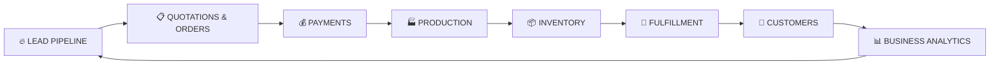
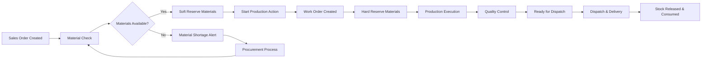
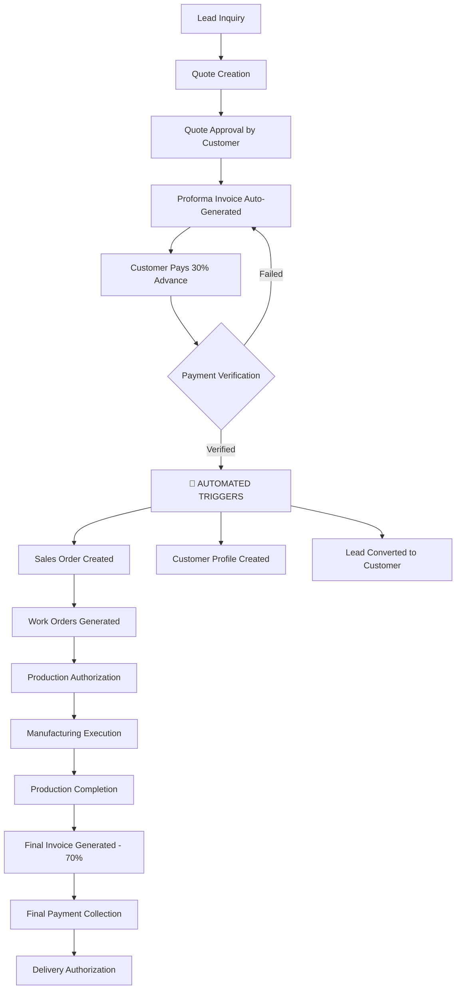

# Business Processes - ElevateIdea 360° Platform

> **📋 USE CASE TRACKING**: For detailed implementation status of all 272 use cases, see **[USE_CASES_MASTER.md](/docs/USE_CASES_MASTER.md)**  
> **🔄 This Document**: Provides complete business context and workflow details  
> **⚡ Quick Updates**: Use USE_CASES_MASTER.md for status updates, this document for business understanding

---

## 📚 **TABLE OF CONTENTS**

### **🎯 FOUNDATION & OVERVIEW**
- [**LEAD MANAGEMENT TERMINOLOGY & SYSTEM ARCHITECTURE**](#lead-management-terminology--system-architecture)
- [**OVERVIEW**](#overview)
- [**8-STAGE BUSINESS PIPELINE OVERVIEW**](#8-stage-business-pipeline-overview)
- [**DASHBOARD-TO-PROCESS MAPPING**](#dashboard-to-process-mapping)
- [**CORE BUSINESS PHILOSOPHY**](#core-business-philosophy)

### **🔧 KEY BUSINESS CONCEPTS**
- [**CRM MODULE ARCHITECTURE**](#crm-module-architecture)
- [**CRITICAL DOCUMENT HIERARCHY: SALES ORDER vs WORK ORDER**](#critical-document-hierarchy-sales-order-vs-work-order)
- [**CUSTOMER ORDER TYPES & BUSINESS MODEL ARCHITECTURE**](#customer-order-types--business-model-architecture)

### **🔄 COMPLETE 8-STAGE BUSINESS PIPELINE**
- [**Stage 1: Lead Generation & Capture**](#stage-1-lead-generation--capture)
- [**Stage 2: Commercial Document Management**](#stage-2-commercial-document-management)
- [**Stage 3: Quote Lifecycle Management**](#stage-3-quote-lifecycle-management)
- [**Stage 4: Manufacturing Execution & Work Order Management**](#stage-4-manufacturing-execution--work-order-management)
- [**Stage 5: Supply Chain & Materials Management**](#stage-5-supply-chain--materials-management)
- [**Stage 6: Delivery & Order Completion**](#stage-6-delivery--order-completion)
- [**Stage 7: Customer Relationship & Lifecycle Management**](#stage-7-customer-relationship--lifecycle-management)
- [**Stage 8: Business Intelligence & Performance Analytics**](#stage-8-business-intelligence--performance-analytics)

### **📋 CROSS-CUTTING BUSINESS CONTEXT**
- [**Textile Industry Context & Operational Workflows**](#textile-industry-context--operational-workflows)
- [**Enhanced Business Rules & Validation Logic**](#enhanced-business-rules--validation-logic)
- [**Management Decision Framework for MSME Operations**](#management-decision-framework-for-msme-operations)

### **🚀 AUTOMATED SYSTEMS**
- [**AUTOMATED LEAD-TO-CUSTOMER CONVERSION SYSTEM**](#automated-lead-to-customer-conversion-system)
- [**CROSS-PROCESS DASHBOARD INTELLIGENCE**](#cross-process-dashboard-intelligence)
- [**CRITICAL SUCCESS FACTORS**](#critical-success-factors)
- [**PLATFORM INTEGRATION BENEFITS**](#platform-integration-benefits)

### **🚨 BUSINESS RULES & COMPLIANCE**
- [**CRITICAL BUSINESS RULES & DATA INTEGRITY**](#critical-business-rules--data-integrity)
- [**COMPLETE COMMERCIAL-TO-PRODUCTION WORKFLOW SUMMARY**](#complete-commercial-to-production-workflow-summary)

### **🎨 USER EXPERIENCE**
- [**UI/UX FLOW & USER JOURNEY**](#uiux-flow--user-journey)
- [**UNIVERSAL PLATFORM CAPABILITIES**](#universal-platform-capabilities)
- [**VOICE COMMAND ACTION MAPPING**](#voice-command-action-mapping)

### **🔗 IMPLEMENTATION REFERENCE**
- [**USE CASE SPECIFICATIONS**](#use-case-specifications)
- [**ACTION-TO-MODULE IMPLEMENTATION MAP**](#action-to-module-implementation-map)

---

> **Quick Navigation Tips:**
> - Click any section link above to jump directly to that content
> - Use `Ctrl+F` (or `Cmd+F` on Mac) to search for specific terms
> - This document focuses on **business workflows** - see `/docs/PRODUCT_REQUIREMENTS.md` for technical specifications

---

## Lead Management Terminology & System Architecture

### Core Entity Architecture

The ElevateIdea 360° platform uses a sophisticated lead management system built around two core entities that work together to handle both new prospect acquisition and existing customer relationship management.

#### BusinessProfile: The Universal Company Record

**BusinessProfile** serves as the master record for any company or organization, regardless of their current relationship status with our business.

**Key Characteristics:**
- **Universal Creation**: Every lead inquiry automatically creates or references a BusinessProfile
- **Status Driven**: `customerStatus` field determines prospect vs customer treatment
- **Single Source of Truth**: All company information, contact details, and business metrics centralized
- **Relationship Evolution**: Status evolves from 'prospect' → 'customer' based on payment behavior

**BusinessProfile Status Values:**
- `prospect` - Company has made inquiries but no advance payments yet
- `customer` - Company has made at least one advance payment (30% payment received)
- `inactive` - Former customer with no recent business activity

#### Lead: The Project-Specific Inquiry Record

**Lead** represents a specific business inquiry or project from a company, whether they are a new prospect or existing customer.

**Key Characteristics:**
- **Project Specific**: Each inquiry creates a separate lead record
- **BusinessProfile Linked**: Always references a BusinessProfile (created or existing)
- **Conversion Tracking**: `conversionStatus` tracks progression through sales process
- **Multiple Per Company**: One BusinessProfile can have many leads over time (repeat business)

### Dual Lead Flow System

The platform handles two fundamentally different types of business inquiries through the same lead management interface:

#### Flow 1: New Prospect Acquisition

```
New Company Inquiry → Create Lead + Create New BusinessProfile (prospect status) → Quote Process → Advance Payment → Sales Order Creation + BusinessProfile Updated (customer status)
```

**Process Details:**
1. **Inquiry Received**: New company contacts us for first time
2. **Lead Creation**: System creates new Lead record
3. **BusinessProfile Creation**: System creates new BusinessProfile with `customerStatus: 'prospect'`
4. **Sales Process**: Lead progresses through quote → proforma → payment stages
5. **Conversion**: Upon advance payment receipt, BusinessProfile status updates to 'customer'
6. **Completion**: Sales order created, lead moves to historical status

**Example from Mock Data:**
- Lead ID: `lead-001` (Mumbai Cotton Mills)
- BusinessProfile ID: `bp-mumbai-cotton-mills` 
- Status: New prospect, never made payment before

#### Flow 2: Existing Customer Repeat Business

```
Existing Customer Inquiry → Create Lead + Reference Existing BusinessProfile (customer status) → Quote Process → Advance Payment → Sales Order Creation (no status change needed)
```

**Process Details:**
1. **Repeat Inquiry**: Existing customer makes new business inquiry
2. **Lead Creation**: System creates new Lead record for this specific inquiry
3. **BusinessProfile Reference**: Lead links to existing BusinessProfile with `customerStatus: 'customer'`
4. **Sales Process**: Lead progresses through quote → proforma → payment stages
5. **Order Creation**: Upon advance payment, new Sales Order created directly
6. **Completion**: Lead moves to historical status, BusinessProfile status unchanged

**Example from Mock Data:**
- Lead ID: `lead-cust-001` (Gujarat Garments repeat business)
- BusinessProfile ID: `bp-gujarat-garments` (existing customer)
- Status: Existing customer making additional inquiry

### Lead Lifecycle Stages

Every lead progresses through defined stages tracked in the `conversionStatus` field:

#### Active Lead Stages (Visible in Lead Management)

1. **`active_lead`** - Initial inquiry received and recorded
   - Lead created, basic requirements captured
   - Initial contact and qualification in progress
   - Ready for quote preparation

2. **`quote_sent`** - Quote provided to prospect/customer
   - Professional quote document sent
   - Awaiting customer response and feedback
   - Follow-up activities scheduled

3. **`verbally_approved`** - Customer agreed to quote terms
   - Verbal confirmation received from customer
   - Preparing formal proforma invoice
   - Moving toward payment collection

4. **`proforma_sent`** - Formal proforma invoice sent
   - Official payment request document delivered
   - Advance payment amount specified
   - Payment deadline communicated

5. **`awaiting_payment`** - Payment collection in progress
   - Customer committed to payment
   - Following up on payment status
   - Ready for conversion upon payment receipt

#### Conversion Completion Stage

6. **`converted_to_order`** - Sales order created, lead converted
   - Advance payment received and verified
   - Sales order automatically generated
   - Lead moved to historical status
   - **Critical**: Lead no longer appears in active lead management

### Active vs Historical Data Management

The platform maintains a clear distinction between active workflow data and historical records:

#### Active Data Display Rules

**Active Leads** (visible in Lead Management interface):
- Include leads with status: `active_lead`, `quote_sent`, `verbally_approved`, `proforma_sent`, `awaiting_payment`
- Exclude leads with status: `converted_to_order`
- Used for daily workflow management and follow-up activities

**Active Quotes** (visible in Quote Management interface):
- Include quotes linked to active leads only
- Exclude quotes from converted leads (sales order created)
- Used for ongoing negotiations and quote management

#### Historical Data Preservation

**Historical Records** (available through reports and search):
- All leads preserved in database regardless of conversion status
- All quotes maintained for audit trail and reference
- Complete interaction history maintained for business intelligence
- Accessible through dedicated historical views when needed

#### Sales Order Creation as Conversion Trigger

**Critical Business Rule**: Sales Order creation marks the completion of lead conversion
- Lead.conversionStatus automatically updates to `converted_to_order`
- Lead disappears from active lead management workflow
- Associated quotes disappear from active quote management
- All data preserved for historical reference and compliance

### Business Rules & Data Integrity

#### Universal BusinessProfile Creation
- **Rule**: Every lead inquiry must have an associated BusinessProfile
- **New Prospects**: System creates new BusinessProfile with prospect status
- **Existing Customers**: System references existing BusinessProfile with customer status
- **Data Integrity**: No orphaned leads without BusinessProfile references

#### Customer Status Evolution
- **Prospect → Customer**: Triggered exclusively by advance payment receipt
- **No Manual Override**: Customer status cannot be manually changed
- **Payment Verification**: Bank reconciliation required before status update
- **Audit Trail**: Complete history of status changes maintained

#### Active Workflow Management
- **Active Filter**: Only unconverted leads appear in daily workflow
- **Historical Access**: Converted leads accessible through reports only
- **Quote Visibility**: Quote active status follows lead active status
- **Cross-Module Consistency**: All modules respect active vs historical distinction

### Practical Examples from System Data

#### New Prospect Example
```
Lead: lead-001 (Mumbai Cotton Mills - first inquiry)
BusinessProfile: bp-mumbai-cotton-mills (prospect status)
Quote: QT-001 (active quote for industrial cotton fabric)
Status: quote_sent (visible in active lead management)
```

#### Existing Customer Example
```
Lead: lead-cust-001 (Gujarat Garments - repeat business)
BusinessProfile: bp-gujarat-garments (customer status - already converted)
Quote: QT-CUST-001 (active quote for seasonal collection)
Status: quote_sent (visible in active lead management for this new inquiry)
```

#### Converted Lead Example
```
Lead: gujarat-002 (Gujarat Garments - completed conversion)
BusinessProfile: bp-gujarat-garments (customer status)
Quote: QT-GJ-002 (historical quote - order created)
Status: converted_to_order (NOT visible in active lead management)
Sales Order: SO-003 (created from this lead conversion)
```

### Integration with Business Process Flow

This lead management system integrates seamlessly with the 8-stage business pipeline:

- **Stage 1 (Lead Pipeline)**: Active leads and quotes managed here
- **Stage 2 (Quotations & Orders)**: Active quotes transition to sales orders
- **Stage 3 (Payments)**: Payment receipt triggers customer conversion
- **Stage 7 (Customers)**: Customer 360° view shows BusinessProfile with customer status
- **Stage 8 (Analytics)**: Historical data drives business intelligence and reporting

---

## Overview
This document outlines the complete lead-to-customer conversion flow for Gujarat textile manufacturers, capturing the real-world business processes that map directly to the 8-stage dashboard organization. The ElevateIdea platform mirrors these natural business workflows through sequential process-driven dashboard design.

## **8-STAGE BUSINESS PIPELINE OVERVIEW**

The ElevateIdea 360° platform is built around the **natural flow of textile manufacturing business operations**, from initial customer inquiry to final delivery and relationship management. Understanding this 8-stage pipeline is crucial for both business stakeholders and the development team.

### **The Complete Business Journey:**



### **Quick Stage Overview:**

1. **🔥 LEAD PIPELINE** - *Customer Acquisition*
   - **Purpose**: Capture and nurture potential customers
   - **Key Action**: "કોણ call કર્યો?" (Who called?)
   - **Output**: Qualified leads ready for quotes

2. **📋 QUOTATIONS & ORDERS** - *Commercial Workflow*
   - **Purpose**: Convert leads to paying customers through quotes and orders
   - **Key Action**: "કયા quotes મોકલવા?" (Which quotes to send?)
   - **Output**: Approved quotes with business profiles

3. **💰 PAYMENTS** - *Financial Hub & Customer Creation Gate*
   - **Purpose**: Collect advance payments and automatically create customers
   - **Key Action**: "કોની advance લેવાની?" (Whose advance to collect?)
   - **Critical**: 30% advance payment = Lead becomes Customer

4. **🏭 PRODUCTION** - *Manufacturing Execution*
   - **Purpose**: Transform customer orders into finished products
   - **Key Action**: "આજે શું બનાવવું?" (What to make today?)
   - **Output**: Quality-checked finished goods

5. **📦 INVENTORY** - *Supply Chain Management*
   - **Purpose**: Manage materials and finished goods efficiently
   - **Key Action**: "કેટલો stock છે?" (How much stock?)
   - **Integration**: Production ↔ Materials ↔ Fulfillment

6. **🚚 FULFILLMENT** - *Delivery & Completion*
   - **Purpose**: Get products to customers professionally and on time
   - **Key Action**: "કયા orders ready છે?" (Which orders are ready?)
   - **Output**: Delivered orders with customer satisfaction

7. **🤝 CUSTOMERS** - *Relationship Management*
   - **Purpose**: Maintain relationships and drive repeat business
   - **Key Action**: "મારા best customers કોણ?" (Who are my best customers?)
   - **Outcome**: Loyal customers generating repeat business

8. **📊 BUSINESS ANALYTICS** - *Intelligence & Optimization*
   - **Purpose**: Monitor performance and identify improvement opportunities
   - **Key Action**: "Dhanda કેમ ચાલે છે?" (How's business going?)
   - **Value**: Data-driven decisions for business growth

### **Critical Business Gates:**
- **Gate 1**: Lead → Quote (qualification process)
- **Gate 2**: Quote → Customer (30% advance payment) 🚨 **AUTOMATED**
- **Gate 3**: Customer → Production (sales order authorization)
- **Gate 4**: Production → Delivery (quality approval)
- **Gate 5**: Delivery → Loyalty (customer satisfaction)

### **Why This Sequence Matters:**
✅ **Natural Business Flow**: Matches how textile manufacturers actually work  
✅ **Logical Dependencies**: Each stage builds on the previous one  
✅ **Clear Handoffs**: Defined trigger points between stages  
✅ **Measurable Progress**: Track business performance at each stage  
✅ **User-Friendly**: Intuitive navigation for non-technical users

## **DASHBOARD-TO-PROCESS MAPPING**

### **8-Stage Business Process = 8 Dashboard Cards**
The platform dashboard is organized as a **digital mirror of textile manufacturing business reality**, with each business process stage corresponding to a dashboard card:

```
BUSINESS PROCESS STAGE          DASHBOARD CARD                MVP MODULES
1. Lead Generation & Capture → 🔥 LEAD PIPELINE           → Lead Management + CRM + Voice
2. Commercial Workflow      → 📋 QUOTATIONS & ORDERS     → Quotations + Sales Orders (post-payment)  
3. Financial Workflow       → 💰 PAYMENTS                → Proforma + Advance + Final + Collection
4. Manufacturing Execution  → 🏭 PRODUCTION               → Work Orders + Manufacturing + Quality
5. Supply Chain Management  → 📦 INVENTORY                → Stock + Procurement + Materials Planning  
6. Delivery & Completion    → 🚚 FULFILLMENT             → Dispatch + Delivery + Order Completion
7. Relationship Management  → 🤝 CUSTOMERS                → Customer 360° + Feedback + Loyalty
8. Business Intelligence    → 📊 BUSINESS ANALYTICS       → Reports + KPIs + Performance Analytics
```

**Key Design Principle**: Dashboard sequence matches the natural flow of textile manufacturing business operations, eliminating cognitive friction and providing intuitive navigation.

**Cross-Document References**:
- **Feature Requirements**: See `/docs/PRODUCT_REQUIREMENTS.md` for detailed feature specifications and system requirements based on these business processes
- **Dashboard Implementation**: See `/docs/DASHBOARD_SPECIFICATIONS.md` for complete dashboard design details, component specifications, and recent improvements
- **UI/UX Implementation**: See `/docs/DESIGN_SYSTEM.md` for visual design patterns that implement this business process flow

**Document Purpose**: This document provides the business context and domain knowledge that drives product and design decisions. Use this to understand WHY the system is organized in 8 sequential process stages and HOW textile manufacturers actually work.

---

## **CORE BUSINESS PHILOSOPHY**

### **Automated Lead-to-Customer Conversion**

The ElevateIdea 360° platform is built on a fundamental business philosophy: **streamlined, intelligent automation of the textile manufacturing sales cycle**. Our approach eliminates manual data entry redundancy while maintaining complete business control and transparency.

#### **Central Business Logic: The Payment Trigger**

**🎯 Core Principle**: *"30% advance payment = Lead automatically becomes Customer"*

This simple rule drives the entire platform's intelligent automation:

- **Before Payment**: Contact remains a "Lead" in the system
- **After 30% Advance**: Lead automatically converts to "Customer" with full business profile
- **Zero Manual Work**: Business profile data flows seamlessly from lead to customer record
- **Instant Access**: All order history, payment records, and production details available immediately

#### **Business Intelligence in Action**

**Smart Data Flow**:
```
Lead Data → Quote Creation → Payment Collection → Customer Creation → Order Management
   ↓              ↓               ↓                 ↓                ↓
Contact Info  → Business Profile → Financial Record → Customer 360° → Production Flow
```

**What This Means for Business Operations**:
- **No Duplicate Data Entry**: Enter customer details once during quotation, use everywhere
- **Instant Customer Access**: Payment receipt immediately creates full customer profile
- **Complete Business Context**: Every interaction has full business history available
- **Seamless Handoffs**: Sales to production transition happens automatically

#### **Textile Manufacturing Alignment**

**Real Business Flow Mapping**:
1. **Inquiry Stage**: Lead with basic contact information
2. **Quote Stage**: Enhanced with detailed business profile for professional documentation
3. **Payment Stage**: Advance payment triggers automatic customer creation
4. **Production Stage**: Full customer context available for manufacturing teams
5. **Relationship Stage**: Complete business history drives future interactions

**Key Business Benefits**:
- ✅ **Eliminate Manual Work**: No redundant data entry between sales and production teams
- ✅ **Maintain Data Accuracy**: Single source of truth for customer information
- ✅ **Accelerate Operations**: Instant access to complete business context
- ✅ **Professional Documentation**: Automatically generated business profiles for formal processes
- ✅ **Team Coordination**: Seamless information sharing between departments

#### **Platform Intelligence Features**

**Automated Business Logic**:
- **Smart Customer Creation**: Payment processing automatically generates customer records
- **Intelligent Data Inheritance**: Lead information becomes customer foundation
- **Context-Aware Navigation**: System knows relationship status and shows relevant options
- **Business-Driven Workflows**: Process flows match real textile manufacturing operations

**MSME-Focused Design**:
- **Zero Learning Curve**: Follows natural business thinking patterns
- **Mobile-First Operations**: Designed for factory floor and client meeting environments
- **Voice-Enabled Interactions**: Hands-free operation during manufacturing tasks
- **Multilingual Support**: Gujarati, Hindi, English for complete team accessibility

---

## **CRM MODULE ARCHITECTURE**

### **Unified CRM System with Intelligent Views**
The platform implements a single, unified CRM module that automatically displays the appropriate view based on the contact's status:

#### **CRM Module Structure**
```
CRM MODULE (Single Unified System)
├── Prospect View (displayed in LEAD PIPELINE business area)
│   ├── Contact management for prospects/leads only
│   ├── Lead interaction tracking and follow-up scheduling
│   ├── Lead scoring and prioritization
│   └── Conversion preparation and nurturing
└── Customer 360° View (displayed in CUSTOMERS business area)
    ├── Complete business profiles for paying customers only
    ├── Order history and financial analytics
    ├── Relationship intelligence and lifecycle management
    └── Strategic account planning and growth opportunities
```

#### **Automatic View Switching**
- **Before Advance Payment**: Contact appears in CRM Prospect View (LEAD area)
- **After Advance Payment**: Contact automatically transfers to CRM Customer 360° View (CUSTOMER area)
- **Same Person, Same CRM Module**: Different views based on business relationship status

#### **Data Continuity**
- **Complete History Preserved**: All interactions from prospect stage transfer to customer stage
- **Seamless Transition**: No data loss during prospect-to-customer conversion
- **Unified Database**: Same contact record, different interface based on payment status
- **Business Logic**: Payment status determines which view displays the contact

---

## **CRITICAL DOCUMENT HIERARCHY: SALES ORDER vs WORK ORDER**

### **Commercial Documents vs Production Documents**

Understanding the distinction between **Sales Orders** and **Work Orders** is fundamental to textile business operations:

#### **Sales Order (Master Commercial Document)**
- **Created When**: Advance payment (30%) received from customer
- **Purpose**: Master customer order authorizing complete business transaction
- **Contains**: 
  - Customer requirements and specifications
  - Commercial terms (pricing, payment schedule, delivery)
  - Total order value and profit margins
  - Delivery commitments and logistics
- **Scope**: Entire customer order (could be multiple products/batches)
- **Example**: "SO-2024-001: Rajesh Textiles - 1000m Cotton Fabric Order (₹2,40,000)"
- **Business Function**: Customer-facing commercial management

#### **Work Order (Production Sub-Component)**
- **Created From**: Sales Order breakdown for manufacturing execution
- **Purpose**: Specific production instructions for manufacturing teams
- **Contains**:
  - Detailed production specifications and processes
  - Material requirements and machine allocations
  - Production timeline and quality checkpoints
  - Resource assignments (workers, machines, materials)
- **Scope**: Individual manufacturing tasks within the sales order
- **Examples**:
  - "WO-2024-001A: Weaving 500m Cotton 40s (Loom-3, 5 days)"
  - "WO-2024-001B: Dyeing 500m Natural Blue (Tank-2, 2 days)"

#### **Critical Architectural Principle: STATUS vs DELIVERED QUANTITY**

**🚨 FUNDAMENTAL DISTINCTION:**

**STATUS = Process/Workflow Stage** (Sales Order Level Only)
- **Production Status**: "order_confirmed", "production_started", "quality_check", "ready_to_ship"
- **Material Status**: "materials_ready", "materials_pending", "supplier_delayed"  
- **Process Status**: "weaving_stage", "dyeing_in_progress", "quality_testing"
- **Purpose**: Workflow management, business decisions, customer communication
- **Level**: Sales Order level ONLY - never at item level

**DELIVERED QUANTITY = Physical Completion** (Item Level)
- **Physical Tracking**: `deliveredQuantity` vs `orderedQuantity` per item
- **Purpose**: Partial delivery support, invoice reconciliation, inventory tracking
- **Level**: Item level for flexibility (MVP: no partial delivery, but structure supports future)
- **Business Example**: "750m of 1500m completed" (quantity), while order status is "in_production" (stage)

**🎯 Complete Architecture:**
- ✅ **Sales Order Level**: All STATUS tracking (production, material, process stages)
- ✅ **Work Order Level**: Execution tasks that roll up to Sales Order status
- ✅ **Item Level**: DELIVERED QUANTITY tracking only (physical completion)
- ❌ **Item Status**: Never - items don't have status, only completion quantities
- ❌ **Item → WO Mapping**: Items don't map to WOs, Sales Orders map to WOs

**Business Logic Example:**
```
Sales Order SO-002: Gujarat Garments Cotton Fabric Order
├── STATUS (Process Stage - SO Level):
│   ├── status: "production_started" ← Workflow stage
│   ├── productionStatus: "dyeing_stage" ← Detailed process info
│   └── materialStatus: "all_materials_ready" ← Material availability
├── ITEMS (Physical Completion - Item Level):
│   ├── Premium Cotton Fabric: deliveredQuantity: 0/1500m ← Physical tracking
│   └── Custom Dyeing Service: deliveredQuantity: 0/1500m ← Physical tracking
├── Work Orders (Execution - SO Level):
│   ├── WO-001: Yarn preparation (completed)
│   ├── WO-002: Weaving process (completed) 
│   ├── WO-003: Dyeing process (in_progress) ← Current stage
│   └── WO-004: Finishing process (pending)
└── Customer Communication: "Your order is in dyeing stage" ← STATUS-based
```

**MVP Implementation:**
- **Status Tracking**: Fully implemented at SO level
- **Delivered Quantity**: Structure ready, MVP sets to 0 (no partial delivery)
- **Future Flexibility**: Can enable partial delivery without architectural changes

**Why SO-Level Status:**
- **MSME Business Reality**: Owner thinks "customer order status" not "item status"
- **Production Reality**: Textile orders typically processed together in batches
- **Customer Communication**: Single status update per order simplifies communication
- **System Simplicity**: Avoid over-engineering for MSME requirements

**Work Order Function**: Internal production management and task execution

#### **Document Relationship Hierarchy**
```
Sales Order (1) → Work Orders (Many)
     ↓                    ↓
Commercial View      Production View
Customer-facing      Internal execution
Business terms      Manufacturing tasks
Order management     Production planning
```

### **Business Area Mapping**
- **📋 QUOTATIONS & ORDERS** → Manages **Sales Orders** (commercial documents)
- **🏭 PRODUCTION** → Manages **Work Orders** (manufacturing execution)

This separation ensures:
- **Commercial clarity** for customer relationships
- **Production efficiency** for manufacturing teams  
- **Proper authorization flow** from payment → sales order → work orders
- **Clear responsibility boundaries** between sales and production teams

---

## Customer Order Types & Business Model Architecture

### Overview of Order Types

The ElevateIdea 360° platform supports two distinct business models through a unified order management system. Understanding these order types is crucial for proper workflow management, material ownership handling, and production planning.

### Customer Order Concept

From a **customer perspective**, they place a "Customer Order" - a request for textile services or products. Internally, the platform processes these customer orders through two distinct business model paths based on material ownership and risk profile.

### Document ID Naming Convention

The platform uses a standardized naming convention to avoid confusion between different order types and ensure clear document identification throughout the workflow.

#### Sales Order Level (Customer-Facing Orders)
- **Job Orders**: `JO-YYYY-NNN` (e.g., `JO-2024-001`)
  - Services like dyeing, finishing, printing, weaving
  - Customer provides materials (material ownership: client)
  - Payment typically after service completion

- **Product Orders**: `PRD-YYYY-NNN` (e.g., `PRD-2024-001`)  
  - Manufactured textile products
  - Company provides materials (material ownership: company)
  - Payment typically with advance

#### Production Order Level (Manufacturing Execution)
- **Production Orders for Job Orders**: `PROD-JO-YYYY-NNN-XX` (e.g., `PROD-JO-2024-001-01`)
- **Production Orders for Product Orders**: `PROD-PRD-YYYY-NNN-XX` (e.g., `PROD-PRD-2024-001-01`)

#### Supporting Documents
- **Quotes**: `QT-JO-NNN` / `QT-PRD-NNN`
- **Invoices**: `INV-JO-YYYY-NNN` / `INV-PRD-YYYY-NNN` 
- **Work Orders**: `WO#NNN` (specific manufacturing tasks)
- **Inward Entry**: `IE-NNN` (customer materials for Job Orders only)
- **Goods Receipt Note**: `GRN-NNN` (purchased materials for inventory)

#### Business Process Flow
- **Job Orders** → Customer materials → **Inward Entry (IE)** → **Production Order (PROD-JO)**
- **Product Orders** → Company materials → **Inventory reservation** → **Production Order (PROD-PRD)**  
- **GRN** → Updates inventory → No direct link to Production Orders

This naming convention ensures clear distinction between order types and eliminates confusion between Sales Orders, Production Orders, and Purchase Orders throughout the system.

### Technical Architecture: CustomerOrder Base Interface

All customer orders inherit from a common `CustomerOrder` base interface that captures universal commercial information:

```typescript
// Base interface for all customer orders (generic term)
interface CustomerOrder {
  id: string;
  businessProfileId: string;
  items: OrderItem[];
  totalAmount: number;
  status: OrderStatus;
  orderDate: string;
  materialOwnership: 'company' | 'client';
}
```

### Business Model 1: Sales Orders (Product Sales)

**Material Ownership**: Company owns materials  
**Business Model**: Traditional product sales  
**Customer Payment**: Full payment upfront or credit terms  
**Risk Profile**: Company bears material cost risk  

#### Key Characteristics:
- **Purpose**: Selling company-owned finished textile products
- **Material Source**: Company procures raw materials for inventory
- **Production Planning**: Company-driven based on demand forecasting
- **Payment Terms**: Standard sales terms, often credit-based for established customers
- **Inventory Impact**: Products sold from company inventory or produced for stock

#### Business Examples:
- Ready-made fabric sales to garment manufacturers
- Standard textile products from company inventory
- Bulk fabric orders where company sources materials

#### Technical Implementation:
```typescript
interface ProductOrder extends SalesOrder {
  materialOwnership: 'company';
  paymentTerms: 'upfront' | 'credit' | 'installments';
  inventoryType: 'stock' | 'made_to_order';
}
```

### Business Model 2: Job Orders (Service Processing)

**Material Ownership**: Client owns materials  
**Business Model**: Service processing and job work  
**Customer Payment**: 30% advance + service fees  
**Risk Profile**: Client bears material risk, company provides services  

#### Key Characteristics:
- **Purpose**: Processing client-owned materials into finished products
- **Material Source**: Client provides raw materials (fabric, yarn, etc.)
- **Production Planning**: Client material receipt triggers production planning
- **Payment Terms**: 30% advance payment mandatory, balance on delivery
- **Service Focus**: Dyeing, finishing, printing, weaving services on client materials

#### Business Examples:
- Custom dyeing services on client-provided fabric
- Finishing and printing on customer-supplied textiles
- Processing raw yarn into finished fabric for clients

#### Technical Implementation:
```typescript
interface JobOrder extends CustomerOrder {
  materialOwnership: 'client';
  advancePaymentPercentage: 30;
  serviceRequirements: {
    processes: string[];
    specifications: string;
    specialInstructions?: string;
  };
  inwardEntryRequired: true;
}
```

### Production Order Creation Rules

The platform automatically creates Production Orders based on order type and material status:

#### Sales Orders (Product Sales):
- **Trigger**: Order creation + material availability check
- **Production Order**: Created immediately if materials available
- **Material Management**: Company manages procurement and inventory

#### Job Orders (Service Processing):
- **Trigger**: Inward Entry completion (client material receipt)
- **Production Order**: Auto-created after material receipt verification
- **Material Management**: Client provides materials, tracked through inward entry

### Key Business Logic Differences

#### Payment Flow:
```
Sales Orders: 
Customer Order → Credit Check → Production → Delivery → Invoice → Payment

Job Orders:
Customer Order → 30% Advance → Material Receipt → Production → Delivery → Final Payment
```

#### Material Risk:
- **Sales Orders**: Company bears material cost and quality risk
- **Job Orders**: Client bears material cost and quality risk

#### Production Triggering:
- **Sales Orders**: Market demand and inventory optimization
- **Job Orders**: Client material availability and processing requirements

### Cross-Module Integration

#### Sales & Quotations Module:
- Manages both Sales Orders and Job Orders through unified interface
- Displays local terminology while maintaining ERP compliance in backend

#### Production Module:
- Receives Production Orders automatically based on material readiness
- Uses ERP standard terminology (Production Order, Work Order) in code
- Displays local terminology (Job Card, Lot) in UI

#### Procurement Module:
- Handles company material procurement for Sales Orders
- Manages client material inward entry for Job Orders
- Triggers Production Order creation for Job Orders after material receipt

### Status Flow by Order Type

#### Sales Order Status Flow:
```
order_confirmed → material_ready → production_started → quality_check → ready_to_ship → delivered
```

#### Job Order Status Flow:
```
order_confirmed → awaiting_material → material_received → production_started → quality_check → ready_to_ship → delivered
```

### Business Intelligence & Reporting

#### Revenue Recognition:
- **Sales Orders**: Revenue recognized at delivery
- **Job Orders**: Service revenue recognized at completion

#### Profitability Analysis:
- **Sales Orders**: Material cost + production cost vs selling price
- **Job Orders**: Labor cost + overhead vs service charges

#### Customer Relationship Management:
- **Sales Orders**: Focus on volume, payment terms, and inventory planning
- **Job Orders**: Focus on service quality, turnaround time, and material handling

---

## Complete Business Pipeline

### **Stage 1: Lead Generation & Capture**
**Dashboard Card**: 🔥 **LEAD PIPELINE** (Business Entry Point)
**Platform Modules**: Lead Management + CRM (Prospect View)

#### **Business Mental Model & Daily Workflow**
**Business Owner's Mindset**: "કોણ call કર્યો? કયા leads hot છે? આજે કોને quotes મોકલવા?"
*Translation*: "Who called? Which leads are hot? Who should I send quotes to today?"

**Daily Workflow Pattern**:
- **Morning (7-9 AM)**: Review overnight inquiries, WhatsApp messages, missed calls
- **Priority Assessment**: Categorize by urgency and potential order value
- **Immediate Actions**: Return calls to hot leads, gather missing specifications
- **Planning**: Schedule follow-ups, prepare quote requirements for ready leads

#### **Lead Sources & Channels**
- **Direct Inquiries**: Phone calls from textile buyers and garment manufacturers
- **WhatsApp Business**: Messages with fabric requirements and specifications
- **Referrals**: Recommendations from existing satisfied customers
- **Trade Shows**: Contacts from textile exhibitions in Ahmedabad, Surat, Mumbai
- **Website Forms**: Online inquiries through company website
- **Walk-ins**: Direct visits to factory/showroom

**Lead Information Captured:**
- **Company Details**: Name, location, business type (garment manufacturer, trader, retailer)
- **Contact Person**: Name, designation, phone number, WhatsApp number
- **Material Requirements**: Fabric type, width, quantity needed
- **Technical Specifications**: GSM, treatments (pre-shrunk, mercerized), dye requirements
- **Color Preferences**: Solid colors, prints, patterns, color matching requirements
- **Usage Purpose**: End product (sarees, kurtas, bedsheets, industrial use)
- **Budget Range**: Expected price per meter or total budget
- **Timeline**: Required delivery date, urgency level
- **Competition**: Other suppliers being considered

**Lead Prioritization:**
- **🔥 Hot Lead**: Immediate requirement (within 15 days), budget confirmed, ready to place order
- **⭐ Warm Lead**: Near-term requirement (15-30 days), comparing 2-3 suppliers, budget discussed
- **❄️ Cold Lead**: Future requirement (30+ days), price shopping, relationship building

---

### **Stage 2: Commercial Document Management**
**Dashboard Card**: 📋 **QUOTATIONS & ORDERS** (Commercial Workflow)
**Platform Modules**: Quotation Management + Sales Order Management + Commercial Analytics

#### **Business Area Scope**
This business area manages the complete commercial document lifecycle:
1. **Quotations**: Price proposals and commercial negotiations (pre-payment)
2. **Sales Orders**: Master customer orders (created after advance payment received)
3. **Commercial Analytics**: Quote-to-order conversion and commercial performance

#### **Business Mental Model & Daily Workflow**
**Business Owner's Mindset**: "કયા quotes મોકલવા? કયા approved છે? કયા orders બનાવવા?"
*Translation*: "Which quotes to send? Which are approved? Which orders to create?"

**Daily Workflow Pattern**:
- **Mid-Morning (9-11 AM)**: Prepare quotes for qualified leads from morning review
- **Calculation Process**: Consider material costs, production capacity, delivery timeline
- **Pricing Strategy**: Factor in customer relationship, order size, market conditions
- **Follow-up Tracking**: Monitor quote responses, negotiate terms, handle revisions

#### **Quote Creation Process**
1. **Lead Review**: Analyze captured lead requirements and specifications
2. **Cost Calculation**: 
   - Raw material costs (yarn, dyes, chemicals)
   - Manufacturing costs (labor, machine time, power)
   - Quality control and testing costs
   - Packaging and transportation
   - Margin calculation
3. **Quote Preparation**:
   - Quote number generation (QT-YYYY-XXX format)
   - Detailed specifications matching lead requirements
   - Per meter pricing with quantity breaks
   - Total order value calculation
   - Payment terms (advance %, final payment schedule)
   - Delivery timeline and logistics
   - Validity period (typically 7-15 days)
   - Terms and conditions

**Multiple Quote Scenarios:**
- **Quantity Variations**: Full order vs. trial order vs. bulk pricing
- **Specification Changes**: Different GSM, treatments, or quality grades
- **Price Negotiations**: Revised quotes after customer feedback
- **Alternative Proposals**: Substitute materials or processes to meet budget
- **Rush Orders**: Premium pricing for expedited delivery

**Quote Communication:**
- **WhatsApp**: PDF quote with fabric samples photos
- **Email**: Formal quote document with company letterhead
- **Phone Calls**: Verbal discussion of specifications and pricing
- **Physical Samples**: Courier fabric swatches for approval

#### **Enhanced Commercial Document Lifecycle with Structured Items**

The enhanced platform transforms traditional string-based item descriptions into comprehensive structured data that flows seamlessly through the entire commercial lifecycle, enabling professional GST compliance, precise material planning, and complete traceability for MSME textile manufacturers.

**Complete Document Progression**:
```
Quote (Structured Items) → ProformaInvoice (Items + Tax) → SalesOrder (Items + Production) → Final Invoice (Complete Compliance)
```

#### **Enhanced Quote Structure for Professional Presentation**

**Business Logic**: Professional presentation with detailed item specifications for customer confidence

**Enhanced Quote Structure**:
- **Item Code**: Professional textile codes (TEX-PREM-001, TEX-SEAS-002)
- **HSN Classification**: Accurate HSN codes for tax compliance preparation
- **Detailed Specifications**: Quantity, unit, rate with clear descriptions
- **Tax Readiness**: Structured data ready for GST calculations

**MSME Business Benefit**: 
- Professional customer presentation increases quote acceptance rates
- Accurate HSN codes prevent tax compliance issues
- Detailed breakdown enables precise material cost calculations
- Customer confidence in professional documentation standards

**Business Scenario Example**:
```
Quote for Baroda Fashion House:
- TEX-PREM-001: Premium Cotton Fabric, HSN 5208, 1000 meters @ ₹200/meter
- TEX-DYE-001: Custom Dyeing Service, HSN 9983, 1000 meters @ ₹25/meter
Total: ₹225,000 + applicable taxes
```

#### **ProformaInvoice with Tax Calculations**

**Business Logic**: Advance payment request with complete tax transparency for customer and regulatory compliance

**Enhanced ProformaInvoice Features**:
- **Item-wise Tax Calculation**: Individual CGST/SGST per item based on HSN codes
- **Customer Tax Transparency**: Clear breakdown of base amount vs. tax amounts
- **Advance Payment Clarity**: Percentage-based advance calculation on total including taxes
- **Regulatory Compliance**: Proper tax invoice format for advance payment requests

**MSME Business Benefit**:
- Clear customer communication about total costs including taxes
- Regulatory compliance for advance payment requests
- Accurate cash flow planning with tax-inclusive amounts
- Professional documentation for customer accounting departments

#### **SalesOrder with Production Integration**

**Business Logic**: Master production document linking customer requirements to manufacturing execution with material planning integration

**Enhanced SalesOrder Capabilities**:
- **Production-Ready Specifications**: Items linked to material requirements and production processes
- **Material Status Integration**: Real-time visibility of material availability per item
- **Delivery Tracking**: Production progress and delivery status per item
- **Customer Communication**: Item-specific status updates and delivery commitments

**MSME Business Benefit**:
- Clear production planning based on customer requirements
- Material readiness validation before production commitments
- Item-specific delivery tracking for customer communication
- Integrated view of customer orders and production capabilities

#### **FinalInvoice with Complete Compliance**

**Business Logic**: Professional GST-compliant final billing with complete item traceability from quote to delivery

**Enhanced FinalInvoice Features**:
- **Complete Tax Compliance**: Full CGST/SGST/IGST calculations with HSN code accuracy
- **Item Delivery Reconciliation**: Actual delivered quantities vs. ordered quantities
- **Professional Documentation**: Industry-standard invoice format for customer accounting
- **Payment Reconciliation**: Advance payment adjustments and balance due calculations

**MSME Business Benefit**:
- Professional invoicing builds customer confidence and relationship strength
- Complete tax compliance prevents regulatory issues and penalties
- Accurate delivery documentation for dispute resolution
- Clear payment tracking for cash flow management

---

### **Stage 3: Quote Lifecycle Management**  
**Dashboard Card**: 📋 **QUOTATIONS & ORDERS** (Conversion Stage - Continued)
**Platform Modules**: Quotation Management + Sales Order Creation + Quote Analytics

**Quote Status Tracking:**
- **⏳ Pending**: Quote sent, waiting for customer response
- **🔄 Under Discussion**: Customer has questions, negotiations ongoing
- **✅ Approved**: Customer accepted quote, ready for advance payment
- **❌ Rejected**: Customer declined (documented reason: price, specs, timeline)
- **🔄 Revised**: New quote created based on customer feedback
- **🔥 Expired**: Validity period passed, requires follow-up or re-quote

**Customer Interaction Management:**
- **Follow-up Schedule**: Automated reminders for quote follow-ups
- **Negotiation History**: Record of all price discussions and spec changes
- **Competitor Analysis**: Customer mentions of competing quotes
- **Relationship Notes**: Personal details, preferences, business patterns

**Quote Revision Process:**
1. **Customer Feedback**: Price too high, specifications need adjustment
2. **Cost Re-analysis**: Review material costs, manufacturing efficiency
3. **Revised Quote**: New quote number with updated terms
4. **Comparison Tracking**: Link revised quotes to original for analysis

---

### **Stage 3: Complete Financial Workflow Management**
**Dashboard Card**: 💰 **PAYMENTS** (Financial Transaction Hub)
**Platform Modules**: Proforma Invoices + Advance Payment + Final Payment + Collection Management
**Cross-Process Flow**: 📋 QUOTATIONS & ORDERS → 💰 PAYMENTS → 🏭 PRODUCTION

#### **Business Area Scope**  
This business area manages the complete financial transaction lifecycle:
1. **Proforma Invoices**: Formal invoice generation from approved quotes
2. **Advance Payments**: 30% advance collection (critical business gate)
3. **Final Invoices**: Final invoice generation after production completion
4. **Payment Collection**: Outstanding payment tracking and collection management

#### **Business Mental Model & Daily Workflow**
**Business Owner's Mindset**: "કોની advance લેવાની? કયા payment આવ્યા? કયા customers બન્યા?"
*Translation*: "Whose advance to collect? Which payments came? Which became customers?"

**Daily Workflow Pattern**:
- **Afternoon (1-3 PM)**: Follow up on sent quotes, handle customer responses
- **Payment Collection**: Generate proforma invoices for approved quotes immediately
- **Cash Flow Management**: Track pending advances, prioritize collection calls
- **Customer Conversion**: Monitor payment receipts for automatic customer creation

#### **Automated Quote-to-Proforma Process**
1. **Customer Quote Approval**: Verbal or written confirmation of quote acceptance
2. **🤖 Automatic Proforma Generation**: System auto-creates proforma invoice from approved quote
3. **Proforma Invoice Details**:
   - Unique proforma number (PI-YYYY-XXX format)
   - Customer details (still in Lead status)
   - Complete item specifications from quote
   - Advance payment percentage and amount
   - Bank details for payment
   - Terms and conditions
   - Validity period for payment

**Advance Payment Structure:**
- **Standard**: 30-50% advance payment
- **New customers**: 50% advance payment  
- **Trusted leads**: 30% advance payment
- **Rush orders**: 100% advance payment

**Critical Business Rule**: 
- ⚠️ **Leads remain as Leads** until advance payment is received
- ⚠️ **No customer creation** until actual payment commitment
- ⚠️ **No sales orders** without verified advance payment

---

### **Stage 5: Advance Payment & Automated Customer Creation**
**Dashboard Card**: 💰 **ADVANCE PAYMENTS** (Financial Commitment Gate - Continued)
**Platform Modules**: Payment Collection + Proforma Invoices + Lead-Customer Conversion  
**Automation**: 🔄 **Automatic Lead-to-Customer Conversion**

**Payment Collection Methods:**
- **Bank Transfer**: RTGS/NEFT with bank account details
- **UPI Payments**: Digital payments for smaller amounts
- **Cheque Collection**: Traditional method with clearing time
- **Cash Payment**: For local customers (with proper receipt)

**🔄 AUTOMATED CUSTOMER CREATION PROCESS:**
**When advance payment is received and verified, the system automatically triggers:**

1. **🤖 Sales Order Auto-Creation**: 
   - Generate unique sales order (SO-YYYY-XXX) from approved quote
   - Link to proforma invoice and advance payment
   - Copy all specifications and terms from quote

2. **🤖 Lead-to-Customer Conversion**:
   - **Auto-generate Customer ID** (unique identifier)
   - **Create Customer Profile** with complete business information
   - **Migrate Lead History**: Transfer all leads, quotes, communications to customer record
   - **Update All References**: Link all existing records to new customer ID
   - **Preserve Data Integrity**: Maintain complete audit trail

3. **🤖 System Integration**:
   - Update advance payment record with customer ID
   - Link sales order to customer record
   - Trigger work order creation eligibility
   - Activate customer in CRM system

**Advanced Payment Verification & Automation:**
- **Bank Statement Monitoring**: Daily reconciliation triggers automation
- **Payment Confirmation**: Auto-notification to customer with order confirmation
- **Outstanding Tracking**: System tracks partial payments
- **Credit Terms**: Future orders automatically reference established customer

**Payment Status Tracking:**
- **💳 Requested**: Proforma invoice sent to lead
- **⏳ Pending**: Awaiting payment from lead
- **✅ Received**: Payment confirmed → **🚀 AUTO CUSTOMER CREATION**
- **⚠️ Partial**: Partial payment received, awaiting balance
- **❌ Delayed**: Payment overdue, no customer creation

---

### **Stage 4: Manufacturing Execution & Work Order Management**
**Dashboard Card**: 🏭 **PRODUCTION** (Manufacturing Execution Hub)
**Platform Modules**: Work Order Management + Manufacturing Execution + Production Tracking + Quality Control
**Cross-Process Flow**: 💰 PAYMENTS → 🏭 PRODUCTION → 📦 INVENTORY

#### **Business Area Scope**
This business area manages manufacturing execution from sales orders to completed products:
1. **Work Orders**: Production tasks created from sales orders (one sales order → multiple work orders)
2. **Manufacturing**: Production floor execution, machine scheduling, resource allocation
3. **Production Tracking**: Progress monitoring, timeline management, bottleneck identification
4. **Quality Control**: In-process quality checks, final inspection, compliance management

#### **Business Mental Model & Daily Workflow**
**Business Owner's Mindset**: "કયા orders production માં છે? આજે શું બનાવવું? Quality કેમ છે?"
*Translation*: "Which orders are in production? What to make today? How's the quality?"

**Daily Workflow Pattern**:
- **Early Morning (6-8 AM)**: Plan daily production based on order priorities
- **Resource Allocation**: Assign machines, operators, and materials to specific orders
- **Production Monitoring**: Track progress, handle quality issues, adjust schedules
- **Quality Control**: Monitor fabric GSM, width, color consistency throughout production

#### **Sales Order to Work Order Flow (Automated)**

**Prerequisites for Work Order Creation:**
- **✅ Sales Order Created**: Auto-created from approved quote after advance payment received
- **✅ Customer Converted**: Lead automatically converted to customer upon payment
- **✅ Advance Payment Verified**: 30% advance payment confirmed in bank account
- **✅ Specifications Locked**: All technical details transferred from approved quote
- **✅ Production Authorization**: Manufacturing authorized by payment receipt

**Work Order Creation Process:**
1. **Sales Order Analysis**: System analyzes sales order requirements and specifications
2. **Production Breakdown**: Complex orders split into manageable work order components
3. **Resource Planning**: Materials, machines, and workforce allocated to each work order
4. **Timeline Scheduling**: Production sequence planned based on delivery commitments
5. **Work Order Generation**: Individual work orders created with specific production instructions

**Work Order Details:**
- **WO Number**: Unique work order identifier (WO-YYYY-XXX)
- **Production Specifications**:
  - Exact fabric construction (warp, weft, weave)
  - Yarn specifications (count, quality, source)
  - Dyeing instructions (color codes, fastness requirements)
  - Finishing processes (calendering, mercerizing, sanforizing)
  - Quality parameters (GSM tolerance, width tolerance, defect limits)
- **Quantity Breakdown**:
  - Ordered quantity vs. production quantity (waste allowance)
  - Quality grades (A-grade, B-grade acceptance levels)
  - Sample quantities for approval
- **Timeline Management**:
  - Material procurement timeline
  - Production start date
  - Quality testing schedule
  - Tentative completion date
  - Buffer time for rework if needed

**Production Planning:**
- **Material Procurement**: Order yarn, dyes, chemicals based on WO requirements
- **Machine Scheduling**: Allocate loom time, dyeing time, finishing time
- **Labor Planning**: Assign skilled workers for specific processes
- **Quality Checkpoints**: Plan inspection stages throughout production

#### **Production Order & Work Order Status Lifecycle**

The manufacturing process follows a sophisticated status progression system where Production Orders and Work Orders evolve through distinct lifecycle stages. Each status change triggers specific business logic and determines visibility in different UI tabs.

##### **Production Order Status Lifecycle**

Production Orders aggregate the status of all their child Work Orders and progress through these stages:

```
awaiting_material → material_received → awaiting_work_order_creation → 
ready_for_production → in_progress → awaiting_qc → 
quality_issues (if QC rejects) | ready_for_delivery (if QC approves) → 
partial_delivery → completed
```

**Status Definitions:**
- **`awaiting_material`**: Customer fabric not yet received
- **`material_received`**: Fabric received via GRN, ready for production planning
- **`awaiting_work_order_creation`**: Material ready, work orders need to be generated
- **`ready_for_production`**: All work orders created, awaiting machine allocation
- **`in_progress`**: At least one child work order is actively being produced
- **`awaiting_qc`**: All child work orders completed, awaiting quality inspection
- **`quality_issues`**: One or more work orders rejected by QC, requires attention
- **`ready_for_delivery`**: All work orders QC approved, ready for dispatch
- **`partial_delivery`**: Some work orders delivered, others pending
- **`completed`**: All work orders fully delivered to customer

##### **Work Order (Lot) Status Lifecycle**

Individual Work Orders represent lots (single color/process) and follow this progression:

```
pending → in_progress → completed → ready_qc → 
qc_approved | qc_rejected → ready_for_delivery → 
dispatched → delivered
```

**Status Definitions:**
- **`pending`**: Work order created, awaiting machine assignment and start
- **`in_progress`**: Active production on manufacturing floor
- **`completed`**: Production finished, output ready for quality inspection
- **`ready_qc`**: Same as completed but explicitly flagged for QC workflow
- **`qc_approved`**: Quality control passed, approved for delivery
- **`qc_rejected`**: Quality control failed, requires rework or rejection
- **`ready_for_delivery`**: QC approved, ready for packaging and dispatch
- **`dispatched`**: In transit to customer
- **`delivered`**: Successfully delivered to customer
- **`rework_required`**: Returned from QC for production corrections

##### **Quality Control Status Lifecycle**

QC Items are created when Work Orders reach `completed` or `ready_qc` status:

```
pending_inspection → in_progress → approved | rejected
```

**Status Definitions:**
- **`pending_inspection`**: Work order completed, awaiting QC inspector assignment
- **`in_progress`**: QC inspector actively conducting quality checks
- **`approved`**: Quality standards met, work order cleared for delivery
- **`rejected`**: Quality standards not met, work order requires rework

**QC Results Impact:**
- **QC Approved** → Work Order status becomes `qc_approved`
- **QC Rejected** → Work Order status becomes `qc_rejected`, Production Order status becomes `quality_issues`

##### **Delivery Status Lifecycle**

Delivery Items are created only after QC approval:

```
ready_dispatch → delivery_scheduled → dispatched → delivered | failed_returned
```

**Status Definitions:**
- **`ready_dispatch`**: QC approved, ready for logistics planning
- **`delivery_scheduled`**: Vehicle and driver assigned, delivery planned
- **`dispatched`**: In transit to customer location
- **`delivered`**: Successfully delivered and customer confirmed
- **`failed_returned`**: Delivery attempt failed, item returned to facility

##### **Tab Visibility Rules**

The status progression determines when items appear in different UI tabs:

**Production Tab (Work Order Management)**:
- Shows Work Orders in: `pending`, `in_progress`, `completed`, `ready_qc`
- Filters by status: All | Pending | In Progress | Completed

**QC Tab (Quality Control)**:
- Shows Work Orders with status: `completed` OR `ready_qc`
- Only displays work orders that need quality inspection
- Filters by QC status: All | Pending Inspection | In Progress | Approved | Rejected

**Ready Tab (Delivery Management)**:
- Shows Delivery Items with any delivery status
- Only items with `qcGrade` assigned (QC must be completed)
- Filters by delivery status: All | Ready Dispatch | Scheduled | Dispatched | Delivered

**Key Business Rule**: Items flow sequentially through tabs - Production → QC → Ready. An item cannot appear in Ready tab without first completing QC workflow.

##### **Status Change Triggers**

**Production Order Status Changes When:**
- Any child Work Order status changes → Recalculate aggregated status
- All Work Orders reach same milestone → Progress Production Order status
- QC results received → Update based on approval/rejection pattern

**Work Order Status Changes When:**
- Production milestones reached → Manual or automated status update
- QC inspection completed → Automatic status update based on QC result
- Delivery events occur → Status updated by logistics workflow

**Quality Control Status Changes When:**
- Inspector assigned to Work Order → `pending_inspection` to `in_progress`
- QC inspection completed → `in_progress` to `approved`/`rejected`
- Rework completed after rejection → Reset to `pending_inspection`

This status lifecycle ensures complete traceability and proper workflow progression throughout the manufacturing and delivery process.

---

### **Stage 5: Supply Chain & Materials Management**  
**Dashboard Card**: 📦 **INVENTORY** (Supply Chain Hub)
**Platform Modules**: Stock Management + Procurement + Materials Planning + GRN (Goods Receipt Note)
**Cross-Process Flow**: 🏭 PRODUCTION ↔ 📦 INVENTORY → 🚚 FULFILLMENT

#### **Inventory Business Mental Model**
**Business Owner's Mindset**: "કેટલો stock છે? શું material ઓર્ડર કરવું? કયા orders માટે stock છે?"
*Translation*: "How much stock is there? What materials to order? Which orders have stock?"

**Stock Management Daily Pattern**:
- **Stock Checking**: Review available finished goods vs. incoming orders
- **Material Planning**: Calculate yarn and chemical requirements for sales orders and work orders
- **Procurement Decisions**: Balance cash flow with material availability
- **Allocation Strategy**: Reserve stock for confirmed orders, plan production for shortfall

#### **Enhanced MSME Material Planning Business Logic**

**Customer-Centric Material Planning for MSME Operations:**

**MSME-Optimized Approach (Current Implementation)**
- **Created**: Automatically when Sales Order is placed (after 30% advance payment)
- **Purpose**: Customer-focused material planning and single-decision procurement
- **Scope**: All materials consolidated per customer order for simplified decision making
- **Business Logic**: "Approve ₹285,000 materials for Gujarat Garments order?" (single decision point)

```
Sales Order SO-002: Gujarat Garments - 1000m Cotton Fabric, Red Color
Customer: Gujarat Garments | Order Value: ₹400,000 | Required Date: 2025-11-15
↓
Consolidated Material Requirement:
MR-SO-002-CONSOLIDATED: All materials for Gujarat Garments Order SO-002
Materials Array:
├── Cotton Yarn 30s Count (500kg) - ₹185,000 for order items
├── Red Dye Chemical (50kg) - ₹75,000 for custom color
└── Processing Chemicals (25kg) - ₹25,000 for finishing
Total Material Investment: ₹285,000 for customer order
```

**MSME Business Benefits:**
- **Single Approval Decision**: "Approve ₹285,000 for Gujarat Garments?" vs multiple material-by-material decisions
- **Customer Context**: Material decisions clearly linked to customer orders and delivery commitments
- **Cash Flow Clarity**: Total material investment visible per customer order for financial planning
- **Simplified Workflow**: One Material Requirement covers entire customer order (MSME-friendly)

**Enhanced Supply Chain Relationship Model for MSME Operations:**

```
Customer Order-Centric Flow (MSME Optimized):
Sales Order (Customer Focus) → 1 Consolidated MR → 1 Purchase Request → Multiple POs (Vendor-Split)

Example:
SO-002 (Gujarat Garments ₹400k order)
↓ generates
MR-SO-002-CONSOLIDATED (₹285k total materials)
↓ generates  
PR-SO-002-001 (Single procurement request for all materials)
↓ splits into
├── PO-001 (Cotton Yarn from Surat Yarn Mills)
├── PO-002 (Dyes from Chemical Suppliers Ltd)
└── PO-003 (Processing chemicals from Local Supplier)
```

**Work Order Integration (Future Enhancement)**
- **Material Consumption**: Work Orders reference and consume from the single consolidated MR
- **Production Planning**: WO scheduling based on material availability from consolidated MR
- **Just-in-Time**: Granular material allocation within Work Orders for process optimization

**MSME Business Rules (1 SO = 1 MR Model):**
1. **One consolidated Material Requirement per Sales Order** - matches MSME decision-making patterns
2. **Customer-centric material planning** - "Materials for Customer XYZ's order" not "Cotton Yarn procurement"
3. **Materials array structure** - Multiple materials in single MR for consolidated approval decisions
4. **Single approval workflow** - Approve entire material requirement for customer order simultaneously
5. **Vendor optimization at PO level** - Single PR splits into multiple POs based on vendor specialization
6. **Complete traceability** - Customer order → Materials → Vendors → Production → Delivery tracking

**Future Enhancement Path:**
- **Phase 2**: Add Work Order level Material Requirements during production module implementation
- **Phase 3**: Enable flexible PR creation (choose Sales Order or Work Order level)
- **Phase 4**: Smart procurement timing recommendations and cash flow optimization

#### **Stock Reservation & Material Allocation Workflow**

**Business Problem Statement:**
In textile manufacturing, multiple Sales Orders often compete for limited material stock. Without proper reservation management, businesses face over-allocation issues, production delays, and customer dissatisfaction. The challenge is balancing accurate material commitments with production flexibility.

**Core Business Principle:**
Material availability must be calculated dynamically to prevent over-promising while maintaining the flexibility to prioritize urgent orders based on business requirements.

##### **End-to-End Workflow Sequence**

**Complete Business Flow**: `SO → Material Check → Soft Reserve → Start Production (WO) → Hard Reserve → QC → Ready → Dispatch`



**Detailed Workflow Stages:**

1. **Sales Order (SO) Created**: After advance payment confirmed
   - **Business Context**: Customer commitment confirmed through financial transaction
   - **System Action**: Automatic Material Requirements (MR) creation
   - **Next Step**: Immediate material availability assessment

2. **Material Check**: Dynamic availability calculation using Free Stock formula
   - **Calculation**: `Free Stock = On-hand - Soft Reserved - Hard Reserved`
   - **Business Logic**: Real-time assessment considering all existing reservations
   - **Decision Point**: Proceed with soft reservation or trigger procurement

3. **Soft Reserve**: Logical allocation if materials available, shortage alert if not
   - **Success Path**: Materials logically allocated, order status "Ready for Production"
   - **Shortage Path**: Material Requirements sent to Procurement, status "Material Pending"
   - **Business Impact**: Production planning visibility and procurement prioritization

4. **Start Production**: User action to begin manufacturing
   - **Trigger**: Supervisor clicks "Start Production" in Production module
   - **Validation**: Final availability check before hard reservation
   - **Authorization**: Confirms commitment to use allocated materials

5. **Work Order (WO) Created**: Production tasks breakdown from Sales Order
   - **Process**: Sales Order decomposed into machine-specific production tasks
   - **Resource Assignment**: Machines, workers, and processes allocated
   - **Timeline**: Production schedule established with delivery commitments

6. **Hard Reserve**: Physical stock blocking for production guarantee
   - **Stock Lock**: Materials physically blocked from other orders
   - **Irreversible**: Cannot be reallocated until production completes or cancels
   - **Production Safety**: Guarantees no material shortage during manufacturing

7. **Quality Control (QC)**: Production output inspection and approval
   - **Inspection Process**: Comprehensive quality checks against specifications
   - **Decision Points**: Approve, Rework, or Reject production output
   - **Status Update**: Materials remain hard reserved until QC approval

8. **Ready**: Approved products ready for customer dispatch
   - **Quality Approved**: Products meet customer specifications
   - **Packaging**: Professional packaging with documentation prepared
   - **Dispatch Queue**: Orders ready for customer delivery

9. **Dispatch**: Final delivery and stock consumption completion
   - **Material Consumption**: Hard reserved materials marked as consumed
   - **Stock Release**: Reserved quantities removed from inventory
   - **Order Completion**: Full business cycle closure with customer satisfaction

**Cross-Module Integration Points:**
- **Sales → Production**: Material availability drives delivery commitments
- **Production → Procurement**: Shortage alerts trigger purchase requirements
- **Production → QC**: Quality control validates production output
- **QC → Fulfillment**: Approved products enable dispatch operations
- **Fulfillment → Inventory**: Stock consumption completes reservation cycle

##### **Two-Stage Stock Reservation System**

**Stage 1: Soft Reservation (Planning & Allocation)**
- **Trigger Point**: Sales Order creation with confirmed advance payment (30% received)
- **Business Purpose**: Logical material allocation for accurate production planning
- **Business Rule**: Materials are "planned" for the order but can be reallocated for higher priority needs
- **Flexibility Level**: High - Supervisor can release/reassign for urgent orders
- **Industry Context**: Allows for customer priority management and seasonal demand fluctuations

**Stage 2: Hard Reservation (Production Execution)**
- **Trigger Point**: "Start Production" action (Work Order creation)
- **Business Purpose**: Physical stock blocking to guarantee material availability during production
- **Business Rule**: Materials are physically allocated and cannot be reassigned until production completes
- **Flexibility Level**: Low - Materials locked until Work Order completion or cancellation
- **Industry Context**: Prevents production stoppages due to material shortages

##### **Material Availability Calculation Logic**

**Free Stock Formula**: `Free Stock = On-hand Stock - Soft Reserved - Hard Reserved`

**Business Rule**: All material availability checks must use Free Stock, never total on-hand stock

**Multi-Order Conflict Resolution**:
When multiple Sales Orders require the same materials with limited stock availability:

```
Scenario Example:
Cotton Yarn 40s Count: 1000kg on-hand stock
10 Sales Orders each requiring 200kg
Business Reality: Only 5 orders can be fulfilled

System Behavior:
- First 5 orders (by creation date): Soft reservation granted
- Remaining 5 orders: Material shortage status
- Free stock after reservations: 0kg available for new orders
```

##### **Business Scenarios & Management Rules**

**Scenario A: Priority Order Management**
- **Business Need**: Urgent order from premium customer arrives
- **Process**: Supervisor manually releases lower-priority soft reservations
- **System Action**: Material reallocated to urgent order, original order moves to shortage status
- **Business Impact**: Maintains customer relationships while optimizing revenue

**Scenario B: Production Start Workflow**
- **Process**: Sales Order with soft reservation → "Start Production" button → System checks current availability
- **Validation**: Final confirmation that soft-reserved materials are still available
- **Success Path**: Soft reservation converts to hard reservation, Work Orders created
- **Failure Path**: If materials consumed by other orders, alert supervisor and block production start

**Scenario C: Seasonal Planning**
- **Business Context**: Cotton harvest season affects yarn availability
- **Planning Rule**: Soft reservations provide visibility into future material needs
- **Procurement Trigger**: Shortage calculations drive purchase order requirements
- **Timeline Management**: Priority orders get preference during material scarcity periods

##### **MSME Textile Industry Business Context**

**Advance Payment Integration**:
- Soft reservation only activated after 30% advance payment received
- Ensures commitment from customer before blocking valuable materials
- Aligns with traditional Gujarat textile business practices

**Customer Relationship Management**:
- Long-term customers may receive preferential material allocation
- Festival season orders (Navratri, Diwali, wedding seasons) get priority treatment
- Regional supplier relationships affect material procurement timing and allocation

**Cash Flow Considerations**:
- Soft reservations provide clear procurement requirements without premature stock blocking
- Hard reservations ensure materials available when production investments are made
- Balance between material commitment and financial flexibility

##### **Cross-Module Business Impact**

**Sales Module Integration**:
- Sales team sees accurate material availability before confirming delivery dates
- Customer commitments based on realistic material allocation scenarios
- Prevents over-promising and customer relationship damage

**Procurement Module Integration**:
- Shortage calculations drive accurate purchase requirements
- Material purchase timing based on actual production needs
- Supplier negotiations informed by real material allocation demands

**Production Module Integration**:
- Work Orders created only with guaranteed material availability
- Production scheduling based on material allocation priorities
- Eliminates production delays due to material shortage surprises

**Customer Communication Integration**:
- Delivery commitments supported by actual material allocation
- Proactive communication when material shortages affect delivery schedules
- Customer expectations managed through transparent availability information

##### **Business Benefits & Risk Mitigation**

**Operational Benefits**:
- **Accurate Planning**: Never over-promise materials to customers
- **Efficient Production**: No surprise material shortages during production execution
- **Optimized Cash Flow**: Clear procurement requirements based on actual allocation needs
- **Customer Satisfaction**: Reliable delivery commitments supported by material availability

**Risk Prevention**:
- **Over-commitment Elimination**: Multiple orders cannot claim the same materials
- **Production Delay Prevention**: Materials guaranteed before production starts
- **Customer Relationship Protection**: Accurate delivery commitments prevent disappointment
- **Working Capital Optimization**: Emergency procurement requirements minimized

**Business Intelligence Value**:
- Material utilization patterns for procurement optimization
- Customer priority insights for business development
- Seasonal demand forecasting for inventory planning
- Production efficiency metrics based on material availability accuracy

This stock reservation system transforms material management from reactive problem-solving to proactive business planning, essential for sustainable growth in competitive textile manufacturing markets.

#### **Production Workflow**
1. **Material Inspection**: Incoming yarn quality check and approval
2. **Warping & Sizing**: Prepare warp yarn with required sizing chemicals
3. **Loom Setup**: Thread the loom with warp and configure for required construction
4. **Weaving Process**: 
   - Monitor fabric production for quality consistency
   - Regular checking of GSM, width, pattern alignment
   - Daily production quantity tracking
5. **Grey Fabric Inspection**: Check woven fabric before dyeing/finishing
6. **Dyeing/Printing**: Apply colors and patterns as per specifications
7. **Finishing Processes**: Final treatments, calendering, cutting
8. **Final Quality Control**: Comprehensive inspection before packing

**Quality Control Checkpoints:**
- **Incoming Materials**: Yarn quality, dye lot consistency
- **In-Process**: Loom settings, fabric construction, pattern alignment  
- **Post-Weaving**: Grey fabric inspection, defect marking
- **Post-Dyeing**: Color matching, fastness testing
- **Final Inspection**: Overall quality, packaging standards
- **Customer Sample**: Final approval sample before bulk dispatch

**Production Tracking:**
- **Daily Production Reports**: Quantity produced, quality issues, machine downtime
- **Material Consumption**: Actual vs. planned yarn usage
- **Waste Management**: B-grade fabric, cutting waste, rework quantities
- **Timeline Adherence**: Production vs. planned schedule, delay reasons

#### **Enhanced MSME Material Planning Business Logic**

##### **Single Decision Point per Customer Order**

**Core MSME Principle**: Non-technical business owners need simple, customer-focused decisions rather than complex material-by-material approvals.

**Traditional Problem**:
```
Owner sees: "Approve Cotton Yarn for ₹135,000"
Owner thinks: "Which customer is this for? What's the total cost? Can I afford this?"
Result: Confusion and delayed decisions
```

**Enhanced Solution**:
```
Owner sees: "Approve ₹285,000 materials for Baroda Fashion order (Nov 15 delivery)"
Owner thinks: "I know this customer, delivery date is firm, total cost is clear"
Result: Confident, fast decision making
```

##### **Customer-Centric Material Requirements**

**Business Mental Model**: "Materials needed for Baroda Fashion order" rather than "Cotton Yarn needed for production"

**Enhanced MR Structure**:
- **Customer Context**: Customer name and order summary prominently displayed
- **Delivery Urgency**: Material requirement date linked to customer delivery commitment
- **Total Investment**: Complete material cost for this customer relationship
- **Business Impact**: Clear understanding of customer delivery risk if materials delayed

**MSME Decision Framework**:
1. **Customer Relationship**: "This is for our premium customer Baroda Fashion"
2. **Financial Impact**: "Total material investment ₹285,000 for ₹450,000 order"
3. **Delivery Commitment**: "Materials needed by Nov 10 for Nov 15 customer delivery"
4. **Business Risk**: "Delay affects our relationship with this important customer"

##### **Consolidated Approval Workflow**

**Single Approval Decision**:
- **What**: All materials needed for one customer order
- **When**: Single approval after advance payment received (customer commitment confirmed)
- **Amount**: Total cost transparency for informed decision making
- **Context**: Customer name, delivery date, order value for business context

**Business Process**:
```
1. Sales Order confirmed with 30% advance → Customer commitment established
2. System calculates all materials needed → Complete requirement identified
3. Owner reviews: "₹285,000 for Baroda Fashion, deliver Nov 15" → Business context clear
4. Single approval decision → "Yes, proceed with all materials"
5. System generates vendor-specific purchase orders → Execution automation
```

#### **Enhanced Supply Chain Relationship Model for MSME Operations**

##### **Linear Relationship Architecture**

**MSME-Optimized Flow**: Simple, traceable relationships that match how textile business owners think about their operations.

**Core Relationship Principles**:
- **1 Customer Order → 1 Material Decision**: Simple decision making
- **1 Material Decision → 1 Purchase Approval**: Single authorization point
- **1 Purchase Approval → Multiple Vendor Orders**: Vendor efficiency without complexity
- **Complete Traceability**: Any material delivery traces to specific customer

##### **Business Relationship Model**

**Customer-Centric Thinking**:
```
Business Owner Question: "When will Baroda Fashion order be ready?"
System Answer: "Cotton yarn delivered ✅, Dyes arriving tomorrow ⏳, Production starts Nov 11"

Business Owner Question: "Which customers affected if Ahmedabad Yarn supplier delays?"
System Answer: "Baroda Fashion (Nov 15), Gujarat Mills (Nov 20), Export House (Nov 25)"
```

##### **Vendor Relationship Optimization**

**Business Logic**: Group materials by vendor for purchasing efficiency while maintaining customer accountability

**Vendor Optimization Benefits**:
- **Purchasing Power**: Larger orders per vendor for better pricing
- **Relationship Management**: Fewer vendor relationships to manage
- **Delivery Coordination**: Single delivery per vendor per time period
- **Payment Efficiency**: Single payment per vendor delivery

**Customer Accountability Maintained**:
- **Impact Analysis**: Which customers affected by vendor delays
- **Priority Management**: Customer relationships drive vendor priority
- **Communication**: Customer updates based on vendor performance
- **Risk Management**: Customer delivery commitments protected

---

## **CROSS-CUTTING BUSINESS CONTEXT**

### **Textile Industry Context & Operational Workflows**

#### **Gujarat MSME Textile Manufacturing Reality**

**Business Environment**: Small to medium textile manufacturers in Gujarat operating with 10-50 employees, serving both domestic and export markets with focus on cotton and blended fabrics.

**Daily Operational Patterns**:
- **Morning Planning (7-9 AM)**: Review overnight orders, check material status, plan production priorities
- **Customer Communication (9-11 AM)**: Follow up on quotes, negotiate terms, provide delivery updates
- **Production Monitoring (11 AM-6 PM)**: Oversee manufacturing, quality checks, address bottlenecks
- **Evening Review (6-8 PM)**: Assess daily progress, plan next day priorities, customer communication

#### **MSME Decision-Making Characteristics**

**Owner/Manager Decision Profile**:
- **Experience-Based**: 15-25 years textile industry experience, strong intuitive understanding
- **Customer-Relationship Focused**: Personal relationships drive business decisions
- **Cash Flow Conscious**: Every material purchase decision impacts working capital
- **Quality Reputation Dependent**: Single quality issue can damage long-term customer relationships

**Information Needs**:
- **Customer Context**: "Which customer is this for?" drives all operational decisions
- **Financial Impact**: Total cost visibility before committing to material purchases
- **Timeline Pressure**: Customer delivery commitments create urgency hierarchy
- **Relationship Value**: Long-term customer relationships influence priority decisions

#### **Material Planning in Textile Context**

**Textile-Specific Material Planning**:
- **Yarn Planning**: Different yarn counts (30s, 40s, 60s) for different fabric specifications
- **Chemical Requirements**: Dyes, fixatives, finishing chemicals based on customer color/finish requirements
- **Seasonal Variations**: Festival seasons (Navratri, Diwali) create demand spikes and material shortages
- **Export vs Domestic**: Different quality standards and material specifications

**Supplier Ecosystem**:
- **Yarn Suppliers**: Often 2-3 preferred suppliers based on quality consistency and payment terms
- **Chemical Suppliers**: Local suppliers for quick delivery, specialized suppliers for specific requirements
- **Transport Partners**: Integrated logistics for material receipt and finished goods dispatch

#### **Customer Communication Workflows**

**Proactive Customer Updates**:
- **Material Status**: "Your cotton yarn arrived, production starts tomorrow"
- **Quality Assurance**: "Sample ready for approval before bulk production"
- **Delivery Confirmation**: "Order completed, dispatch scheduled for tomorrow"
- **Issue Resolution**: "Dye supplier delayed 2 days, delivery postponed to Nov 17"

**Business Relationship Management**:
- **Regular Customers**: Weekly status calls, priority treatment, extended payment terms
- **New Customers**: More frequent updates, sample approvals, quality demonstrations
- **Export Customers**: Detailed documentation, compliance certificates, shipping coordination

#### **Production Planning Integration**

**Material-to-Production Workflow**:
- **Material Arrival**: Quality check → Stock update → Production scheduling
- **Production Planning**: Customer priority + material availability + machine capacity
- **Quality Control**: Inline quality checks → Customer sample approval → Bulk production
- **Finishing & Dispatch**: Final quality → Customer inspection → Packaging → Dispatch

**Capacity Management**:
- **Order Scheduling**: Balance customer priorities with production capacity
- **Material Optimization**: Minimize waste, maximize yield from purchased materials
- **Quality Consistency**: Maintain consistent quality across customer orders
- **Delivery Coordination**: Group deliveries by geography for cost optimization

#### **Cash Flow & Working Capital Management**

**MSME Financial Constraints**:
- **Limited Working Capital**: Material purchases must be carefully timed with customer payments
- **Advance Payment Dependency**: 30% advance enables material purchase for customer order
- **Vendor Payment Terms**: Balance between vendor credit terms and customer payment cycles
- **Seasonal Cash Flow**: Festival seasons create both opportunity and cash flow pressure

**Financial Planning Integration**:
- **Material Cost Allocation**: Track material costs per customer order for profitability analysis
- **Vendor Payment Planning**: Coordinate multiple vendor payments with cash flow availability
- **Customer Payment Tracking**: Monitor advance payments, delivery payments, and outstanding balances
- **Profitability Analysis**: Customer profitability including material costs, production costs, and delivery costs

### **Enhanced Business Rules & Validation Logic**

#### **Data Integrity Requirements**

**Mandatory Relationship Validation**:
- **Complete Traceability Chain**: Every GRN must trace back to specific customer order through PO→PR→MR→SO
- **Item Consistency**: Items must maintain structure and HSN codes throughout Quote→ProformaInvoice→SalesOrder→FinalInvoice progression
- **Material-Item Mapping**: Every material requirement must link to specific customer order items
- **Customer Context Preservation**: Customer information must be available at every stage of supply chain

**Financial Validation Rules**:
- **Tax Calculation Consistency**: HSN-based tax rates must be consistent across ProformaInvoice and FinalInvoice
- **Amount Reconciliation**: Total amounts must match across item summations and document totals
- **Advance Payment Validation**: Material requirements can only be approved after advance payment received
- **Cost Allocation Integrity**: Material costs must allocate properly to customer orders for profitability tracking

#### **Business Process Validation**

**Material Planning Validation**:
- **Customer Commitment Requirement**: Material requirements only created after sales order confirmation (30% advance received)
- **Delivery Date Validation**: Material requirement dates must allow sufficient time for production before customer delivery
- **Vendor Capacity Validation**: Purchase orders must consider vendor delivery capabilities and lead times
- **Cash Flow Validation**: Total material costs must align with available working capital and customer payment schedules

**Production Readiness Validation**:
- **Complete Material Availability**: Production cannot start until ALL required materials are available
- **Quality Specification Matching**: Materials received must match customer order quality specifications
- **Quantity Sufficiency**: Available materials must cover complete customer order requirements plus normal wastage
- **Customer Priority Validation**: Material allocation must respect customer relationship priorities

#### **Exception Handling Workflows**

**Material Shortage Management**:
- **Automatic Impact Analysis**: System identifies which customer orders affected by material shortages
- **Priority-Based Allocation**: Available materials allocated based on customer relationship value and delivery commitments
- **Alternative Sourcing**: Automated vendor comparison for emergency material procurement
- **Customer Communication**: Automated delivery impact notifications for affected customers

**Quality Issue Resolution**:
- **Defective Material Process**: Quality rejection → vendor notification → replacement request → production rescheduling
- **Customer Quality Standards**: Material quality validation against specific customer requirements
- **Batch Tracking**: Complete traceability from material lots to customer deliveries for quality issue resolution
- **Vendor Performance Impact**: Quality issues affect vendor rating and future purchase decisions

#### **Risk Management & Prevention**

**Financial Risk Prevention**:
- **Over-commitment Prevention**: System prevents material allocation beyond available stock and confirmed orders
- **Cash Flow Protection**: Material purchase timing aligned with customer advance payments and delivery schedules
- **Vendor Payment Risk**: Purchase order commitments balanced with customer payment reliability
- **Currency Fluctuation Buffer**: Material costs include buffer for price variations in commodity markets

**Operational Risk Management**:
- **Delivery Commitment Protection**: Conservative material planning ensures customer delivery dates are achievable
- **Vendor Dependency Management**: Multiple vendor options maintained for critical materials
- **Seasonal Planning**: Material procurement planning considers festival season demand patterns
- **Quality Reputation Protection**: Multiple quality checkpoints prevent defective products reaching customers

### **Management Decision Framework for MSME Operations**

#### **Strategic Decision Support**

**Customer Relationship Investment Decisions**:
- **Customer Profitability Analysis**: Complete view of customer profitability including material costs, production costs, and relationship maintenance
- **Relationship Value Assessment**: Long-term customer value vs. immediate order profitability for priority decisions
- **Market Position Evaluation**: Customer types (export, domestic, premium, volume) and strategic importance
- **Growth Opportunity Analysis**: Customer expansion potential and business development opportunities

**Operational Excellence Decisions**:
- **Vendor Partnership Evaluation**: Vendor performance impact on customer satisfaction and business reliability
- **Capacity Utilization Optimization**: Customer order scheduling for maximum equipment and labor utilization
- **Quality Investment Decisions**: Quality improvement investments vs. customer requirement evolution
- **Technology Adoption Timing**: System enhancement priorities based on operational impact and customer benefits

#### **Daily Operational Decision Support**

**Production Priority Management**:
- **Customer Priority Matrix**: Delivery urgency + relationship value + order profitability for daily scheduling
- **Material Availability Optimization**: Production sequencing based on material availability and customer commitments
- **Quality Risk Assessment**: Customer quality sensitivity vs. production efficiency for quality control decisions
- **Capacity Allocation**: Customer order prioritization during peak demand periods

**Financial Decision Support**:
- **Working Capital Optimization**: Material purchase timing vs. customer payment schedules for cash flow management
- **Vendor Payment Prioritization**: Vendor payment scheduling based on material criticality and relationship importance
- **Customer Credit Management**: Credit extension decisions based on customer relationship value and payment history
- **Profitability Optimization**: Customer mix optimization for maximum profitability with available resources

#### **Business Intelligence for Growth**

**Market Intelligence Integration**:
- **Customer Demand Patterns**: Seasonal variations, growth trends, and market evolution analysis
- **Competitive Position Analysis**: Customer feedback on competitive offerings and market positioning
- **Material Market Intelligence**: Supplier market conditions, price trends, and supply chain reliability
- **Export Market Opportunities**: Export customer requirements and international market development potential

**Performance Analytics for Strategic Planning**:
- **Customer Lifecycle Value**: Long-term customer profitability and relationship development analysis
- **Operational Efficiency Metrics**: Material utilization, production efficiency, and quality performance tracking
- **Vendor Ecosystem Performance**: Supplier reliability, quality consistency, and cost competitiveness analysis
- **Business Growth Indicators**: Revenue growth, market share evolution, and customer base expansion metrics

#### **Risk-Adjusted Decision Making**

**Business Continuity Planning**:
- **Customer Concentration Risk**: Revenue concentration analysis and customer diversification planning
- **Supplier Dependency Risk**: Material source diversification and alternative supplier development
- **Market Risk Management**: Customer mix optimization for market volatility protection
- **Financial Risk Mitigation**: Working capital management and cash flow stabilization strategies

**Growth Investment Decisions**:
- **Customer Acquisition Investment**: New customer development costs vs. relationship expansion investment
- **Capacity Expansion Timing**: Market demand evolution vs. customer commitment reliability for expansion decisions
- **Quality Enhancement Investment**: Customer quality requirement evolution vs. competitive differentiation needs
- **Technology Investment Prioritization**: Operational efficiency vs. customer service enhancement for technology adoption

---

### **Stage 6: Delivery & Order Completion**
**Dashboard Card**: 🚚 **FULFILLMENT** (Delivery & Completion Hub)  
**Platform Modules**: Dispatch Management + Delivery Tracking + Order Completion + Logistics Coordination
**Cross-Process Flow**: 📦 INVENTORY → 🚚 FULFILLMENT → 🤝 CUSTOMERS

#### **Fulfillment Business Mental Model**
**Business Owner's Mindset**: "કયા orders ready છે? કયા dispatch કરવા? Delivery કેમ ચાલે છે?"
*Translation*: "Which orders are ready? Which to dispatch? How's the delivery going?"

**Dispatch Daily Pattern**:
- **Order Completion Review**: Check finished goods against order specifications
- **Packaging & Documentation**: Prepare professional packaging with proper documentation
- **Transport Coordination**: Book appropriate transport based on destination and urgency
- **Customer Communication**: Inform customer of dispatch with tracking details

#### **Pre-Dispatch Process**
1. **Final Quality Inspection**: Comprehensive quality check against WO specifications
2. **Customer Sample Approval**: Send sample for final customer approval if required
3. **Quantity Reconciliation**: Confirm delivered quantity vs. ordered quantity
4. **Packaging Preparation**: 
   - Professional packaging with company branding
   - Care instructions and fabric details
   - Invoice and delivery documentation
5. **Transport Arrangement**: Book truck, train, or courier based on destination

**Dispatch Documentation:**
- **Delivery Challan**: Detailed list of items being dispatched
- **Tax Invoice**: GST invoice with proper HSN codes and tax calculations
- **Transport Receipt**: Vehicle details, driver information, expected delivery date
- **Insurance Certificate**: Cargo insurance for valuable shipments
- **Quality Certificate**: Lab test reports if required by customer

**Delivery Tracking:**
- **Transport Updates**: Real-time location tracking where possible
- **Customer Notification**: Advance intimation of dispatch and expected delivery
- **Delivery Confirmation**: Receipt acknowledgment from customer
- **Post-Delivery Follow-up**: Customer satisfaction check

---

### **Stage 7: Customer Relationship & Lifecycle Management**
**Dashboard Card**: 🤝 **CUSTOMERS** (Relationship Management Hub)
**Platform Modules**: CRM (Customer 360° View) + Relationship Management + Loyalty Programs
**Cross-Process Flow**: 🚚 FULFILLMENT → 🤝 CUSTOMERS → 🔥 LEAD PIPELINE (repeat business)

### **Stage 8: Business Intelligence & Performance Analytics**
**Dashboard Card**: 📊 **BUSINESS ANALYTICS** (Intelligence & Optimization Hub)
**Platform Modules**: Performance Analytics + Financial Reports + Process Analytics + Predictive Intelligence  
**Cross-Process Flow**: All Stages → 📊 BUSINESS ANALYTICS → Process Optimization Insights

#### **Customer Relationship Business Mental Model**
**Business Owner's Mindset**: "મારા best customers કોણ? કોને repeat માટે call કરવું? Customer satisfaction કેમ છે?"
*Translation*: "Who are my best customers? Who to call for repeat business? How's customer satisfaction?"

**Relationship Management Daily Pattern**:
- **Post-Delivery Follow-up**: Check customer satisfaction, handle any issues
- **Payment Collection**: Follow up on final payments, maintain good relationships
- **Future Opportunity**: Identify repeat business potential, seasonal patterns
- **Feedback Collection**: Gather feedback for service improvement and loyalty building

#### **Analytics Business Mental Model**
**Business Owner's Mindset**: "Dhanda કેમ ચાલે છે? Performance કેમ છે? અડચણ ક્યાં છે?"
*Translation*: "How's the business going? How's the performance? Where are the bottlenecks?"

**Business Intelligence Daily Use**:
- **Performance Review**: Check daily sales, production efficiency, payment collection
- **Problem Identification**: Spot bottlenecks in lead conversion, production, or delivery
- **Opportunity Analysis**: Identify best customers, profitable products, growth trends
- **Decision Support**: Use data for pricing, capacity planning, customer prioritization

#### **Final Payment Collection**
- **Payment Due Calculation**: Total order value minus advance payment received
- **Payment Terms**: 
  - Cash customers: Payment on delivery
  - Credit customers: 15-30 days credit period
  - Trusted customers: Extended credit terms
- **Payment Follow-up**: Systematic collection process for outstanding amounts
- **Incentives**: Early payment discounts, prompt payment recognition

---

## **FINANCIAL TRANSACTION FLOW & ACCOUNT STATEMENT LOGIC**

### **Document Hierarchy & Financial Impact**

#### **Financial Document Types**
1. **Proforma Invoice (PI)** 
   - **Purpose**: Internal payment request document
   - **Financial Impact**: NO debit to customer account
   - **Function**: Enables advance payment collection

2. **Sales Invoice** 
   - **Purpose**: Official tax invoice (created at delivery)
   - **Financial Impact**: Creates DEBIT to customer account (full amount)
   - **Function**: Official customer liability & GST compliance

#### **Payment Transaction Types**
1. **Advance Payment** 
   - **Against**: Proforma Invoice
   - **Financial Impact**: CREDIT entry (reduces future liability)
   - **Timeline**: Early in process (before manufacturing)

2. **Final Payment**
   - **Against**: Sales Invoice 
   - **Financial Impact**: CREDIT entry (clears remaining balance)
   - **Timeline**: After delivery (balance amount only)

### **Chronological Financial Flow**

#### **Industry Standard Timeline**
```
Day 1:    Advance Payment (₹30,000) → Credit vs PI-001
Day 30:   Sales Invoice (₹100,000) → Debit (full amount)
Day 30:   Advance Adjustment → Net outstanding = ₹70,000
Day 45:   Final Payment (₹70,000) → Credit vs INV-001
```

#### **Account Statement Display Logic**
```
DATE        TYPE                REF NO          DEBIT       CREDIT      BALANCE
01-Oct-24   Advance Payment     vs PI-001                   30,000      -30,000
30-Oct-24   Sales Invoice       INV-2024-001    1,00,000                70,000
15-Nov-24   Final Payment       vs INV-001                  70,000      0
```

### **Key Business Rules**

#### **Payment-Invoice Relationships**
- **ALL payments must reference specific invoices**
- **Advance payments** → Reference Proforma Invoice ID
- **Final payments** → Reference Sales Invoice ID
- **No orphan payments** allowed in the system

#### **Account Statement Logic**
- **Shows chronological financial transactions only**
- **Advance creates temporary credit balance** (customer prepaid)
- **Sales Invoice creates official debit** (full liability)
- **Running balance reflects actual money owed**
- **Can go negative** with advance payments (credit balance)

#### **Transaction Audit Trail**
- **Document references** for all entries
- **Payment method tracking** (RTGS/UPI/Cheque/Cash)
- **Transaction IDs** for bank reconciliation
- **Chronological sequence** for business clarity

**Customer Relationship Management:**
- **Satisfaction Survey**: Formal or informal feedback collection
- **Quality Review**: Discussion of any quality issues and resolution
- **Future Requirements**: Understanding of upcoming orders and seasonal patterns
- **Relationship Building**: Personal touch, festival greetings, business visits

**Business Intelligence:**
- **Customer Profitability Analysis**: Margin analysis by customer
- **Repeat Order Patterns**: Seasonal trends, quantity patterns
- **Customer Lifetime Value**: Total business potential over time
- **Credit Worthiness**: Payment behavior tracking for future terms

---

## **AUTOMATED LEAD-TO-CUSTOMER CONVERSION SYSTEM**

### **Core Business Philosophy**
**"A customer is someone who has committed financially to our business."**

In the textile manufacturing industry, distinguishing between prospects and actual customers is crucial for:
- **Accurate Business Analytics**: Revenue forecasting based on actual paying customers
- **Credit Management**: Proper assessment of credit-worthy customers  
- **Resource Allocation**: Focus production capacity on confirmed orders
- **Relationship Management**: Different service levels for leads vs. customers

### **Automated Conversion Trigger Points**

#### **🔴 Lead Status (Pre-Payment)**
**Characteristics:**
- Inquiry received and lead created
- Quote provided and negotiations ongoing
- Proforma invoice sent for advance payment
- **No financial commitment made**

**System Behavior:**
- Maintains lead record with all interaction history
- Tracks quotes and proforma invoices against lead ID
- No customer profile created
- No access to customer-specific features

#### **🟢 Customer Status (Post-Payment)**
**Automatic Conversion Triggered By:**
- **Verified advance payment receipt** in company bank account
- **Payment reconciliation** completed and confirmed

**System Auto-Actions (Within Seconds):**
1. **Generate unique Customer ID** (format: CUST-YYYY-XXXX)
2. **Create comprehensive Customer Profile**:
   - Complete business information from lead data
   - Contact history and communication preferences  
   - Payment behavior and credit assessment
   - Technical preferences and quality requirements
3. **Auto-create Sales Order** from approved quote
4. **Transfer all historical data**:
   - All lead interactions → Customer communication history
   - All quotes → Customer quotation history
   - Proforma invoice → Customer advance payment record
5. **Update system references**:
   - Link sales order to customer ID
   - Update advance payment with customer reference
   - Activate customer in CRM system
6. **Trigger downstream processes**:
   - Enable work order creation
   - Activate customer loyalty tracking
   - Initialize customer analytics

### **Data Integrity & Business Logic**

#### **Lead Data Structure (Pre-Customer)**
```
Lead Record:
├── Lead ID (primary key)
├── Company/Individual Information
├── Contact Details & Preferences  
├── Business Requirements & History
├── Quote History (linked by Lead ID)
├── Proforma Invoice (linked by Lead ID)
├── Communication History
└── Conversion Status: "PENDING PAYMENT"
```

#### **Customer Data Structure (Post-Conversion)**
```
Customer Record:
├── Customer ID (new primary key) 
├── Original Lead ID (for audit trail)
├── Complete Business Profile (migrated data)
├── Sales Order History (auto-created first order)
├── Payment History (advance + future payments)
├── Production History (work orders)
├── Quality & Service History
├── Loyalty & Rewards Status
└── Conversion Date & Details
```

#### **System Integration Rules**
1. **Quote Management**: Quotes remain linked to original lead until payment
2. **Proforma Invoice**: Created against lead, transferred to customer upon payment
3. **Sales Order**: Only created after payment, always linked to customer
4. **Work Order**: Only possible with valid customer and sales order
5. **Financial Records**: Split between lead (proforma) and customer (orders)

### **Module Responsibility in Automated Flow**

#### **Module 1: Lead Management**
- **Before Payment**: Complete lead lifecycle management
- **After Payment**: Historical data provider for customer creation
- **Responsibility**: Lead nurturing and conversion preparation

#### **Module 2: Quotation & Sales Orders**
- **Before Payment**: Quote creation and proforma generation
- **After Payment**: Auto sales order creation from quotes
- **Responsibility**: Quote-to-order conversion automation

#### **Module 3: CRM - Customer Management**  
- **Before Payment**: No customer records exist
- **After Payment**: Customer creation and relationship management
- **Responsibility**: Automated conversion and ongoing customer relationships

#### **Module 4: Advance Payment Management**
- **Before Payment**: Payment collection and tracking
- **After Payment**: Conversion trigger and automation coordinator
- **Responsibility**: Payment verification and system automation triggers

### **Business Benefits of Automated Conversion**

#### **Operational Efficiency**
- **Zero Manual Errors**: No manual customer creation reduces data inconsistencies
- **Instant Processing**: Payment receipt immediately enables production planning
- **Complete Audit Trail**: Every customer has complete pre-conversion history

#### **Business Intelligence**
- **Accurate Customer Metrics**: Only paying customers in analytics
- **Lead Conversion Tracking**: Clear visibility of lead-to-customer funnel
- **Payment Behavior Analysis**: Immediate start of customer credit history

#### **Risk Management**
- **Credit Control**: Only established customers get credit terms
- **Production Planning**: No production without confirmed customers
- **Cash Flow**: Direct link between payment and production authorization

---

## **Critical Success Factors**

### **Cash Flow Management**
- **Advance Payment Discipline**: Never start production without confirmed advance
- **Payment Terms Clarity**: Clear communication of all payment milestones
- **Credit Risk Assessment**: Regular review of customer payment behavior

### **Quality Consistency**
- **Specification Adherence**: Exact compliance with customer requirements
- **Sample Approval Process**: Confirm quality expectations before bulk production
- **Continuous Improvement**: Learn from quality issues and customer feedback

### **Timeline Management**
- **Realistic Commitments**: Promise delivery dates that account for potential delays
- **Proactive Communication**: Inform customers immediately of any delays
- **Buffer Management**: Build appropriate buffers for material procurement and production

### **Customer Relationship**
- **Personal Touch**: Understand customer's business and seasonal patterns
- **Proactive Service**: Anticipate customer needs and offer solutions
- **Long-term Partnership**: Focus on mutual growth rather than transactional relationships

---

## **Platform Integration Benefits**

### **Operational Efficiency**
- **Single Source of Truth**: All information accessible from one platform
- **Automated Workflows**: Reduce manual tracking and follow-up errors  
- **Mobile Access**: Real-time updates from factory floor or customer visits

### **Business Intelligence**
- **Pipeline Visibility**: Clear view of leads, quotes, and orders in progress
- **Performance Metrics**: Conversion rates, average order values, customer profitability
- **Trend Analysis**: Seasonal patterns, popular fabric types, pricing trends

### **Risk Management**
- **Payment Tracking**: Clear visibility of outstanding payments and credit exposure
- **Quality Consistency**: Documented processes ensure repeatable quality
- **Customer Communication**: Complete history of all interactions and commitments

---

---

## **CRITICAL BUSINESS RULES & DATA INTEGRITY**

### **🚨 Non-Negotiable Business Rules**

#### **Customer Creation Rules**
1. **❌ NO Manual Customer Creation**: Customers can only be created through payment-triggered automation
2. **❌ NO Sales Orders Without Payment**: Sales orders require verified advance payment
3. **❌ NO Production Without Customer**: Work orders require valid customer and sales order
4. **✅ Lead Conversion Only**: Leads must convert through payment process

#### **Data Integrity Rules**
1. **Unique Identifiers**: Each customer gets unique system-generated ID
2. **Complete History**: All lead history transfers to customer record
3. **Audit Trail**: Every conversion maintains complete tracking
4. **Reference Integrity**: All system references update automatically

#### **Payment & Order Rules**
1. **Advance Payment Verification**: Must reconcile with bank statement
2. **Quote Validity**: Proforma invoices honor original quote terms
3. **Order Authorization**: Payment receipt authorizes all downstream processes
4. **Credit Assessment**: Customer credit history starts from first payment

#### **System Automation Rules**
1. **Zero Manual Intervention**: Conversion process is fully automated
2. **Real-time Processing**: Conversion happens within seconds of payment confirmation
3. **Error Handling**: Failed conversions trigger alerts and manual review
4. **Backup & Recovery**: All conversion steps maintain transaction logs

### **🔐 Data Security & Compliance**

#### **Lead Data Protection**
- Lead information protected until conversion
- Payment details encrypted and secured
- Communication history maintained confidentially

#### **Customer Data Management**
- Customer profiles comply with data protection regulations
- Payment history secured with banking-grade encryption
- Business information available only to authorized personnel

#### **System Access Controls**
- Module-specific access based on user roles
- Lead vs. Customer data segregation enforced
- Audit logs for all data access and modifications

---

## **🖥️ UI/UX FLOW & USER JOURNEY**

### **Complete Lead-to-Customer UI Navigation Path**

The ElevateIdea 360° platform provides a seamless user interface that mirrors the business process flow, with intelligent automation and visual status differentiation throughout the lead-to-customer conversion journey.

#### **🏠 Stage 1: Dashboard → Lead Management**
**User Navigation Path:** Dashboard → "📋 Lead Management" button  
**UI State:** All entries are **prospects/leads** (not customers yet)

**What Users See & Experience:**
- **Lead Cards Layout**: Professional card-based design showing:
  - Company name and location prominently displayed
  - Contact person with designation and department
  - Material requirements and specifications
  - Budget range and timeline expectations
  - Last contact summary and notes
- **Visual Priority System**: 
  - 🔥 **Hot Lead** (red accent) - Immediate requirements, budget confirmed
  - ⭐ **Warm Lead** (orange accent) - Near-term needs, comparing suppliers  
  - ❄️ **Cold Lead** (blue accent) - Future requirements, relationship building
- **Action Buttons**: 📞 Call | 📱 WhatsApp | 📧 Email | 📝 Create Quote
- **Status Indicators**: Active Lead | Quote Sent | Under Discussion | Quote Expired
- **Search & Filters**: Industry, location, budget range, timeline, priority

**Business Logic Visibility:**
- **No Customer Status**: All entries clearly marked as "Lead" 
- **Conversion Tracking**: Visual progress indicators showing lead stage
- **Contact History**: Complete communication timeline for each lead

---

#### **📋 Stage 2: Lead → Quote Creation & Management**  
**User Navigation Path:** Lead Management → Select Lead → "📝 Create Quote"  
**UI State:** Quote creation linked to **Lead ID** (still prospect status)

**What Users See & Experience:**
- **Quote Creation Form**:
  - Pre-filled with lead requirements and specifications
  - Material cost calculator with real-time pricing
  - Margin configuration and total value computation
  - Payment terms setup (advance percentage, final payment)
  - Delivery timeline and logistics planning
- **Quote Preview**: Professional PDF-ready format with company branding
- **Communication Options**: 
  - 📱 WhatsApp integration with PDF attachment
  - 📧 Email template with quote and cover letter
  - 🖨️ Print option for physical delivery
- **Version Control**: Track quote revisions and negotiations
- **Status Management**: 
  - ⏳ **Pending** - Quote sent, awaiting response
  - 🔄 **Under Discussion** - Customer feedback, negotiations ongoing
  - ✅ **Approved** - Customer accepted, ready for proforma invoice
  - ❌ **Rejected** - Declined with documented reason
  - 🔥 **Expired** - Validity period passed, requires follow-up

**Critical UI Business Rule Display:**
- **"Still a Lead"** status clearly shown - no customer creation yet
- **Quote-Lead Linking** visually represented in interface
- **Conversion Prerequisites** displayed (approval needed for next stage)

---

#### **💰 Stage 3: Quote Approval → Proforma Invoice Generation**
**User Navigation Path:** Quote Management → "✅ Mark as Approved" → Auto-Navigation to Payments  
**UI State:** **Automatic proforma creation** but still **Lead status maintained**

**What Users See & Experience:**
- **Auto-Generated Proforma**:
  - Unique proforma number (PI-YYYY-XXX format) 
  - Lead details (clearly marked as "Prospect")
  - Complete item specifications from approved quote
  - Advance payment calculation and bank details
  - Terms, conditions, and payment validity period
- **Immediate Navigation**: System auto-redirects to Payments module
- **Payment Collection Interface**: 
  - Proforma linked to original lead
  - Payment tracking dashboard
  - Bank reconciliation tools
  - Customer communication templates

**Key UI Visual Cues:**
- **🔸 Prospect Status** maintained with gray/amber indicators
- **Payment Pending** alerts and reminders
- **No Customer Features** available (credit terms, order history, etc.)

---

#### **🚀 Stage 4: CRITICAL TRANSFORMATION - Payments Module**
**User Navigation Path:** Dashboard → "💰 Payments" (Enhanced consolidated component)  
**UI State:** **Payment-Centric Conversion Hub** - where automation magic happens

**Enhanced Payments UI Experience (Post-Consolidation):**
```
💰 Payments - Unified Payment Management
├── 🎯 Payment Type Filters: 
│   ├── [All Payments] - Complete payment overview
│   ├── [💳 Advance] - Lead-related advance payments (conversion triggers)
│   └── [💰 Final] - Customer-related final payments
├── 📊 Status Filters: 
│   ├── [Show All] - Complete payment portfolio
│   ├── [🔴 Overdue] - Urgent attention required
│   ├── [⏳ Pending] - Awaiting payment from prospects/customers
│   └── [✅ Received] - Confirmed payments (triggers automation)
├── 📈 Summary Dashboard:
│   ├── Total Outstanding Amount (₹)
│   ├── Overdue Payments Count
│   └── Received This Month (₹)
└── 💳 Payment Records Display:
    ├── ADVANCE PAYMENTS (Lead-linked):
    │   ├── 🔸 Prospect Company Name + Location
    │   ├── 📄 Proforma Invoice Reference  
    │   ├── 💰 Amount & Payment Status
    │   ├── 📱 Contact Actions (Call, WhatsApp, Reminder)
    │   └── 🚀 [Record Payment] ← CONVERSION TRIGGER
    └── FINAL PAYMENTS (Customer-linked):
        ├── ✅ Customer Company Name + Location
        ├── 📋 Sales Order & Final Invoice Reference
        ├── 💰 Balance Amount & Payment Status
        ├── 📱 Customer Communication Actions
        └── 💰 [Record Final Payment]
```

**🔥 THE AUTOMATION MOMENT:**
When user clicks "💰 Record Payment" for an advance payment:

**Instant Visual Feedback (< 2 seconds):**
1. **💳 Payment Status** updates to "✅ Received"
2. **🚀 Success Animation** shows "Converting Lead to Customer..."
3. **✅ Customer Badge** replaces prospect indicator
4. **📋 Sales Order Created** notification appears
5. **🔄 Cross-Module Updates** refresh all related interfaces

**System Actions Visible to User:**
- **Payment Record** moves from "Advance Pending" to "Advance Received"
- **New Sales Order** appears in Sales Orders module
- **Customer Profile** becomes active in Customer Management
- **Production Options** become available in Work Orders

---

#### **📋 Stage 5: Post-Conversion - Sales Orders (Customer View)**
**User Navigation Path:** Dashboard → "📋 Sales Orders"  
**UI State:** Now displays **Customer Orders** (converted from leads)

**What Users See & Experience:**
- **Customer-Centric Interface**:
  - ✅ **"Customer"** badges with green indicators
  - Company information with full business profile access
  - Complete order history and relationship timeline
- **Payment Integration**:
  - **Cross-Navigation Links**: Click payment status → jumps to Payments view
  - **Payment History**: Direct links to advance and final payment records
  - **Outstanding Tracking**: Real-time balance information
- **Production Workflow**:
  - **Ready for Production** - Advanced payment confirmed
  - **In Production** - Work order active with progress tracking
  - **Completed** - Finished goods ready for delivery
- **Business Intelligence**:
  - Customer profitability indicators
  - Order value trends and patterns
  - Payment behavior scoring

**Visual Status Evolution:**
```
Lead Management → Sales Orders
🔸 Prospect Card    →    ✅ Customer Card
"Lead ID: XXX"      →    "Customer ID: YYY" 
Gray/Amber Theme    →    Green/Blue Theme
Basic Contact       →    Full Business Profile
```

---

#### **👥 Stage 6: Customer Relationship Management**
**User Navigation Path:** Dashboard → "👥 Customers"  
**UI State:** **Complete Customer Profiles** (only converted leads appear here)

**What Users See & Experience:**
- **360° Customer Dashboard**:
  - **Customer Status Verification**: Only entries with ✅ "Customer" badges
  - **Conversion History**: Complete lead → quote → payment → customer journey
  - **Business Intelligence**: Total orders, revenue, profit margins
  - **Credit Management**: Payment scores, credit limits, terms
  - **Relationship Timeline**: All interactions from initial lead contact
- **Customer Segmentation**:
  - **Payment Behavior**: Excellent | Good | Watch List | Risk
  - **Order Volume**: Large | Medium | Small | Trial
  - **Geographic**: Local | Regional | National | International
- **Predictive Analytics**:
  - **Repeat Order Probability**: Based on historical patterns
  - **Seasonal Trends**: Fabric preferences and timing patterns
  - **Customer Lifetime Value**: Projected business potential

**Business Rule Enforcement in UI:**
- **No Manual Customer Creation**: All customers arrived through payment conversion
- **Complete Audit Trail**: Every customer shows original lead source
- **Payment-First Philosophy**: Customer status directly linked to payment history

---

### **🎨 Visual Design Language & Status Differentiation**

#### **Color-Coded Status System**
- **🔸 Prospects/Leads**: Gray badges, amber accents, "Prospect" labels
- **✅ Customers**: Green badges, blue accents, "Customer" labels
- **⏳ Pending Payments**: Orange indicators, attention-grabbing animations
- **🔴 Overdue Payments**: Red alerts, urgent action prompts
- **✅ Received Payments**: Green confirmations, success indicators

#### **Cross-Module Navigation Intelligence**
```
Lead Management ↔ Quote Management ↔ Payments ↔ Sales Orders ↔ Customer Management
      ↓                    ↓              ↓           ↓              ↓
   [Prospect]         [Prospect]     [🚀CONVERT]  [Customer]    [Customer]
```

**Smart Navigation Features:**
- **Context-Aware Links**: Click on any reference ID to jump to related module
- **Breadcrumb Navigation**: Always shows user's current position in flow
- **Status-Based Actions**: Available buttons change based on lead/customer status
- **Real-Time Updates**: All modules refresh automatically after status changes

---

### **📱 Mobile-First Responsive Design**

#### **Factory Floor Accessibility**
- **Voice Command Integration**: "Show pending payments", "Mark payment received"
- **One-Handed Operation**: Large touch targets, swipe gestures
- **Offline Capability**: View records and sync when connection returns
- **WhatsApp Integration**: Direct communication from payment records

#### **Real-World Usage Scenarios**
- **Morning Reviews**: Dashboard summary of overnight payments and urgent actions
- **Customer Visits**: Mobile access to complete customer history and payment status
- **Bank Reconciliation**: Quick payment recording with photo upload of receipts
- **Production Meetings**: Sales order status with payment confirmation verification

---

### **🔄 Financial Management Consolidation (Current Enhancement)**

#### **Before Consolidation:**
```
Financial Management Section:
├── 💳 Advance Payment Management (separate component)
├── 📄 Proforma Invoice Management (separate component)  
├── 📊 Final Invoice Management (separate component)
├── 💰 Payment Collection (separate component)
└── 📈 Financial Reports (coming soon)
```
**Issues:** 4+ separate buttons, scattered functionality, navigation complexity

#### **After Consolidation (Current State):**
```
Financial Management Section:
├── 💰 Payments (unified: advance + final with filtering)
├── 📄 Invoices (unified: proforma + final with filtering) ← Next Step
├── 📊 Reports (coming soon)
└── 💵 Cash Flow (coming soon)
```
**Benefits:** 2 main buttons, unified experience, consistent filtering, cross-navigation

#### **Enhanced User Experience:**
- **Tabbed Filtering**: Internal categorization instead of separate navigation
- **Unified Search**: Find any payment or invoice from single interface  
- **Consistent Actions**: Same interaction patterns across payment types
- **Cross-References**: Easy navigation between related invoices and payments

---

### **🚨 Critical UI/UX Business Rules**

#### **Lead vs Customer Visual Enforcement**
1. **Never Show "Customer" for Unpaid Leads**: UI strictly enforces payment-first rule
2. **Real-Time Status Updates**: Payment confirmation instantly updates all modules
3. **Consistent Color Coding**: Same status indicators across all components
4. **Audit Trail Visibility**: Users can always trace lead → customer conversion path

#### **Payment-Centric Design Philosophy**
1. **Payments as Conversion Hub**: Central role in lead-to-customer transformation
2. **Visual Payment States**: Clear differentiation of advance vs final payments
3. **Action-Oriented Interface**: "Record Payment" buttons prominently placed
4. **Automation Feedback**: Users see system actions happening in real-time

#### **Business Process Integrity**
1. **No Manual Customer Creation**: UI prevents bypassing payment workflow
2. **Quote-Order Linkage**: Visual connections show approved quote → sales order
3. **Payment Verification**: Bank reconciliation tools integrated into UI
4. **Credit Management**: Customer payment history drives UI behavior

---

---

## **CROSS-PROCESS DASHBOARD INTELLIGENCE**

### **Smart Navigation Between Process Stages**
The dashboard provides intelligent connections showing how business processes naturally flow together:

```
🔥 LEAD PIPELINE → 📋 QUOTATIONS & ORDERS → 💰 PAYMENTS → 🏭 PRODUCTION
    ↑                                                           ↓
🤝 CUSTOMERS ← 🚚 FULFILLMENT ← 📦 INVENTORY ← 🏭 PRODUCTION
    ↓                                              ↑
📊 BUSINESS ANALYTICS ← ← ← ← ← ← ← ← ← ← ← ← ← (All Stages)
```

### **Process Stage Indicators**
Each dashboard card shows its position in the business flow:
- **🔥 LEAD PIPELINE**: "Stage 1/8 • Entry Point" 
- **📋 QUOTATIONS & ORDERS**: "Stage 2/8 • Commercial Workflow"
- **💰 PAYMENTS**: "Stage 3/8 • Financial Hub"
- **🏭 PRODUCTION**: "Stage 4/8 • Manufacturing Execution"
- **📦 INVENTORY**: "Stage 5/8 • Supply Chain Management" 
- **🚚 FULFILLMENT**: "Stage 6/8 • Delivery & Completion"
- **🤝 CUSTOMERS**: "Stage 7/8 • Relationship Management"
- **📊 BUSINESS ANALYTICS**: "Stage 8/8 • Business Intelligence"

### **Context-Aware Cross-Navigation**
Dashboard cards show smart links to related process stages:
- **From LEAD PIPELINE**: "3 hot leads ready for quotes → QUOTATIONS & ORDERS"
- **From QUOTATIONS & ORDERS**: "₹2.4L quotes approved, awaiting payment → PAYMENTS"
- **From PAYMENTS**: "Advance payment received, ready for production → PRODUCTION"  
- **From PRODUCTION**: "Materials needed for work orders → INVENTORY"
- **From INVENTORY**: "Stock allocated, ready for fulfillment → FULFILLMENT"
- **From FULFILLMENT**: "Orders delivered, customer feedback → CUSTOMERS"
- **From CUSTOMERS**: "Repeat business opportunity → LEAD PIPELINE"
- **From BUSINESS ANALYTICS**: "Process optimization insights → All Stages"

### **Business Intelligence Integration**
The 📊 **BUSINESS ANALYTICS** card provides cross-process insights:
- **Lead-to-Customer Funnel**: Conversion rates across all 8 stages
- **Process Bottlenecks**: Identify stages where business flow slows
- **Performance Optimization**: Suggest improvements for each process stage
- **Predictive Intelligence**: Anticipate next actions based on process patterns

---

---

## **COMPLETE COMMERCIAL-TO-PRODUCTION WORKFLOW SUMMARY**

### **Critical Business Logic: Document Creation Sequence**



### **Key Business Document Relationship**

**QUOTATIONS & ORDERS Business Area**:
- **Quotations**: Pre-payment commercial proposals
- **Sales Orders**: Post-payment master commercial documents

**PRODUCTION Business Area**:
- **Work Orders**: Manufacturing tasks created from sales orders  
- **Manufacturing**: Production execution of work orders

**Document Hierarchy**:
```
Lead → Quote → Proforma Invoice → Advance Payment
                     ↓
            Sales Order (Master Document)
                     ↓
         Work Order 1 + Work Order 2 + Work Order 3
                     ↓
            Production Tasks → Completion
                     ↓
         Final Invoice → Final Payment → Delivery
```

### **Critical Business Gates**
1. **Quote Approval** → Proforma invoice generation
2. **Advance Payment (30%)** → Sales order + Customer creation + Work order authorization
3. **Production Completion** → Final invoice generation  
4. **Final Payment (70%)** → Delivery authorization

### **System Integration Points**
- **QUOTATIONS & ORDERS** manages commercial documents (quotes → sales orders)
- **PAYMENTS** manages financial workflow (proforma → advance → final)
- **PRODUCTION** manages manufacturing execution (work orders → completion)
- **CUSTOMERS** manages relationships (post-payment customer profiles)

This workflow ensures proper financial commitment before production and maintains clear separation between commercial and manufacturing operations.

---

## **UNIVERSAL PLATFORM CAPABILITIES**

### **Voice Integration**
Voice commands are available as a **standard platform feature** across all business areas and modules. Users can interact with any part of the system using multilingual voice commands (Gujarati, Hindi, English) optimized for factory environments.

#### **Universal Voice Capabilities**
- **Navigation**: Move between business areas and modules hands-free
- **Search and Retrieval**: Find customers, orders, leads, and data using natural language
- **Quick Actions**: Perform common tasks without screen interaction
- **Status Updates**: Get real-time information about business processes
- **Factory Environment Optimization**: Noise cancellation and clear recognition for industrial settings

#### **Multilingual Support**
- **Gujarati** (Primary): Natural language for local textile manufacturers
- **Hindi** (Secondary): Pan-India business expansion support
- **English** (Technical): Technical terms and export-related functionality

#### **Context-Aware Commands**
Voice commands automatically adapt to the current business area:
- Commands understand which screen/module user is currently viewing
- Responses provide relevant information for current business context
- Smart suggestions based on user's current workflow and data

#### **Factory Environment Benefits**
- **Hands-Free Operation**: Continue fabric handling while managing business data
- **Noise Resistance**: Optimized for manufacturing environment sound levels
- **Speed and Efficiency**: Faster than typing for quick queries and updates
- **Accessibility**: Natural interaction for users with varying technical expertise

**Note**: Voice capability is universal across all 8 business areas and is not highlighted separately for individual areas as it's a standard platform feature.

---

## **VOICE COMMAND ACTION MAPPING**

### **Universal Navigation Commands**
| Voice Command (English) | Voice Command (Hindi) | Voice Command (Gujarati) | Action | Module |
|-------------------------|----------------------|-------------------------|--------|---------|
| "Show dashboard" | "डैशबोर्ड दिखाएं" | "ડેશબોર્ડ બતાવો" | Navigate to main dashboard | Navigation |
| "Go to leads" | "लीड्स दिखाएं" | "લીડ્સ બતાવો" | Navigate to Lead Management | Lead Management |
| "Show payments" | "पेमेंट्स दिखाएं" | "પેમેન્ટ્સ બતાવો" | Navigate to Payments | Payment Management |
| "Check orders" | "ऑर्डर्स चेक करें" | "ઓર્ડર્સ ચેક કરો" | Navigate to Sales Orders | Order Management |

### **Lead Management Voice Commands**
| English | Hindi | Gujarati | Use Case | System Action |
|---------|-------|----------|----------|---------------|
| "Add new lead" | "नया लीड जोड़ें" | "નવો લીડ ઉમેરો" | UC-L01 | Open lead creation form |
| "Show hot leads" | "हॉट लीड्स दिखाएं" | "હોટ લીડ્સ બતાવો" | UC-L10 | Filter by hot priority |
| "Today's leads" | "आज के लीड्स" | "આજના લીડ્સ" | UC-L11 | Filter by today's date |
| "Follow up pending" | "फॉलो अप पेंडिंग" | "ફોલો અપ પેન્ડિંગ" | UC-L15 | Show pending follow-ups |
| "Call next lead" | "अगला लीड कॉल करें" | "આગળો લીડ કૉલ કરો" | UC-L17 | Auto-dial highest priority lead |
| "Lead conversion rate" | "लीड कन्वर्शन रेट" | "લીડ કન્વર્શન રેટ" | UC-L25 | Show conversion analytics |

### **Quotation & Order Voice Commands**
| English | Hindi | Gujarati | Use Case | System Action |
|---------|-------|----------|----------|---------------|
| "Create quotation" | "कोटेशन बनाएं" | "કોટેશન બનાવો" | UC-Q01 | Open quote creation |
| "Send quote" | "कोटेशन भेजें" | "કોટેશન મોકલો" | UC-Q19 | Send via WhatsApp/Email |
| "Pending quotes" | "पेंडिंग कोट्स" | "પેન્ડિંગ કોટ્સ" | UC-Q11 | Filter pending quotes |
| "Mark approved" | "अप्रूव्ड मार्क करें" | "એપ્રૂવ્ડ માર્ક કરો" | UC-Q25 | Update quote status |
| "Quote follow up" | "कोट फॉलो अप" | "કોટ ફોલો અપ" | UC-Q23 | Initiate follow-up |
| "Complete business profile" | "बिजनेस प्रोफाइल कम्प्लीट करें" | "બિઝનેસ પ્રોફાઇલ કમ્પ્લીટ કરો" | UC-Q26 | Open business profile form |
| "Add GST details" | "जीएसटी डिटेल्स जोड़ें" | "જીએસટી ડિટેઇલ્સ ઉમેરો" | UC-Q27 | Capture tax information |
| "Add billing address" | "बिलिंग एड्रेस जोड़ें" | "બિલિંગ એડ્રેસ ઉમેરો" | UC-Q28 | Capture billing address |
| "Add contact details" | "कॉन्टैक्ट डिटेल्स जोड़ें" | "કોન્ટેક્ટ ડિટેઇલ્સ ઉમેરો" | UC-Q29 | Add decision maker details |
| "Send profile link" | "प्रोफाइल लिंक भेजें" | "પ્રોફાઇલ લિંક મોકલો" | UC-Q30 | Send secure profile link to customer |
| "Check link status" | "लिंक स्टेटस चेक करें" | "લિંક સ્ટેટસ ચેક કરો" | UC-Q31 | Track profile link status |

### **Payment Management Voice Commands**
| English | Hindi | Gujarati | Use Case | System Action |
|---------|-------|----------|----------|---------------|
| "Record payment" | "पेमेंट रिकॉर्ड करें" | "પેમેન્ટ રિકોર્ડ કરો" | UC-P09 | Open payment entry |
| "Payment confirmed" | "पेमेंट कन्फर्म किया" | "પેમેન્ટ કન્ફર્મ કર્યું" | UC-P12 | **Trigger customer conversion** |
| "Pending payments" | "पेंडिंग पेमेंट्स" | "પેન્ડિંગ પેમેન્ટ્સ" | UC-P24 | Filter pending payments |
| "Overdue payments" | "ओवरड्यू पेमेंट्स" | "ઓવરડ્યૂ પેમેન્ટ્સ" | UC-P27 | Show overdue alerts |
| "Send reminder" | "रिमाइंडर भेजें" | "રીમાઈન્ડર મોકલો" | UC-P15 | Send payment reminder |

### **Production Voice Commands**
| English | Hindi | Gujarati | Use Case | System Action |
|---------|-------|----------|----------|---------------|
| "Start production" | "प्रोडक्शन शुरू करें" | "પ્રોડક્શન શરૂ કરો" | UC-PR15 | Begin work order |
| "Production entry" | "प्रोडक्शन एंट्री" | "પ્રોડક્શન એન્ટ્રી" | UC-PR16 | Record daily production |
| "Quality check" | "क्वालिटी चेक" | "ક્વોલિટી ચેક" | UC-PR22 | Open QC interface |
| "Work order status" | "वर्क ऑर्डर स्टेटस" | "વર્ક ઓર્ડર સ્ટેટસ" | UC-PR30 | Show WO progress |

### **Context-Aware Voice Commands**

#### **Smart Context Recognition**
The voice system recognizes current screen context and adapts commands:

```
Current Screen: Lead Management
"Call" → Calls selected/highlighted lead (UC-L17)
"Send quote" → Creates quote for selected lead (UC-L23)
"Mark hot" → Updates lead priority (UC-L05)

Current Screen: Payments  
"Record payment" → Opens payment entry for selected invoice (UC-P09)
"Confirm" → Confirms selected payment (UC-P12)
"Send reminder" → Sends reminder for selected payment (UC-P15)

Current Screen: Customer Profile
"Call" → Calls selected customer (UC-C21)
"Order history" → Shows customer orders (UC-C09)
"Payment history" → Shows payment history (UC-C10)
```

#### **Business Intelligence Voice Queries**
| Voice Query | Response | Data Source |
|-------------|----------|-------------|
| "How many leads today?" | "आज 7 नए लीड्स आए हैं" | Lead Management |
| "What's sales this month?" | "इस महीने ₹8.5 लाख की सेल हुई है" | Sales Analytics |
| "Which customer owes money?" | "राजेश टेक्सटाइल्स - ₹45,000 बाकी है" | Payment Management |
| "Production status?" | "5 ऑर्डर्स प्रोडक्शन में, 2 तैयार हैं" | Production Tracking |
| "Stock shortage?" | "कॉटन यार्न 40s कम है - 200kg बचा है" | Inventory Management |


1. **Payment System** → **Customer Creation** → **Sales Orders** → **Production**
2. **Lead Management** → **Quotations** → **Payments** (Core conversion flow)
3. **Production** → **Inventory** → **Fulfillment** (Operations flow)
4. **All Modules** → **Analytics** (Data aggregation)

This comprehensive analysis provides complete clarity for systematic MVP implementation with all 200+ use cases mapped to specific modules, voice commands, and technical requirements.

---

**Document Created**: September 3, 2025  
**Last Updated**: October 26, 2025 - Added comprehensive Lead Management Terminology & System Architecture documentation
**Purpose**: Complete business flow documentation with implementation guidance for ElevateIdea 360° Platform MVP development  
**Next Review**: Monthly updates based on user feedback and business process refinements  
**Target Users**: Gujarat textile manufacturers, garment producers, fabric traders, development team

**Enhanced Features**: 
- **Lead Management Terminology**: Comprehensive documentation of lead/prospect/customer distinctions and dual-flow system
- **Complete Use Case Matrix**: 200+ detailed use cases across all 8 business stages
- **Action-to-Module Mapping**: Specific module assignments for every user action  
- **MVP Implementation Priority Matrix**: P0/P1/P2 prioritization with timelines
- **Voice Command Action Mapping**: 100+ multilingual voice commands mapped to system actions
- **Implementation Sequence**: Detailed dependency mapping and development roadmap

---

## **USE CASE SPECIFICATIONS**

### **Complete Use Case Documentation**

All **272 use cases** across the 8 business stages are comprehensively documented in the dedicated **[USE_CASES_MASTER.md](/docs/USE_CASES_MASTER.md)** file, organized by:

- **Business Stage** (Lead Pipeline → Analytics)
- **Priority Classification** (MVP Critical vs Post-MVP Future)
- **Voice Command Support** (Trilingual: Gujarati, Hindi, English)
- **Use Case Details** (User actions, system responses, UI components)

### **Implementation Tracking**

For real-time development progress and detailed use case implementation status, see **[USE_CASES_MASTER.md](/docs/USE_CASES_MASTER.md)**:

- **Executive Dashboard**: Overall progress, phase status, critical focus areas
- **Development Strategy**: MVP strategy, 13 core modules, timeline & milestones  
- **Complete Use Case Tracking**: All 272 use cases with Status and Notes columns
- **Progress Summaries**: Implementation statistics by business stage

**This document focuses on business process understanding. For complete use case specifications and implementation tracking, refer to the consolidated master document above.**

---

## **ACTION-TO-MODULE IMPLEMENTATION MAP**

### **Module Assignment Matrix**

| Business Stage | Primary Modules | Secondary Modules | Integration Points |
|----------------|-----------------|-------------------|-------------------|
| **🔥 Lead Pipeline** | Lead Management + CRM (Prospect View) | Voice Integration | → Quotations, Analytics |
| **📋 Quotations & Orders** | Quotation Management + Sales Order | Lead Management, Payment | → Payments, Production |
| **💰 Payments** | Advance Payment + Final Payment + Proforma | CRM, Banking Integration | → Customer Creation, Production |
| **🏭 Production** | Work Order + Manufacturing + Quality | Inventory, Customer Orders | → Inventory, Fulfillment |
| **📦 Inventory** | Stock + Procurement + GRN | Production, Supplier Management | → Production, Fulfillment |
| **🚚 Fulfillment** | Dispatch + Delivery + Logistics | Inventory, Customer Communication | → Customer Management, Final Payment |
| **🤝 Customers** | CRM (360° View) + Relationship Management | All Business Stages | ↔ All Modules (Central Hub) |
| **📊 Analytics** | Performance + Financial + Process Analytics | All Business Data | ← All Modules (Data Consumer) |

### **Critical Integration Points**

**🚀 AUTOMATED CONVERSION TRIGGERS**:
1. **Payment Confirmed** → **Customer Created** → **Sales Order Generated** → **Work Order Triggered**
2. **Production Complete** → **Stock Updated** → **Fulfillment Ready** → **Customer Notified**
3. **Order Delivered** → **Final Invoice** → **Customer Profile Updated** → **Analytics Captured**

**🔄 CROSS-MODULE DATA FLOW**:
- **Lead Data** flows to Quotations → Payments → Customer Profiles
- **Order Data** flows through Production → Inventory → Fulfillment → Analytics  
- **Customer Data** is created/updated by Payments and enhanced by all other modules
- **Analytics Data** aggregates from all modules for 360° business intelligence

---

*This comprehensive business flow analysis transforms theoretical business requirements into **practical implementation guidance**, providing complete clarity for systematic MVP development with all use cases, modules, priorities, and technical requirements clearly mapped.*