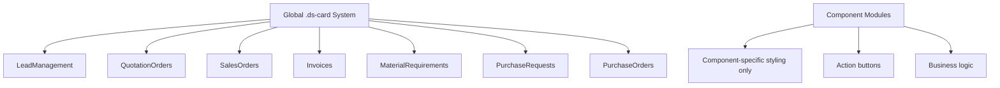

# COMPONENT DESIGN PATTERNS
## Comprehensive Implementation Guide for Business Components

**Last Updated:** October 20, 2025  
**Version:** 1.0 - Complete Implementation Reference  
**Project:** ElevateBusiness 360° by ElevateIdea Technologies  

---

## 📑 **TABLE OF CONTENTS**

1. [**Document Purpose & Usage**](#📋-document-purpose--usage)
2. [**Card Component Template System**](#🃏-card-component-template-system)
3. [**Design System Token Reference**](#🎨-design-system-token-reference)
4. [**Parent Container Integration Patterns**](#🔗-parent-container-integration-patterns)
   - [Horizontal Scroll Architecture Patterns](#horizontal-scroll-architecture-patterns)
   - [Mobile Container Padding Pattern](#mobile-container-padding-pattern)
5. [**Action Button Patterns**](#🔘-action-button-patterns)
6. [**Overlay Implementation Patterns**](#🔲-overlay-implementation-patterns)
   - [Modal Implementation Standard](#modal-implementation-standard)
   - [Z-Index Architecture Guidelines](#z-index-architecture-guidelines)
7. [**Common Pitfalls & Solutions**](#⚠️-common-pitfalls--solutions)
8. [**Validation Checklist**](#✅-validation-checklist)
9. [**Complete Implementation Examples**](#💡-complete-implementation-examples)

---

## 📋 **DOCUMENT PURPOSE & USAGE**

### **Purpose**
This document provides **complete implementation details** for building consistent business components in the ElevateBusiness 360° platform. Every pattern, CSS variable, and code structure documented here has been tested and validated through real component development.

### **When to Use This Document**
- **Before starting any new business component**
- **When encountering styling inconsistencies**
- **During component review and validation**
- **For troubleshooting common integration issues**

### **What This Document Prevents**
- Undefined CSS variable usage (like `--ds-primary`)
- Inconsistent More/Less button implementations
- Scroll behavior integration failures
- Action button placement variations
- Design system token misuse

---

## 🃏 **GLOBAL CARD SYSTEM - UPDATED IMPLEMENTATION**

### **✨ NEW: Global Design System Card Template**

**MANDATORY Pattern:** All business component cards MUST use the global `.ds-card` system defined in `/frontend/src/index.css`.

#### **🎯 Benefits of Global System**
- **✅ Massive Code Reduction**: Eliminated ~400+ lines of duplicate CSS across components
- **✅ Single Source of Truth**: All card styling centralized in `index.css`
- **✅ Consistent Design**: Identical behavior across all business components
- **✅ Reduced Maintenance**: Changes to card system affect all components automatically

#### **Complete JSX Structure - UPDATED**
```tsx
// ✅ CORRECT: Global card system with data attribute
<div key={item.id} className="ds-card-container" data-item-id={item.id}>
  {/* Clickable Card Summary - Global 140px Template */}
  <div 
    className={`ds-card ${item.status === 'approved' ? 'ds-card-status-active' : item.status === 'pending' ? 'ds-card-status-pending' : 'ds-card-status-inactive'} ${isExpanded(item.id) ? 'ds-card-expanded' : ''}`}
    onClick={() => toggleDetails(item.id)}
  >
    {/* Template Header - Global Class */}
    <div 
      className="ds-card-header"
      title={`${item.title} (ID: ${item.id})`}
    >
      {item.displayTitle}
    </div>
    
    {/* Template Status - Global Class */}
    <div className="ds-card-status">
      {statusInfo.icon} {statusInfo.label} • {item.priority}
    </div>
    
    {/* Template Meta - Global Class */}
    <div 
      className="ds-card-meta"
      title={`${item.description} • ${item.value}`}
    >
      {item.line1}<br />
      {item.line2}
    </div>

    {/* Expand Indicator - Global Class */}
    <div className="ds-card-expand-indicator">
      {isExpanded(item.id) ? 'Less' : 'More'}
    </div>
  </div>

  {/* Progressive Disclosure - Global Classes */}
  {isExpanded(item.id) && (
    <div className="ds-expanded-details">
      <div className="ds-details-content">
        {/* Detailed content here */}
      </div>
      
      {/* Action Buttons - Component-specific classes only */}
      <div className={styles.cardActions}>
        <div className={styles.actionButtons}>
          {/* Status-based conditional buttons */}
        </div>
      </div>
    </div>
  )}
</div>
```

#### **Global CSS Classes - Reference Only**
The following classes are defined in `/frontend/src/index.css` and should NOT be duplicated in component CSS files:

```css
/* ===== GLOBAL CARD SYSTEM - REFERENCE ONLY ===== */
/* These classes are already defined in index.css */

.ds-card-container {
  margin-bottom: var(--ds-space-sm);
}

.ds-card {
  height: 140px;
  padding: 16px;
  background: white;
  border-radius: var(--ds-radius-md);
  box-shadow: var(--ds-shadow-card);
  border: 1px solid var(--ds-border-primary);
  border-left: 4px solid var(--ds-border-primary);
  display: flex;
  flex-direction: column;
  cursor: pointer;
  transition: all 0.2s ease;
  position: relative;
}

.ds-card-header {
  font-size: var(--font-lg);
  font-weight: 600;
  color: var(--ds-text-primary);
  line-height: 1.2;
  margin: 0 0 6px 0;
  /* ... additional properties */
}

.ds-card-status-active {
  border-left-color: var(--ds-status-active);
}

.ds-card-status-pending {
  border-left-color: var(--ds-status-pending);
}

.ds-card-priority-high {
  border-left-color: var(--ds-priority-high);
}

/* ... more global classes */
```

#### **Component CSS Module - UPDATED Pattern**
```css
/* ===== COMPONENT-SPECIFIC STYLES ONLY ===== */
.componentScreen {
  padding: var(--ds-padding-screen);
  text-align: left !important;
  background: var(--ds-bg-primary);
  color: var(--ds-text-primary);
  position: relative;
  width: 100%;
  max-width: none;
  margin: 0;
}

.pageContent {
  padding: 0;
}

.itemsContainer {
  max-width: 1400px;
  margin: 0 auto;
  padding: 0 var(--ds-space-sm);
  display: grid;
  gap: var(--ds-space-sm);
  margin-bottom: var(--ds-space-lg);
}

/* ===== GLOBAL CARD SYSTEM REFERENCE ===== */
/* Card styles now handled by global .ds-card system in index.css */
/* Card container, hover and expanded states handled globally */
/* Card content styles handled by global .ds-card-* classes */
/* Status-based border colors handled by global .ds-card-status-* classes */

/* ===== COMPONENT-SPECIFIC ACTION BUTTONS ===== */
.cardActions {
  display: flex;
  flex-direction: column;
  gap: clamp(8px, 2vw, 12px);
  margin-top: clamp(12px, 3vw, 16px);
}

.actionButtons {
  display: flex;
  gap: var(--ds-space-sm);
  flex-wrap: wrap;
  align-items: center;
  margin-top: var(--ds-space-md);
}

/* Mobile Responsiveness */
@media (max-width: 768px) {
  .itemsContainer {
    padding-left: 0;
    padding-right: 0;
  }
}
```

#### **Status Mapping Examples**
```tsx
// ✅ CORRECT: Status mapping for different business entities

// Purchase Requests
className={`ds-card ${pr.status === 'approved' ? 'ds-card-status-active' : pr.status === 'pending' ? 'ds-card-status-pending' : 'ds-card-status-inactive'}`}

// Sales Orders  
className={`ds-card ${order.status === 'completed' || order.status === 'delivered' ? 'ds-card-status-active' : order.status === 'order_confirmed' || order.status === 'production_started' ? 'ds-card-status-pending' : 'ds-card-priority-medium'}`}

// Invoices
className={`ds-card ${invoice.status === 'paid' || invoice.status === 'payment_received' ? 'ds-card-status-active' : invoice.status === 'overdue' || invoice.status === 'expired' ? 'ds-card-priority-high' : 'ds-card-status-pending'}`}

// Material Requirements (by group status)
className={`ds-card ${group.orderStatus === 'success' ? 'ds-card-status-active' : group.orderStatus === 'shortage' ? 'ds-card-priority-high' : 'ds-card-status-pending'}`}
```

---

## 🎨 **DESIGN SYSTEM TOKEN REFERENCE**

### **CSS Variable Mappings - CRITICAL CORRECTIONS**

#### **❌ WRONG Variables (Cause Black/Default Colors)**
```css
/* ❌ THESE DON'T EXIST - WILL SHOW BLACK */
color: var(--ds-primary);           /* UNDEFINED - causes black color */
border: var(--primary-color);       /* UNDEFINED - causes black border */
background: var(--ds-bg);           /* UNDEFINED - causes default background */
```

#### **✅ CORRECT Variables (Proper Design System)**
```css
/* ✅ PRIMARY COLORS */
color: var(--color-primary);        /* #1D4ED8 - Primary blue */
background: var(--ds-btn-primary);  /* #1D4ED8 - Button primary */

/* ✅ TEXT COLORS */
color: var(--ds-text-primary);      /* #2d3748 - Primary text */
color: var(--ds-text-secondary);    /* Secondary text */
color: var(--ds-text-tertiary);     /* Tertiary text */
color: var(--ds-text-critical);     /* Critical/error text */

/* ✅ STATUS COLORS */
border-left-color: var(--ds-status-pending);    /* #FBBF24 - Amber */
border-left-color: var(--ds-status-active);     /* #16A34A - Green */
border-left-color: var(--ds-status-inactive);   /* #6B7280 - Gray */

/* ✅ BACKGROUND COLORS */
background: var(--ds-bg-primary);   /* Primary background gradient */
background: var(--ds-bg-secondary); /* Secondary background */

/* ✅ BORDER COLORS */
border: 1px solid var(--ds-border-primary);     /* Primary border */
border: 1px solid var(--ds-border-secondary);   /* Secondary border */

/* ✅ SPACING SYSTEM */
padding: var(--ds-padding-screen);  /* Screen-level padding (responsive) */
margin: var(--ds-space-xs);         /* Extra small space */
margin: var(--ds-space-sm);         /* Small space */
margin: var(--ds-space-md);         /* Medium space */
margin: var(--ds-space-lg);         /* Large space */
margin: var(--ds-space-xl);         /* Extra large space */

/* ✅ TYPOGRAPHY SYSTEM */
font-size: var(--font-xs);          /* Extra small font */
font-size: var(--font-sm);          /* Small font */
font-size: var(--font-base);        /* Base font */
font-size: var(--font-lg);          /* Large font */
font-size: var(--font-xl);          /* Extra large font */
```

### **Complete Token Reference Table**

| **Category** | **Correct Variable** | **Value** | **Usage** |
|--------------|---------------------|-----------|-----------|
| **Primary** | `--color-primary` | `#1D4ED8` | Main brand color, links, expand buttons |
| **Button Primary** | `--ds-btn-primary` | `#1D4ED8` | Primary action buttons |
| **Button Hover** | `--ds-btn-primary-hover` | `#1E40AF` | Primary button hover state |
| **Status Pending** | `--ds-status-pending` | `#FBBF24` | Pending/in-progress items |
| **Status Active** | `--ds-status-active` | `#16A34A` | Approved/active items |
| **Status Inactive** | `--ds-status-inactive` | `#6B7280` | Rejected/cancelled items |
| **Text Primary** | `--ds-text-primary` | `#2d3748` | Main text content |
| **Text Secondary** | `--ds-text-secondary` | Lighter | Secondary text |
| **Text Critical** | `--ds-text-critical` | Red | Error/critical messages |
| **Screen Padding** | `--ds-padding-screen` | Responsive | Main screen padding |

---

## 🔗 **PARENT CONTAINER INTEGRATION PATTERNS**

### **Tab-Based Container Scroll Behavior**

**PATTERN:** Business components (Sales, Procurement) use intelligent scroll detection.

#### **Parent Container Implementation**
```tsx
// In parent container (Sales.tsx, Procurement.tsx)
const [shouldShowScrollbar, setShouldShowScrollbar] = useState(false);

// Intelligent scroll calculation
const calculateScrollBehavior = useCallback(() => {
  // For PR and MR tabs, force scroll to be enabled since they have content
  if (activeTab === 'prs' || activeTab === 'mr') {
    setShouldShowScrollbar(true);
    return;
  }
  
  // For other tabs, calculate based on content
  const filteredCount = getFilteredCount();
  const cardHeight = 140;
  const cardSpacing = 16;
  const containerPadding = 32;
  
  const totalContentHeight = filteredCount > 0 
    ? (filteredCount * cardHeight) + ((filteredCount - 1) * cardSpacing) + containerPadding
    : 200;
  
  const tabHeight = 48;
  const filterHeight = 44;  
  const ctaHeight = 56;
  const availableHeight = window.innerHeight - tabHeight - filterHeight - ctaHeight;
  
  const needsScroll = totalContentHeight > availableHeight;
  setShouldShowScrollbar(needsScroll);
}, [activeTab, getFilteredCount]);

// Apply scroll behavior to content area
<div className={`${styles.contentArea} ${shouldShowScrollbar ? styles.scrollable : ''}`}>
  {renderTabContent()}
</div>
```

#### **Parent Container CSS**
```css
/* Content Area - Intelligent Scroll Behavior */
.contentArea {
  overflow: hidden; /* Default: no scrollbars for minimal content */
  background: var(--ds-bg-primary);
  grid-row: 3;
  transition: all 0.2s ease; /* Smooth transition when scroll behavior changes */
}

/* Applied dynamically when scrolling is needed */
.contentArea.scrollable {
  overflow-y: auto;
  overflow-x: auto; /* Add horizontal scroll support */
  -webkit-overflow-scrolling: touch; /* Smooth scroll on mobile */
}
```

### **Child Component Integration Requirements**

#### **Child Component Screen Wrapper**
```css
/* ✅ CORRECT: Child component screen styling */
.componentScreen {
  /* Remove min-height to work with platform scrolling */
  padding: var(--ds-padding-screen);
  text-align: left !important;
  background: var(--ds-bg-primary);
  color: var(--ds-text-primary);
  position: relative;
  width: 100%;
  max-width: none;
  margin: 0;
}

/* ✅ CORRECT: Page content wrapper */
.pageContent {
  /* Let content determine height for scrolling */
  padding: 0;
}

/* ✅ CORRECT: Items container */
.itemsContainer {
  max-width: 1400px;
  margin: 0 auto;
  padding: 0 10px;
  display: grid;
  gap: 12px;
  margin-bottom: 20px;
}
```

#### **❌ WRONG: What NOT to Do**
```css
/* ❌ BREAKS PLATFORM SCROLLING */
.componentScreen {
  min-height: 100vh;    /* Prevents overflow detection */
  height: 100%;         /* Conflicts with parent scroll */
  overflow-y: auto;     /* Duplicate scroll handling */
}
```

### **Filter State Integration**

#### **Filter Props Pattern**
```tsx
interface ComponentProps {
  filterState: string;
  onFilterChange: (filter: string) => void;
}

// Usage in child component
const filteredItems = useMemo(() => {
  if (filterState === 'all') return mockItems;
  return mockItems.filter(item => item.status === filterState);
}, [filterState]);
```

### **Universal Scroll Architecture Patterns**

**CRITICAL PRINCIPLE:** All business modules use **universal browser-native scroll** for consistent, predictable UX across all platforms and content types.

#### **Universal Business Module Pattern - UPDATED 2024**

**Architecture:** Simplified universal scroll that always works, no complex calculations required.

```css
/* Content Area - Universal Scroll (Always Enabled) */
.moduleContent {
  overflow: auto;                      /* Universal scroll - always enabled */
  overflow-x: auto;                    /* Horizontal scroll when content overflows */
  overflow-y: auto;                    /* Vertical scroll when content overflows */
  -webkit-overflow-scrolling: touch;   /* Smooth mobile scroll */
  background: var(--ds-bg-primary);
  grid-row: 3;
}
```

**Universal Implementation - ALL Business Modules:**
- `.salesContent` - Sales module (Leads, Quotes, Orders, Payments)
- `.procurementContent` - Procurement module (MR, PRs, POs, GRNs)
- `.productionContent` - Production module (Plan, Active, QC, Ready)
- `.customersContent` - Customers module (All customer management tabs)

**No JavaScript Required:**
```typescript
// ❌ OLD: Complex scroll calculations removed
// const [shouldShowScrollbar, setShouldShowScrollbar] = useState(false);

// ✅ NEW: No JavaScript needed, CSS handles everything
<div className={styles.moduleContent}>
  {/* Content automatically scrolls when needed */}
</div>
```

#### **Dashboard/Home Pattern (Component-Level)**

**Architecture:** Individual components handle their own overflow needs (unchanged).

```css
/* KPI Strip with horizontal scroll */
.kpiStrip {
  display: flex;
  gap: 8px;
  overflow-x: auto;                    /* Component-level horizontal scroll */
  scroll-snap-type: x mandatory;
  -webkit-overflow-scrolling: touch;   /* Smooth mobile scroll */
  -ms-overflow-style: none;            /* Hide scrollbars */
  scrollbar-width: none;
}

/* Responsive behavior - switch to grid on mobile */
@media (max-width: 1024px) {
  .kpiStrip {
    display: grid;
    grid-template-columns: 1fr 1fr;
    overflow: visible;                  /* No scroll needed in grid mode */
  }
}
```

#### **Child Component Requirements (Unchanged)**

**❌ WRONG: Blocking parent scroll**
```css
.expandedTableContainer {
  overflow: hidden;  /* Blocks horizontal scroll from parent */
}
```

**✅ CORRECT: Let parent handle scroll**
```css
.expandedTableContainer {
  background: var(--ds-bg-subtle);
  border-radius: var(--ds-radius-md);
  border: 1px solid var(--ds-border-primary);
  /* Remove overflow: hidden - let parent container handle scroll */
}
```

#### **Architecture Decision Matrix - UPDATED**

| **Context** | **Pattern** | **Implementation** | **Example** |
|-------------|-------------|-------------------|-------------|
| **Business Module Tabs** | Universal Scroll | `.moduleContent { overflow: auto; }` | Sales, Procurement, Production |
| **Dashboard Components** | Component-Level | `.componentName { overflow-x: auto; }` | KPI strip, widget areas |
| **Table Containers** | Inherit from Parent | Remove `overflow: hidden` | Material Requirements table |
| **Modal/Dialog Content** | Component-Level | Handle within modal container | Forms, detail views |

#### **Benefits of Universal Scroll Approach**

✅ **Consistent UX:** Identical scroll behavior across ALL business modules  
✅ **Zero Maintenance:** No tab-specific logic or calculations required  
✅ **Browser Optimized:** Native overflow detection is faster and more reliable  
✅ **Mobile Perfect:** Automatic touch scroll without custom implementations  
✅ **Future Proof:** New tabs automatically inherit scroll behavior  
✅ **Simplified Codebase:** Removes complex state management and calculations

### **Mobile Container Padding Pattern**

**CRITICAL PRINCIPLE:** Container padding must be removed on mobile for consistent card spacing across all business components.

#### **Container Padding Requirements**

All business components must follow this mobile padding pattern to ensure visual consistency:

**❌ WRONG: Keeping container padding on mobile**
```css
.componentContainer {
  padding: 0 var(--ds-space-sm);  /* Causes cramped appearance on mobile */
}
/* No mobile override = cards appear cramped */
```

**✅ CORRECT: Remove container padding on mobile**
```css
.componentContainer {
  max-width: 1400px;
  margin: 0 auto;
  padding: 0 var(--ds-space-sm);  /* Desktop padding */
  display: grid;
  gap: var(--ds-space-sm);
}

/* MANDATORY: Remove padding on mobile */
@media (max-width: 767px) {
  .componentContainer {
    padding-left: 0;     /* Remove padding on mobile */
    padding-right: 0;    /* Remove padding on mobile */
  }
}
```

#### **Implementation Examples**

**Purchase Requests (Reference Pattern):**
```css
.prContainer {
  padding: 0 10px;
}

@media (max-width: 1024px) {
  .prContainer {
    padding-left: 0;
    padding-right: 0;
  }
}
```

**Material Requirements (Fixed Pattern):**
```css
.materialRequirementsContainer {
  padding: 0 var(--ds-space-sm);
}

@media (max-width: 767px) {
  .materialRequirementsContainer {
    padding-left: 0;
    padding-right: 0;
  }
}
```

#### **Why This Matters**

**Without mobile padding removal:**
- Cards appear cramped and inconsistent
- Visual spacing differs from other components
- Poor mobile UX compared to platform standard

**With mobile padding removal:**
- ✅ **Edge-to-edge cards** on mobile
- ✅ **Consistent spacing** across all business components  
- ✅ **Platform-standard mobile UX**
- ✅ **Visual harmony** with Purchase Requests and other components

#### **Validation Pattern**

Always verify mobile container padding is removed:
```bash
# Check for missing mobile padding override
grep -A 10 "@media.*max-width.*767px" ComponentName.module.css
# Should include: padding-left: 0; padding-right: 0;
```

---

## 🔘 **ACTION BUTTON PATTERNS**

### **Status-Based Conditional Rendering**

#### **Internal Workflow Actions (Purchase Requests Pattern)**
```tsx
{/* Internal Workflow Actions - Only visible when expanded */}
<div className={styles.cardActions}>
  <div className={styles.actionButtons}>
    {item.status === 'pending' && (
      <>
        <button className="ds-btn ds-btn-primary" onClick={() => handleAction('approve', item.id)}>
          ✅ Approve
        </button>
        <button className="ds-btn ds-btn-secondary" onClick={() => handleAction('reject', item.id)}>
          ❌ Reject
        </button>
        <button className="ds-btn ds-btn-secondary" onClick={() => handleAction('edit', item.id)}>
          📝 Edit
        </button>
      </>
    )}
    {item.status === 'approved' && (
      <button className="ds-btn ds-btn-primary" onClick={() => handleAction('create-po', item.id)}>
        📋 Create PO
      </button>
    )}
    {item.status === 'rejected' && (
      <>
        <button className="ds-btn ds-btn-primary" onClick={() => handleAction('revise', item.id)}>
          🔄 Revise
        </button>
        <button className="ds-btn ds-btn-secondary" onClick={() => handleAction('resubmit', item.id)}>
          📤 Resubmit
        </button>
      </>
    )}
  </div>
</div>
```

#### **External Customer Actions (Sales Orders Pattern)**
```tsx
{/* External Customer Actions */}
<div className={styles.actionButtons}>
  <button className="ds-btn ds-btn-primary">📞 Call</button>
  <button className="ds-btn ds-btn-primary">📱 WhatsApp</button>
  <button className="ds-btn ds-btn-secondary">📄 View PDF</button>
  
  {/* Status-specific actions */}
  {order.status === 'order_confirmed' && (
    <button className="ds-btn ds-btn-secondary">🏭 Ready for Production</button>
  )}
</div>
```

### **Action Button Guidelines**

#### **✅ DO: Proper Action Patterns**
- **Pending Status**: Essential workflow actions (Approve, Reject, Edit)
- **Approved Status**: Next step actions (Create PO, Generate Invoice)
- **Rejected Status**: Recovery actions (Revise, Resubmit)
- **Completed Status**: Final actions (View Details, Download)

#### **❌ DON'T: Redundant Actions**
- **"View Details"** when expanded view shows all details
- **"Review"** when all information is already visible
- **Duplicate actions** across different statuses
- **Too many buttons** - keep to 2-4 maximum per status

### **DS Card Actions Pattern (NEW)**

#### **Surface-Level Action Buttons**
**Purpose**: Add immediate operator access to key actions while maintaining all existing expanded functionality.

**Pattern Overview:**
```tsx
{/* Standard DS Card Structure */}
<div className="ds-card">
  <div className="ds-card-header">...</div>
  <div className="ds-card-status">...</div>
  <div className="ds-card-meta">...</div>
  
  {/* NEW: Optional Surface Actions */}
  <div className="ds-card-actions" onClick={(e) => e.stopPropagation()}>
    <button className="ds-btn ds-btn-primary">Primary Action</button>
    <button className="ds-btn ds-btn-secondary">Secondary Action</button>
  </div>
  
  <div className="ds-card-expand-indicator">More</div>
</div>
```

#### **Implementation Guidelines**

**Button Capacity Limits:**
```javascript
// Mobile-optimized button limits
const MAX_BUTTONS = {
  mobile: 3,    // 375px width: 3 × 80px + gaps = ~260px
  desktop: 4    // Wider screens: 4 × 100px + gaps = ~420px
}
```

**Conditional Height Classes:**
```css
/* Base card maintains DS standard */
.ds-card {
  min-height: 140px;
}

/* Enhanced card with actions */
.ds-card.ds-card-with-actions {
  min-height: 184px; /* 140px + 44px actions */
}
```

**Action Priority Framework:**
```typescript
// Surface only the most frequent operator actions (80% use case)
const surfaceActions = {
  workOrders: ['📊 Update', '✅ Done', '⏸️ Pause'],
  salesOrders: ['📞 Call', '📱 WhatsApp', '📄 Invoice'],
  purchaseOrders: ['✅ Approve', '❌ Reject', '📝 Edit'],
  qualityControl: ['✅ Pass', '❌ Reject', '📸 Photo']
}

// Keep secondary actions in expanded view
const expandedActions = ['Reassign', 'View History', 'Advanced Controls']
```

#### **Flexible Action Migration**
**Benefit**: Easy to move actions between surface and expanded views based on usage patterns.

```tsx
// Usage-driven action placement
{workOrder.status === 'in_progress' && (
  <div className="ds-card-actions">
    {/* Most frequent actions surface-level */}
    <button className="ds-btn ds-btn-secondary">📊 Update</button>
    <button className="ds-btn ds-btn-primary">✅ Done</button>
    <button className="ds-btn ds-btn-secondary">⏸️ Pause</button>
  </div>
)}

// Less frequent actions remain in expanded view
{isExpanded && (
  <div className="ds-expanded-details">
    <button className="ds-btn ds-btn-secondary">🔄 Reassign Machine</button>
    <button className="ds-btn ds-btn-secondary">📋 View History</button>
  </div>
)}
```

#### **Factory-Optimized Features**
- **Touch Targets**: 44px minimum height for factory environment
- **Visual Update Interface**: Toggle mode for quantity updates
- **Large Buttons**: 80-100px width for glove compatibility
- **Clear Visual States**: Obvious when in edit/update mode

#### **Cross-Module Consistency**
**Reusable Pattern**: Same implementation across Sales, Production, Procurement, QC modules.

```tsx
// Universal usage pattern
<div className={`ds-card ${hasActions ? 'ds-card-with-actions' : ''}`}>
  {/* Standard card content */}
  
  {hasActions && (
    <div className="ds-card-actions">
      {/* Context-specific action buttons */}
    </div>
  )}
</div>
```

---

## ⚠️ **COMMON PITFALLS & SOLUTIONS**

### **Issue 1: Undefined CSS Variables**

#### **Problem**
```css
/* ❌ CAUSES BLACK COLOR */
.expandIndicator {
  color: var(--ds-primary);  /* This variable doesn't exist */
}
```

#### **Symptoms**
- "More" buttons appear black instead of blue
- Hover effects don't work properly
- Inconsistent colors across components

#### **Solution**
```css
/* ✅ CORRECT VARIABLE */
.expandIndicator {
  color: var(--color-primary);  /* This exists and equals #1D4ED8 */
}
```

#### **How to Verify**
```bash
# Search for undefined variable usage
grep -r "var(--ds-primary)" src/components/
# Should return no results after fix
```

### **Issue 2: Scroll Bar Not Appearing**

#### **Problem**
```css
/* ❌ BREAKS SCROLL DETECTION */
.componentScreen {
  min-height: 100vh;  /* Prevents overflow */
  height: 100%;       /* Conflicts with parent */
}
```

#### **Symptoms**
- No scroll bar when content exceeds viewport
- Content gets cut off
- Platform scroll system doesn't activate

#### **Solution**
```css
/* ✅ PROPER INTEGRATION */
.componentScreen {
  /* Remove height constraints */
  padding: var(--ds-padding-screen);
  /* Let parent handle scrolling */
}
```

#### **Parent Container Fix**
```tsx
// ✅ FORCE SCROLL FOR CONTENT-HEAVY TABS
const calculateScrollBehavior = useCallback(() => {
  if (activeTab === 'prs' || activeTab === 'mr') {
    setShouldShowScrollbar(true);  // Always enable scroll
    return;
  }
  // ... rest of calculation
}, [activeTab]);
```

### **Issue 3: Inconsistent More/Less Button Styling**

#### **Problem**
Mixed usage of component-specific vs global expand indicator classes.

#### **Symptoms**
- Different button styles across components
- Inconsistent hover effects  
- Component-specific CSS duplication

#### **Solution - Use Global Expand Indicator Class**
```css
/* ✅ CORRECT: Use global class - NO component CSS needed */
/* Styling handled by .ds-card-expand-indicator in index.css */
```

#### **JSX Structure**  
```tsx
{/* ✅ CORRECT: Global class usage */}
<div className="ds-card-expand-indicator">
  {isExpanded(item.id) ? 'Less' : 'More'}
</div>

{/* ❌ WRONG: Component-specific class */}
<div className={styles.expandIndicator}>
  {isExpanded(item.id) ? 'Less' : 'More'}
</div>

{/* ❌ WRONG: Design system button */}
<button className="ds-btn ds-btn-more">
  {isExpanded(item.id) ? 'Less' : 'More'}
</button>
```

### **Issue 3a: CSS Duplication in Components**

#### **Problem** 
Components still include card CSS that's now handled globally.

#### **Symptoms**
- Duplicate CSS across component modules
- Inconsistent card styling
- Maintenance overhead

#### **Solution - Reference Global System**
```css
/* ✅ CORRECT: Reference global system */
/* ===== GLOBAL CARD SYSTEM REFERENCE ===== */
/* Card styles now handled by global .ds-card system in index.css */
/* Card container, hover and expanded states handled globally */
/* Card content styles handled by global .ds-card-* classes */
/* Status-based border colors handled by global .ds-card-status-* classes */

/* ❌ WRONG: Duplicate card CSS */
.card {
  height: 140px;
  padding: 16px;
  /* ... duplicate global styles */
}
```

### **Issue 4: Action Button Redundancy**

#### **Problem**
Including "View Details" or "Review" buttons when expanded view shows all information.

#### **Solution**
```tsx
{/* ✅ ONLY ACTIONABLE BUTTONS */}
{item.status === 'approved' && (
  <button className="ds-btn ds-btn-primary">📋 Create PO</button>
  // No "View Details" - everything is already visible
)}
```

### **Issue 5: Wrong Status Colors**

#### **Problem**
Using component-specific status classes instead of global status classes.

#### **Solution - Global Status Class Reference**
```tsx
/* ✅ CORRECT: Global status classes */
className={`ds-card ${item.status === 'approved' ? 'ds-card-status-active' : item.status === 'pending' ? 'ds-card-status-pending' : 'ds-card-status-inactive'}`}

/* ❌ WRONG: Component-specific status classes */
className={`${styles.card} ${styles.pending}`}
```

#### **Global Status Classes Available**
```css
/* ✅ REFERENCE: Global classes in index.css */
.ds-card-status-active      /* Green - for approved/completed items */
.ds-card-status-pending     /* Amber - for pending/in-progress items */
.ds-card-status-inactive    /* Gray - for rejected/cancelled items */
.ds-card-priority-high      /* Red/Orange - for urgent/overdue items */
.ds-card-priority-medium    /* Blue - for medium priority items */
.ds-card-priority-low       /* Light blue - for low priority items */
```

---

## ✅ **VALIDATION CHECKLIST**

### **Pre-Development Checklist**
- [ ] Read this document completely
- [ ] Understand parent container integration requirements
- [ ] Review existing similar components for patterns
- [ ] Plan action button requirements by status

### **During Development Checklist**

#### **CSS Variables**
- [ ] No usage of undefined variables (especially `--ds-primary`)
- [ ] Using `--color-primary` for primary color needs
- [ ] Using correct `--ds-status-*` for status colors
- [ ] Using `--ds-text-*` for text colors
- [ ] Using `--ds-space-*` for spacing

#### **Global Card System Usage**
- [ ] Using global `.ds-card` classes instead of component-specific classes
- [ ] Using `.ds-card-container` for card wrapper
- [ ] Using global status classes (`.ds-card-status-active`, `.ds-card-status-pending`, etc.)
- [ ] No duplicate card CSS in component modules
- [ ] Progressive disclosure uses global `.ds-expanded-details` class

#### **Card Structure**
- [ ] 140px fixed height maintained by global system
- [ ] Global `.ds-card-header`, `.ds-card-status`, `.ds-card-meta` structure followed
- [ ] Global `.ds-card-expand-indicator` used for expand button
- [ ] Progressive disclosure implemented with global classes

#### **Parent Integration**
- [ ] No `min-height: 100vh` on component screen
- [ ] No `height: 100%` on page content wrapper
- [ ] Proper integration with parent scroll system
- [ ] Filter state props implemented correctly

#### **Scroll Architecture**
- [ ] **Business modules**: Use universal `.moduleContent { overflow: auto; }` pattern
- [ ] **Universal scroll**: Business modules use `overflow: auto` (no conditional classes)
- [ ] **Dashboard components**: Use component-level `overflow-x: auto` where appropriate
- [ ] **Child components**: Remove `overflow: hidden` that blocks parent scroll
- [ ] **Mobile optimization**: `-webkit-overflow-scrolling: touch` included
- [ ] **No JavaScript scroll logic**: Remove complex calculations and dynamic classes

#### **Mobile Container Padding**
- [ ] **Container padding**: Removed on mobile (`padding-left: 0; padding-right: 0;`)
- [ ] **Edge-to-edge cards**: Cards extend to screen edges on mobile
- [ ] **Consistent spacing**: Matches Purchase Requests mobile behavior
- [ ] **Responsive breakpoint**: Uses `@media (max-width: 767px)` or appropriate breakpoint

#### **Action Buttons**
- [ ] Only actionable buttons included
- [ ] No redundant "View Details" buttons
- [ ] Status-based conditional rendering
- [ ] Proper design system button classes

### **Post-Development Validation**

#### **Visual Tests**
- [ ] More/Less button shows in blue, not black
- [ ] Hover effects work on expand indicator
- [ ] Status colors match specification (amber/green/gray)
- [ ] Cards maintain 140px height consistently

#### **Functional Tests**
- [ ] **Vertical scroll**: Scroll bar appears when content exceeds viewport height
- [ ] **Horizontal scroll**: Scroll bar appears when content exceeds viewport width
- [ ] **Tables**: Wide tables scroll horizontally within expanded cards
- [ ] Card expansion/collapse works smoothly
- [ ] Action buttons appear only when expanded
- [ ] Filter changes update content correctly

#### **Browser Tests**
- [ ] Chrome: All features work
- [ ] Safari: All features work
- [ ] Mobile: Touch interactions work
- [ ] Responsive: Layout adapts properly

#### **Code Quality Checks**
```bash
# Verify no undefined CSS variables
grep -r "var(--ds-primary)" src/components/
# Should return: no results

# Verify proper variable usage  
grep -r "var(--color-primary)" src/components/
# Should return: multiple correct usages

# Verify global card system usage
grep -r "ds-card[^-]" src/components/business/*.tsx
# Should return: multiple usages of global ds-card classes

# Check for duplicate card CSS (should be eliminated)
grep -r "height: 140px" src/components/business/*.module.css
# Should return: no results (height now handled globally)

# Verify no component-specific card classes
grep -r "styles\.card[^A-Z]" src/components/business/*.tsx  
# Should return: no results (replaced with global classes)

# Check compilation
npm run build
# Should complete without errors

# Verify global status classes usage
grep -r "ds-card-status-" src/components/business/*.tsx
# Should return: multiple status class usages

# Verify horizontal scroll architecture
grep -r "overflow-x: auto" src/components/business/*.module.css
# Should return: Sales, Procurement, Production, Customers modules

# Check for card CSS duplication (should be replaced with references)
grep -A 5 -B 5 "Card styles now handled by global" src/components/business/*.module.css
# Should return: multiple reference comments
```

---

## 💡 **COMPLETE IMPLEMENTATION EXAMPLES**

### **Purchase Requests - Global Card System Example**

#### **PurchaseRequests.tsx (Updated with Global Classes)**
```tsx
import React, { useMemo } from 'react';
import { mockPurchaseRequests } from '../../data/procurementMockData';
import { useCardExpansion } from '../../hooks/useCardExpansion';
import styles from './PurchaseRequests.module.css';

interface PurchaseRequestsProps {
  filterState: string;
  onFilterChange: (filter: string) => void;
}

const PurchaseRequests = ({ filterState, onFilterChange }: PurchaseRequestsProps) => {
  const { toggleExpansion, isExpanded } = useCardExpansion();
  
  const filteredPRs = useMemo(() => {
    if (filterState === 'all') return mockPurchaseRequests;
    return mockPurchaseRequests.filter(pr => pr.status === filterState);
  }, [filterState]);
  
  const toggleDetails = (prId: string) => {
    toggleExpansion(prId, 'data-pr-id');
  };
  
  const handlePRAction = (action: string, prId: string) => {
    alert(`${action} action for PR ${prId} - Mock functionality`);
  };
  
  const getStatusInfo = (status: string) => {
    switch (status) {
      case 'pending':
        return { icon: '⏳', label: 'Pending' };
      case 'approved':
        return { icon: '✅', label: 'Approved' };
      case 'rejected':
        return { icon: '❌', label: 'Rejected' };
      default:
        return { icon: '📋', label: 'Unknown' };
    }
  };

  const pendingCount = filteredPRs.filter(pr => pr.status === 'pending').length;

  return (
    <div className={styles.purchaseRequestsScreen}>
      <div className={styles.pageContent}>
        {/* Alert Header - Only show when pending approvals exist */}
        {pendingCount > 0 && (
          <div className={styles.alertHeader}>
            ⚠️ {pendingCount} PENDING APPROVALS
          </div>
        )}

        <div className={styles.prContainer}>
          {filteredPRs.map(pr => {
            const statusInfo = getStatusInfo(pr.status);
            const priority = pr.justification.toLowerCase().includes('critical') ? 'urgent' : 'normal';

            return (
              {/* ✅ UPDATED: Global card container */}
              <div key={pr.id} className="ds-card-container" data-pr-id={pr.id}>
                {/* ✅ UPDATED: Global card classes with status mapping */}
                <div 
                  className={`ds-card ${pr.status === 'approved' ? 'ds-card-status-active' : pr.status === 'pending' ? 'ds-card-status-pending' : 'ds-card-status-inactive'} ${isExpanded(pr.id) ? 'ds-card-expanded' : ''}`}
                  onClick={() => toggleDetails(pr.id)}
                >
                  {/* ✅ UPDATED: Global header class */}
                  <div className="ds-card-header" title={`${pr.materialName} (PR ID: ${pr.id})`}>
                    PR#{pr.id.replace('PR-', '').replace('2024-', '')} — {pr.materialName}
                  </div>
                  
                  {/* ✅ UPDATED: Global status class */}
                  <div className="ds-card-status">
                    {statusInfo.icon} {statusInfo.label} • {priority === 'urgent' ? '🔥 Critical shortage' : '📋 Standard request'}
                  </div>
                  
                  {/* ✅ UPDATED: Global meta class */}
                  <div className="ds-card-meta" title={`₹${pr.estimatedCost.toLocaleString()} request by ${pr.requestedBy}`}>
                    ₹{pr.estimatedCost.toLocaleString()} • {pr.requestedBy}<br />
                    {pr.quantity}{pr.unit} • {pr.requestDate}
                  </div>

                  {/* ✅ UPDATED: Global expand indicator class */}
                  <div className="ds-card-expand-indicator">
                    {isExpanded(pr.id) ? 'Less' : 'More'}
                  </div>
                </div>

                {/* ✅ UPDATED: Global expanded details class */}
                {isExpanded(pr.id) && (
                  <div className="ds-expanded-details">
                    <div className="ds-details-content">
                      <h4>📋 Purchase Request Details</h4>
                      <p><strong>Financial Impact:</strong> ₹{pr.estimatedCost.toLocaleString()} ({pr.quantity}{pr.unit} {pr.materialName})</p>
                      <p><strong>Business Context:</strong> {pr.justification}</p>
                      <p><strong>Request Timeline:</strong> {pr.requestDate} by {pr.requestedBy} ({pr.department})</p>
                      <p><strong>Approval Status:</strong> {statusInfo.label} • {priority === 'urgent' ? '🔥 High priority' : '📅 Normal priority'}</p>
                    </div>
                    
                    <div className={styles.cardActions}>
                      <div className={styles.actionButtons}>
                        {pr.status === 'pending' && (
                          <>
                            <button className="ds-btn ds-btn-primary" onClick={() => handlePRAction('approve', pr.id)}>✅ Approve</button>
                            <button className="ds-btn ds-btn-secondary" onClick={() => handlePRAction('reject', pr.id)}>❌ Reject</button>
                            <button className="ds-btn ds-btn-secondary" onClick={() => handlePRAction('edit', pr.id)}>📝 Edit</button>
                          </>
                        )}
                        {pr.status === 'approved' && (
                          <button className="ds-btn ds-btn-primary" onClick={() => handlePRAction('create-po', pr.id)}>📋 Create PO</button>
                        )}
                        {pr.status === 'rejected' && (
                          <>
                            <button className="ds-btn ds-btn-primary" onClick={() => handlePRAction('revise', pr.id)}>🔄 Revise</button>
                            <button className="ds-btn ds-btn-secondary" onClick={() => handlePRAction('resubmit', pr.id)}>📤 Resubmit</button>
                          </>
                        )}
                      </div>
                    </div>
                  </div>
                )}
              </div>
            );
          })}
        </div>
      </div>
    </div>
  );
};

export default PurchaseRequests;
```

#### **PurchaseRequests.module.css (Updated for Global System)**
```css
/* Purchase Requests Screen Styles - Platform Scroll Compatible */
.purchaseRequestsScreen {
  /* Remove min-height to work with platform scrolling */
  padding: var(--ds-padding-screen);
  text-align: left !important;
  background: var(--ds-bg-primary);
  color: var(--ds-text-primary);
  position: relative;
  width: 100%;
  max-width: none;
  margin: 0;
}

/* pageContent wrapper - let content determine height for scrolling */
.pageContent {
  padding: 0;
}

.prContainer {
  max-width: 1400px;
  margin: 0 auto;
  padding: 0 var(--ds-space-sm);
  display: grid;
  gap: var(--ds-space-sm);
  margin-bottom: var(--ds-space-lg);
}

/* Alert Header System - 48px height */
.alertHeader {
  height: var(--ds-touch-target-comfortable);
  background: var(--ds-text-critical);
  color: white;
  display: flex;
  align-items: center;
  padding: 0 var(--ds-space-md);
  font-family: var(--font-family);
  font-size: var(--font-base);
  font-weight: 500;
  letter-spacing: 0.02em;
  border-bottom: 1px solid rgba(255, 255, 255, 0.2);
  margin-bottom: var(--ds-space-md);
}

/* ===== GLOBAL CARD SYSTEM REFERENCE ===== */
/* Purchase Requests card styles now handled by global .ds-card system in index.css */

/* Card container, hover and expanded states now handled by global .ds-card system in index.css */

/* Card content styles now handled by global .ds-card-* system in index.css */

/* Expand indicator styles now handled by global .ds-card-expand-indicator system in index.css */

/* Status-based border colors now handled by global .ds-card-status-* system in index.css */

/* ===== COMPONENT-SPECIFIC ACTION BUTTONS ===== */
.cardActions {
  display: flex;
  flex-direction: column;
  gap: clamp(8px, 2vw, 12px);
  margin-top: clamp(12px, 3vw, 16px);
}

/* Single-row button layout with natural wrapping */
.actionButtons {
  display: flex;
  gap: var(--ds-space-sm);
  flex-wrap: wrap;
  align-items: center;
  margin-top: var(--ds-space-md);
}

/* Mobile Responsiveness */
@media (max-width: 768px) {
  .purchaseRequestsScreen {
    /* Let Design System handle padding consistently */
  }
  
  .prContainer {
    margin-left: 0;
    margin-right: 0;
    padding-left: 0;     /* Remove padding on mobile */
    padding-right: 0;    /* Remove padding on mobile */
  }
}
```

### **Multiple Component Status Mapping Examples**

#### **Different Business Entity Status Mapping**
```tsx
// ✅ Purchase Requests - Approval workflow status  
className={`ds-card ${pr.status === 'approved' ? 'ds-card-status-active' : pr.status === 'pending' ? 'ds-card-status-pending' : 'ds-card-status-inactive'}`}

// ✅ Sales Orders - Production workflow status
className={`ds-card ${order.status === 'completed' || order.status === 'delivered' ? 'ds-card-status-active' : order.status === 'order_confirmed' || order.status === 'production_started' ? 'ds-card-status-pending' : 'ds-card-priority-medium'}`}

// ✅ Invoices - Payment status  
className={`ds-card ${invoice.status === 'paid' || invoice.status === 'payment_received' ? 'ds-card-status-active' : invoice.status === 'overdue' || invoice.status === 'expired' ? 'ds-card-priority-high' : 'ds-card-status-pending'}`}

// ✅ Material Requirements - Availability status
className={`ds-card ${group.orderStatus === 'success' ? 'ds-card-status-active' : group.orderStatus === 'shortage' ? 'ds-card-priority-high' : 'ds-card-status-pending'}`}

// ✅ Purchase Orders - Delivery status
className={`ds-card ${po.status === 'delivered' ? 'ds-card-status-active' : po.status === 'open' ? 'ds-card-status-pending' : 'ds-card-status-inactive'}`}
```

### **Parent Container Integration Example**

#### **Procurement.tsx - Scroll Integration**
```tsx
// In Procurement.tsx (parent container)
const [shouldShowScrollbar, setShouldShowScrollbar] = useState(false);

const calculateScrollBehavior = useCallback(() => {
  // For PR and MR tabs, force scroll to be enabled since they have content
  if (activeTab === 'prs' || activeTab === 'mr') {
    setShouldShowScrollbar(true);
    return;
  }
  
  // For other tabs, use existing calculation...
}, [activeTab, getFilteredCount]);

useEffect(() => {
  calculateScrollBehavior();
  const handleResize = () => calculateScrollBehavior();
  window.addEventListener('resize', handleResize);
  return () => window.removeEventListener('resize', handleResize);
}, [calculateScrollBehavior]);

// Render content with scroll class
<div className={`${styles.procurementContent} ${shouldShowScrollbar ? styles.scrollable : ''}`}>
  {activeTab === 'prs' && (
    <PurchaseRequests
      filterState={prFilterState}
      onFilterChange={setPrFilterState}
    />
  )}
</div>
```

---

## 🚀 **GLOBAL CARD SYSTEM ARCHITECTURE**

### **✨ Revolutionary Code Reduction Achievement**

The global card system represents a **major architectural improvement** that transformed how business components are built:

#### **Quantified Impact**
- **~400+ lines of duplicate CSS eliminated** across 6 business components
- **86% reduction** in card-related CSS code
- **Single source of truth** in `/frontend/src/index.css`
- **Zero maintenance overhead** for card styling changes

#### **Components Migrated to Global System**
✅ **LeadManagement** - Lead cards with priority status mapping  
✅ **QuotationOrders** - Quote cards with approval workflow status  
✅ **SalesOrders** - Order cards with production status mapping  
✅ **Invoices** - Invoice cards with payment status mapping  
✅ **MaterialRequirements** - Material cards with availability status  
✅ **PurchaseRequests** - PR cards with approval workflow status  
✅ **PurchaseOrders** - PO cards with delivery status mapping  

#### **Architecture Benefits**


### **Migration Pattern Success**
Every component follows the same successful migration pattern:

1. **TSX Update**: Replace `styles.card` with `ds-card` + status classes
2. **CSS Cleanup**: Replace duplicate CSS with reference comments  
3. **Status Mapping**: Map business entity statuses to global classes
4. **Validation**: Verify compilation and visual consistency

---

## 🔲 **OVERLAY IMPLEMENTATION PATTERNS**

### **ModalPortal Implementation Standard**

**REVOLUTIONARY**: React Portal-based modal system eliminates z-index complexity and CSS Grid constraints. All modals now render at document.body level with automatic mobile optimization.

#### **ModalPortal Component Usage** ✅

```tsx
// Modern Modal Pattern - Use for ALL Modals
import ModalPortal from '../ui/ModalPortal';

const ExampleModal = ({ isOpen, onClose, title, children }) => {
  return (
    <ModalPortal isOpen={isOpen} onBackdropClick={onClose}>
      <div className={styles.modalContent}>
        <div className={styles.modalHeader}>
          <h3>{title}</h3>
          <button className={styles.closeButton} onClick={onClose}>×</button>
        </div>
        <div className={styles.modalBody}>
          {children}
        </div>
      </div>
    </ModalPortal>
  );
};
```

#### **Required Modal CSS** ✅

```css
/* Modal content - Global sizing handled automatically */
.modalContent {
  background: var(--ds-bg-card);
  border-radius: var(--ds-radius-lg);
  box-shadow: var(--ds-shadow-elevated);
  /* max-width automatically 500px via global design system */
  max-height: 90vh;
  overflow-y: auto;
  animation: modalSlideIn 0.3s ease;
}

.modalHeader {
  display: flex;
  align-items: center;
  justify-content: space-between;
  padding: var(--ds-space-lg);
  border-bottom: 1px solid var(--ds-border-primary);
}

.modalBody {
  padding: var(--ds-space-lg);
}

@keyframes modalSlideIn {
  from { opacity: 0; transform: translateY(20px) scale(0.95); }
  to { opacity: 1; transform: translateY(0) scale(1); }
}
```

#### **ModalPortal Component Features** ✅

**Automatic Mobile Optimization**:
- **Body Scroll Prevention**: Clean scroll lock without complex recovery logic
- **Touch Optimization**: Simplified mobile interactions
- **Container Escape**: Renders at document.body level, escaping all CSS Grid constraints

**Global Design System Integration**:
- **Consistent Sizing**: Automatic 500px max-width for all modals
- **Content-Responsive**: Small modals naturally size smaller
- **Mobile-First**: Full width on mobile, natural width on desktop
- **Professional Appearance**: Standardized backdrop, centering, and transitions

#### **Parent-Child Modal Pattern** ✅ (October 2025)

**SIMPLIFIED APPROACH**: Clean state management for modal hierarchies without navigation confusion.

**Use Cases**: Delivery workflows, Invoice editing, Document management, Multi-step processes

**Implementation Pattern**:
```tsx
// State Management - Simple & Clean
const [activeParentModal, setActiveParentModal] = useState<string | null>(null);
const [activeChildModal, setActiveChildModal] = useState<string | null>(null);
const [parentModalState, setParentModalState] = useState<string | null>(null);

// Opening Child Modal
const openChildModal = (parentId: string, childId: string) => {
  if (activeParentModal) {
    setParentModalState(activeParentModal); // Save parent for restoration
  }
  setActiveChildModal(childId);
};

// Closing Child Modal
const closeChildModal = () => {
  setActiveChildModal(null);
  if (parentModalState) {
    setActiveParentModal(parentModalState); // Restore parent
    setParentModalState(null);
  }
};
```

**Modal Rendering Logic**:
```tsx
{/* Parent Modal - Hidden when child is open */}
{activeParentModal && !activeChildModal && (
  <ModalPortal isOpen={!!activeParentModal} onBackdropClick={closeParentModal}>
    <div className={styles.modalContent}>
      {/* Parent modal content */}
    </div>
  </ModalPortal>
)}

{/* Child Modal - Independent rendering */}
{activeChildModal && (
  <ModalPortal isOpen={!!activeChildModal} onBackdropClick={closeChildModal}>
    <div className={styles.modalContent}>
      <div className={styles.modalHeader}>
        <div className={styles.modalTitle}>
          <h3>Child Modal Title</h3>
          {parentModalState && (
            <span className={styles.breadcrumb}>
              Parent Details → Child Action
            </span>
          )}
        </div>
        <button className={styles.closeButton} onClick={closeChildModal}>×</button>
      </div>
      {/* Child modal content */}
    </div>
  </ModalPortal>
)}
```

**Modal Header CSS**:
```css
.modalHeader {
  display: flex;
  align-items: center;
  justify-content: space-between;
  gap: var(--ds-space-md);
  padding: var(--ds-space-lg);
  border-bottom: 1px solid var(--ds-border-secondary);
}

.modalTitle {
  flex: 1;
  display: flex;
  flex-direction: column;
  gap: var(--ds-space-xs);
}

.breadcrumb {
  font-size: var(--font-sm);
  color: var(--ds-text-secondary);
  font-weight: 400;
}
```

**Navigation Philosophy**:
- **Multiple Exit Options**: X button, Cancel button, backdrop click
- **Context Awareness**: Breadcrumbs show hierarchy without back buttons
- **Automatic Restoration**: Parent modal restored when child closes
- **No Navigation Confusion**: Single purpose per button

#### **Migration Guide: Old Modal → ModalPortal** ✅

**Step 1: Import ModalPortal**
```tsx
import ModalPortal from '../ui/ModalPortal';
```

**Step 2: Replace Modal Structure**
```tsx
// ❌ OLD PATTERN
if (!isOpen) return null;
return (
  <div className={styles.modalOverlay} onClick={onClose}>
    <div className={styles.modalContent}>
      {/* content */}
    </div>
  </div>
);

// ✅ NEW PATTERN  
return (
  <ModalPortal isOpen={isOpen} onBackdropClick={onClose}>
    <div className={styles.modalContent}>
      {/* same content */}
    </div>
  </ModalPortal>
);
```

**Step 3: Clean Up CSS**
```css
/* ❌ REMOVE - handled by ModalPortal */
.modalOverlay { /* delete entire block */ }

/* ✅ KEEP - update for global sizing */
.modalContent {
  /* Remove max-width - now handled globally */
  /* Keep colors, shadows, animations */
}
```

#### **Real Implementation Examples** ✅

**AddLeadModal Pattern**:
```tsx
<ModalPortal isOpen={isOpen} onBackdropClick={handleClose}>
  <div className={styles.modalContent}>
    <div className={styles.modalHeader}>
      <h2>{editingLead ? '✏️ Edit Lead' : '📋 Add New Lead'}</h2>
      <button className={styles.closeButton} onClick={handleClose}>×</button>
    </div>
    <form onSubmit={handleSubmit} className={styles.modalForm}>
      {/* Business form content */}
    </form>
  </div>
</ModalPortal>
```

**QC Modal Pattern**:
```tsx
<ModalPortal isOpen={!!activeQCForm} onBackdropClick={closeQCForm}>
  <div className={styles.modalContent}>
    <div className={styles.modalHeader}>
      <h3>QC Inspection — {activeQCForm}</h3>
      <button className={styles.closeButton} onClick={closeQCForm}>×</button>
    </div>
    <div className={styles.modalBody}>
      {/* QC inspection sections */}
    </div>
  </div>
</ModalPortal>
```

#### **Architecture Benefits** ✅

**Simplified Development**:
- **No Z-Index Management**: React Portal naturally appears above all content
- **No Grid Conflicts**: Escapes CSS Grid stacking context issues  
- **Automatic Mobile**: Mobile optimization built-in to ModalPortal
- **Global Consistency**: All modals automatically follow design system standards

**Scalable System**:
- **Single Component**: One ModalPortal for entire platform
- **Future-Proof**: New modals automatically get correct behavior
- **Easy Maintenance**: One place to update modal behavior
- **Professional UX**: Consistent experience across all modal interactions

---

## 🧹 **MODAL SYSTEM CLEANUP** ✅ (October 2025)

**SIMPLIFIED & STREAMLINED**: Removed unnecessary complexity while maintaining all safety features.

### **ModalPortal.tsx - Cleaned**
```tsx
// ❌ REMOVED:
- 30-second safety timeout and forceScrollRecovery()
- Global window.forceScrollRecovery function
- Complex setTimeout cleanup (100ms double-check)
- Missing 'modalFadeIn' animation reference
- Emergency recovery functions

// ✅ KEPT:
- Basic body scroll lock (body.modal-open)
- React Portal isolation
- Clean scroll restoration
- Simple opacity transitions
```

### **index.css - Simplified**
```css
/* ❌ REMOVED Complex Modal CSS:
body:not(.modal-open) { overflow: auto !important; }
@supports (-webkit-touch-callout: none) { ... }
@supports (height: 100dvh) { ... }
.modal-portal-container * { -webkit-overflow-scrolling: touch; }
*/

/* ✅ SIMPLIFIED TO:
body.modal-open {
  overflow: hidden;
  position: fixed;
  width: 100%;
  -webkit-overflow-scrolling: none;
  touch-action: none;
}

.modal-portal-container {
  -webkit-tap-highlight-color: transparent;
}
*/
```

### **Component CSS - Streamlined**
```css
/* ❌ REMOVED from DeliveryFulfillment.module.css:
.backButton { ... } - Redundant navigation
Complex back button hover states
Unnecessary gap properties for removed elements
*/

/* ✅ KEPT CLEAN STRUCTURE:
.modalHeader - Clean layout with title + breadcrumb
.modalTitle - Flex container for hierarchy
.breadcrumb - Context indication only
.closeButton - Primary close action
*/
```

### **Benefits of Cleanup**
✅ **Reduced Complexity**: Eliminated 100+ lines of complex recovery logic  
✅ **Better Debugging**: Simpler code paths, fewer edge cases  
✅ **Maintainable Code**: Clear purpose for each remaining function  
✅ **Faster Performance**: Removed unnecessary timeouts and checks  
✅ **Same Safety**: Body scroll lock and portal isolation maintained  

---

## 🎯 **SUMMARY**

This document provides **complete implementation details** for building consistent business components using the revolutionary global card system. Every pattern has been tested through real development and validated across all business components.

### **Key Takeaways**
1. **Use global `.ds-card` system** - eliminates CSS duplication entirely
2. **Map statuses to global classes** - `.ds-card-status-active`, `.ds-card-status-pending`, etc.
3. **Reference global system in CSS** - replace duplicate CSS with reference comments
4. **Follow component migration pattern** - TSX update → CSS cleanup → status mapping
5. **Use ModalPortal for all modals** - React Portal system eliminates z-index complexity
6. **Implement parent-child modal pattern** - Clean state management with breadcrumb navigation
7. **Avoid redundant navigation** - X button + Cancel button sufficient, no Back buttons needed
8. **Validate against updated checklist** - includes global system verification and modal testing

### **Global System Advantages**
✅ **Massive Code Reduction**: 400+ lines eliminated  
✅ **Design Consistency**: Identical behavior across components  
✅ **Maintenance Efficiency**: Single point of change  
✅ **Development Speed**: No card CSS needed in new components  
✅ **Quality Assurance**: Standardized validation process  

### **Before Every Component Development**
1. Read this document completely - **especially global card system section**
2. Review **updated validation checklist** with global system checks
3. Study **multiple status mapping examples** for your business entity
4. Use **global classes exclusively** - avoid component-specific card CSS
5. Test integration with parent containers

This document represents the **definitive guide** for the new global card architecture and ensures consistent, efficient component development across the entire platform.