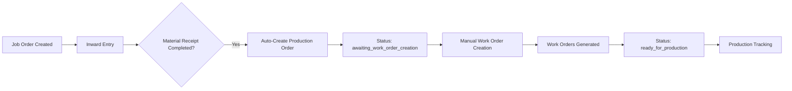

# Production Order Auto-Creation Implementation Plan
**ERP Standard Compliant Architecture**

## Overview

This document outlines the implementation plan for automatic Production Order (Job Card) creation for all Job Orders in the 360° Business Platform. The plan ensures proper ERP standard compliance in code/data structures while maintaining user-friendly local terminology in the UI.

---

## Architectural Correction Required

### Current Code Issues ❌
- Using `JobCard` interface (should be `ProductionOrder`)
- Helper functions named `getJobCardById` (should be `getProductionOrderById`)
- Mock data `mockJobCards` (should be `mockProductionOrders`)

### Required ERP Standard Structure ✅

```typescript
// ERP Standard Data Structures
interface ProductionOrder {
  id: string;
  salesOrderId: string; // Links to Job Order
  customerId: string;
  customerName: string;
  fabricDetails: {
    type: string;
    quantity: number;
    unit: 'meters' | 'yards' | 'kg';
    challanReference: string;
    qualityGrade?: string;
    specialInstructions?: string;
  };
  workOrderIds: string[]; // Links to WorkOrders (ERP standard)
  status: ProductionOrderStatus;
  grnId?: string;
  createdDate: string;
  receivedDate?: string;
  notes?: string;
}

interface WorkOrder { // Already correct ERP standard
  id: string;
  productionOrderId: string; // Links to ProductionOrder
  salesOrderId: string;
  product: string;
  customer: string;
  batchNumber: string;
  targetQuantity: string;
  producedQuantity: string;
  status: WorkOrderStatus;
  priority: 'normal' | 'urgent' | 'high';
  // ... existing fields
}

type ProductionOrderStatus = 
  | 'awaiting_material'           // Before inward entry
  | 'material_received'           // After inward entry
  | 'awaiting_work_order_creation' // Before manual lot creation
  | 'ready_for_production'        // After WorkOrders created
  | 'in_progress'                 // Production started
  | 'completed';                  // All WorkOrders finished
```

---

## Implementation Plan

### Phase 1: Data Structure Refactoring

**Files to Modify:**
- `productionMockData.ts`: Rename `JobCard` → `ProductionOrder`
- All helper functions: `getJobCardById` → `getProductionOrderById`
- Mock data: `mockJobCards` → `mockProductionOrders`
- Update all references throughout codebase

**Breaking Changes:**
- Interface name change requires updating all imports
- Function name changes require updating all calls
- Mock data variable name changes

### Phase 2: Auto-Creation Service

**New File**: `frontend/src/services/ProductionOrderService.ts`

**Trigger**: After Inward Entry completion for Job Orders

```typescript
import { InwardEntry } from '../data/procurementMockData';
import { JobOrder } from '../data/salesMockData';
import { ProductionOrder } from '../data/productionMockData';
import { getBusinessProfileById } from '../data/customerMockData';

export const autoCreateProductionOrder = async (
  inwardEntry: InwardEntry, 
  jobOrder: JobOrder
): Promise<ProductionOrder> => {
  // Validate prerequisites
  if (jobOrder.materialOwnership !== 'client') {
    throw new Error('Production Orders are only created for job work (client material ownership)');
  }

  if (await getProductionOrderBySalesOrder(jobOrder.id)) {
    throw new Error('Production Order already exists for this Job Order');
  }

  return {
    id: `PO-${Date.now()}-${jobOrder.id.split('-')[1]}`, // Production Order ID
    salesOrderId: jobOrder.id,
    customerId: jobOrder.businessProfileId,
    customerName: getBusinessProfileById(jobOrder.businessProfileId)?.businessName || '',
    fabricDetails: {
      type: inwardEntry.materialType,
      quantity: inwardEntry.receivedQuantity,
      unit: inwardEntry.unit,
      challanReference: inwardEntry.challanNumber,
      qualityGrade: inwardEntry.qualityAssessment || 'Standard',
      specialInstructions: jobOrder.serviceRequirements?.specialInstructions
    },
    workOrderIds: [], // Empty initially - awaiting manual lot creation
    status: 'awaiting_work_order_creation',
    grnId: inwardEntry.id,
    createdDate: new Date().toISOString(),
    receivedDate: inwardEntry.receivedDate,
    notes: 'Production Order created automatically after material receipt'
  };
};

export const getProductionOrderBySalesOrder = (salesOrderId: string): ProductionOrder | undefined => {
  return mockProductionOrders.find(po => po.salesOrderId === salesOrderId);
};
```

### Phase 3: Manual Work Order Creation

**New File**: `frontend/src/components/business/WorkOrderCreationModal.tsx`

**Business Logic**: Manual creation of WorkOrders from ProductionOrder

```typescript
interface LotDefinition {
  description: string;
  quantity: number;
  process: 'dyeing' | 'finishing' | 'printing' | 'weaving';
  priority: 'normal' | 'urgent' | 'high';
  notes?: string;
}

export const createWorkOrdersFromLots = async (
  productionOrderId: string, 
  lotDefinitions: LotDefinition[]
): Promise<WorkOrder[]> => {
  const productionOrder = getProductionOrderById(productionOrderId);
  if (!productionOrder) {
    throw new Error('Production Order not found');
  }

  // Validate total quantities match
  const totalLotQuantity = lotDefinitions.reduce((sum, lot) => sum + lot.quantity, 0);
  if (totalLotQuantity !== productionOrder.fabricDetails.quantity) {
    throw new Error('Total lot quantities must equal total fabric quantity');
  }

  const workOrders = lotDefinitions.map((lot, index) => ({
    id: `WO-${Date.now()}-${index + 1}`,
    productionOrderId: productionOrder.id,
    salesOrderId: productionOrder.salesOrderId,
    product: lot.description,
    customer: productionOrder.customerName,
    batchNumber: `${productionOrderId}-WO-${String(index + 1).padStart(2, '0')}`,
    targetQuantity: `${lot.quantity} ${productionOrder.fabricDetails.unit}`,
    producedQuantity: `0 ${productionOrder.fabricDetails.unit}`,
    remainingQuantity: `${lot.quantity} ${productionOrder.fabricDetails.unit}`,
    progress: 0,
    status: 'pending' as WorkOrderStatus,
    assignedMachine: '',
    assignedWorker: '',
    priority: lot.priority,
    createdDate: new Date().toISOString(),
    notes: lot.notes || ''
  }));
  
  // Update ProductionOrder with WorkOrder IDs
  await updateProductionOrder(productionOrderId, {
    workOrderIds: workOrders.map(wo => wo.id),
    status: 'ready_for_production'
  });
  
  return workOrders;
};
```

### Phase 4: UI Implementation (Local Terminology)

**Files to Update:**
- `ProductionOrderManagement.tsx`: Display "Job Cards" but use ProductionOrder data
- `TerminologyContext.ts`: Ensure proper mapping

```typescript
// TerminologyContext mapping
const gujaratiTerminology = {
  // Production terminology
  productionOrder: 'Job Card',
  productionOrders: 'Job Cards',
  workOrder: 'Lot', 
  workOrders: 'Lots',
  createProductionOrder: 'Create Job Card',
  createWorkOrder: 'Create Lot',
  
  // Actions
  startProduction: 'Start Work',
  completeProduction: 'Complete Work',
  qualityCheck: 'QC Check'
};
```

**UI Components Enhancement:**

```typescript
// ProductionOrderManagement.tsx
const { t } = useTranslation();

return (
  <div className={styles.productionModule}>
    <h2>{t('productionOrders')}</h2> {/* Shows "Job Cards" */}
    
    {productionOrders
      .filter(po => po.status === 'awaiting_work_order_creation')
      .map(productionOrder => (
        <ProductionOrderCard 
          key={productionOrder.id}
          productionOrder={productionOrder}
          onCreateWorkOrders={() => openWorkOrderModal(productionOrder.id)}
        />
      ))
    }
  </div>
);
```

### Phase 5: Integration Points

#### A. Inward Entry Integration

**Trigger**: When inward entry completed for Job Order
**File to Modify**: `InwardEntry.tsx` or `GRNService.ts`

```typescript
const completeInwardEntry = async (inwardEntry: InwardEntry) => {
  // Existing inward entry completion logic
  await saveInwardEntry(inwardEntry);
  
  // Check if this inward entry is for a Job Order
  const relatedJobOrder = await getJobOrderById(inwardEntry.relatedJobOrderId);
  if (relatedJobOrder && relatedJobOrder.materialOwnership === 'client') {
    // Auto-create Production Order
    const productionOrder = await autoCreateProductionOrder(inwardEntry, relatedJobOrder);
    await saveProductionOrder(productionOrder);
    
    console.log(`Production Order ${productionOrder.id} created automatically for Job Order ${relatedJobOrder.id}`);
  }
};
```

#### B. Production Module Enhancement

**Route**: `/production-orders` (ERP standard URL)
**Display**: "Job Cards" (via TerminologyContext)
**Functionality**: ProductionOrder management + WorkOrder creation

#### C. Sales Integration

**Enhancement**: Link Job Orders to auto-generated ProductionOrders
**File to Modify**: `SalesOrders.tsx`

```typescript
const getProductionOrderStatus = (jobOrder: JobOrder) => {
  const productionOrder = getProductionOrderBySalesOrder(jobOrder.id);
  if (!productionOrder) return 'pending_production_order';
  return productionOrder.status;
};

// In JobOrder card display
<div className={styles.productionStatus}>
  {getProductionOrderStatus(jobOrder) === 'pending_production_order' ? (
    <span>Awaiting Material Receipt</span>
  ) : (
    <button onClick={() => viewProductionOrder(jobOrder.id)}>
      {t('viewProductionOrder')} {/* Shows "View Job Card" */}
    </button>
  )}
</div>
```

### Phase 6: URL/UI Compliance

**URLs (ERP Standard):**
- `/platform/production-orders`
- `/platform/production-orders/:id`
- `/platform/work-orders`
- `/platform/work-orders/:id`

**UI Display (Local Terms):**
- Page Title: "Job Cards"
- Tab: "Job Cards"  
- Button: "Create Lot" (creates WorkOrder)
- Headers: "Job Card Details"
- Navigation: "Production Orders" → Shows "Job Cards"

---

## Business Logic Flow



### Detailed Status Flow

1. **Job Order Created**: `status: 'order_confirmed'`
2. **Material Receipt**: Inward entry completed
3. **Production Order Auto-Created**: `status: 'awaiting_work_order_creation'`
4. **Manual Lot Definition**: User creates work order specifications
5. **Work Orders Generated**: `status: 'ready_for_production'`
6. **Production Started**: `status: 'in_progress'`
7. **Production Completed**: `status: 'completed'`

---

## Data Relationships

```
JobOrder (1) ← ProductionOrder (1) ← WorkOrders (many)
    ↓              ↓                    ↓
InwardEntry (1) Customer (1)    QualityControl (many)
    ↓
GRN (1)
```

**Key Relationships:**
- One Job Order can have one Production Order
- One Production Order can have multiple Work Orders
- One Inward Entry triggers one Production Order creation
- Each Work Order can have one Quality Control record

---

## Implementation Checklist

### Phase 1: Data Structure ✅
- [ ] Rename `JobCard` interface to `ProductionOrder`
- [ ] Update all helper function names
- [ ] Update mock data variable names
- [ ] Update all imports and references

### Phase 2: Services ✅  
- [ ] Create `ProductionOrderService.ts`
- [ ] Implement `autoCreateProductionOrder` function
- [ ] Add validation logic
- [ ] Create helper functions

### Phase 3: UI Components ✅
- [ ] Create `WorkOrderCreationModal.tsx`
- [ ] Implement lot creation interface
- [ ] Add quantity validation
- [ ] Integrate with ProductionOrder data

### Phase 4: Integration ✅
- [ ] Modify Inward Entry to trigger auto-creation
- [ ] Update Production module UI
- [ ] Add Sales integration
- [ ] Update TerminologyContext mappings

### Phase 5: Testing ✅
- [ ] Test auto-creation workflow
- [ ] Test manual work order creation
- [ ] Validate UI terminology display
- [ ] Test cross-module integration

---

## Success Criteria

1. **Automatic Production Order Creation**: When inward entry is completed for a Job Order, a Production Order is automatically created
2. **Manual Work Order Creation**: Users can manually create work orders (lots) from Production Orders
3. **ERP Compliance**: All code uses ERP standard terminology (ProductionOrder, WorkOrder)
4. **UI Terminology**: All UI displays local terminology (Job Cards, Lots)
5. **Cross-Module Integration**: Production Orders are accessible from Sales module
6. **Status Tracking**: Complete status flow from material receipt to production completion

---

**Created**: November 12, 2024  
**Updated**: November 12, 2024  
**Status**: Planning Phase  
**Next Review**: After Phase 1 completion